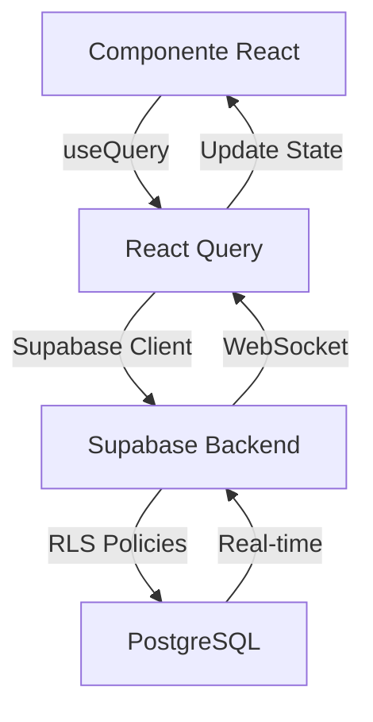

# 🏗️ Arquitetura do Sistema Ortho+

## Visão Geral

O Ortho+ segue uma arquitetura modular plug-and-play com padrões DDD (Domain-Driven Design) e segregação praxeológica de concerns.

## Estrutura de Diretórios

```
src/
├── components/
│   ├── shared/           # Componentes reutilizáveis
│   │   ├── TableFilter.tsx
│   │   ├── ExportButton.tsx
│   │   ├── DateRangePicker.tsx
│   │   ├── StatsCard.tsx
│   │   └── ConfirmDialog.tsx
│   ├── dashboard/        # Componentes de dashboard
│   │   └── CategoryDashboard.tsx
│   └── [módulo]/        # Componentes específicos por módulo
├── core/
│   └── layout/
│       └── Sidebar/     # Sistema de navegação modular
├── hooks/               # Custom hooks reutilizáveis
│   ├── useTableData.ts
│   ├── useRealTimeStats.ts
│   └── useAuth.ts
├── pages/               # Páginas principais
│   ├── Dashboard.tsx
│   ├── dashboards/      # Dashboards por categoria
│   │   ├── ClinicaDashboard.tsx
│   │   ├── FinanceiroDashboard.tsx
│   │   └── ComercialDashboard.tsx
│   └── [módulo]/
└── integrations/
    └── supabase/        # Integração com backend
```

## Padrões Arquiteturais

### 1. Componentes Reutilizáveis

Todos os componentes compartilhados estão em `src/components/shared/`:

- **TableFilter**: Filtros avançados para tabelas (busca + dropdowns)
- **ExportButton**: Exportação unificada (PDF/Excel/CSV)
- **DateRangePicker**: Seleção de período
- **StatsCard**: Cards de KPIs com variants (primary, success, warning, danger)
- **ConfirmDialog**: Diálogos de confirmação padronizados

### 2. Hierarquia de Dashboards

```
Dashboard Principal (Executivo)
├── Dashboard Clínico
├── Dashboard Financeiro
└── Dashboard Comercial
    └── Módulos Individuais
```

#### Dashboard Principal
- TOP 6 KPIs críticos
- Alertas prioritários
- Ações rápidas

#### Dashboards de Categoria
- Template `<CategoryDashboard />`
- KPIs específicos da categoria
- Gráficos e tabelas relevantes

### 3. Sistema de Módulos

Cada módulo é independente e pode ser ativado/desativado:

```typescript
// sidebar.config.ts
export const menuGroups: MenuGroup[] = [
  {
    label: 'CLÍNICA',
    items: [
      { title: 'Agenda', moduleKey: 'AGENDA', ... },
      { title: 'Pacientes', moduleKey: 'PEP', ... },
    ]
  }
];
```

### 4. Custom Hooks

#### `useRealTimeStats()`
```typescript
const { value, isLoading } = useRealTimeStats({
  table: 'patients',
  where: { status: 'ativo' }
});
```

#### `useTableData()`
```typescript
const {
  searchTerm,
  setSearchTerm,
  paginatedData,
  totalPages
} = useTableData({ 
  data: patients, 
  searchFields: ['full_name', 'cpf'] 
});
```

## Fluxo de Dados



## Segurança

### Row Level Security (RLS)
- Todas as queries filtram por `clinic_id` automaticamente
- Políticas de RLS no Supabase garantem isolamento multi-tenant

### Controle de Acesso
- Roles: `ADMIN` e `MEMBER`
- Permissões granulares por módulo
- Validação no frontend + backend

## Performance

### Otimizações Implementadas
1. **React Query**: Cache inteligente de queries
2. **Real-time subscriptions**: Apenas para dados críticos
3. **Componentes memoizados**: `React.memo` em componentes pesados
4. **Paginação**: Tabelas com mais de 50 registros
5. **Busca debounced**: 300ms de delay

## Próximas Evoluções

### Fase 5 (Em andamento): DDD
```
src/modules/patients/
├── domain/
│   ├── entities/Patient.ts
│   ├── value-objects/CPF.ts
│   └── repositories/IPatientRepository.ts
├── application/
│   ├── use-cases/CreatePatient.ts
│   └── dtos/PatientDTO.ts
├── infrastructure/
│   └── repositories/SupabasePatientRepository.ts
└── presentation/
    ├── components/PatientList.tsx
    └── pages/PatientsPage.tsx
```

## Convenções de Código

### Nomenclatura
- Componentes: `PascalCase`
- Hooks: `useCamelCase`
- Arquivos: `kebab-case.tsx`
- Constantes: `SCREAMING_SNAKE_CASE`

### Estrutura de Componentes
```typescript
// 1. Imports
import { useState } from 'react';

// 2. Types/Interfaces
interface Props { }

// 3. Component
export function Component({ }: Props) {
  // 3.1 Hooks
  const [state, setState] = useState();
  
  // 3.2 Queries/Mutations
  const { data } = useQuery();
  
  // 3.3 Handlers
  const handleClick = () => {};
  
  // 3.4 Effects
  useEffect(() => {}, []);
  
  // 3.5 Render
  return ( );
}
```

## Testes

### Estratégia de Testes
1. **Unitários**: Custom hooks
2. **Integração**: Componentes + queries
3. **E2E**: Fluxos críticos (Playwright)

## Monitoramento

### Métricas Rastreadas
- Tempo de resposta de queries
- Taxa de erro de API
- Performance de renderização
- Uso de memória

## Documentação Relacionada

- [Component Library](./COMPONENT_LIBRARY.md)
- [Frontend Optimization](./FRONTEND_OPTIMIZATION.md)
- [User Guides](./guias-usuario/)
