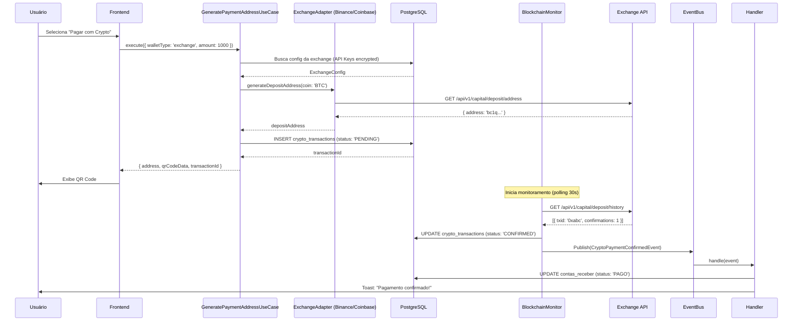
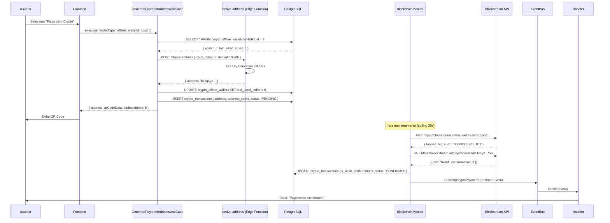
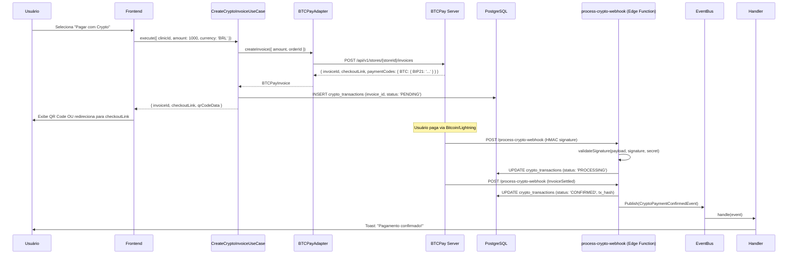

# 🏗️ Documentação Técnica - Implementação de Crypto Payments

## 📋 Índice

1. [Visão Geral da Arquitetura](#visão-geral-da-arquitetura)
2. [Fluxos de Pagamento](#fluxos-de-pagamento)
3. [Componentes do Sistema](#componentes-do-sistema)
4. [Segurança e Criptografia](#segurança-e-criptografia)
5. [Integração com Blockchain](#integração-com-blockchain)
6. [Event-Driven Architecture](#event-driven-architecture)
7. [Testes](#testes)
8. [Deployment](#deployment)
9. [Troubleshooting](#troubleshooting)

---

## 🎯 Visão Geral da Arquitetura

### Stack Tecnológica

```
Frontend:
├── React 18 + TypeScript
├── Tailwind CSS + shadcn/ui
├── React Query (TanStack Query)
└── qrcode library

Backend:
├── PostgreSQL (PostgreSQL + RLS)
├── Edge Functions (Deno)
└── Real-time subscriptions

External APIs:
├── Binance API
├── Coinbase API
├── Kraken API
├── Mercado Bitcoin API
├── Blockstream API (Bitcoin)
└── BTCPay Server (self-hosted)
```

### Arquitetura em Camadas

```
┌─────────────────────────────────────────────────────────────┐
│                         UI Layer                             │
│  (Components: CryptoPaymentPDV, PaymentDialog, etc)         │
└─────────────────────────────────────────────────────────────┘
                              ↓
┌─────────────────────────────────────────────────────────────┐
│                    Application Layer                         │
│  (Use Cases: GeneratePaymentAddress, ProcessWebhook, etc)   │
└─────────────────────────────────────────────────────────────┘
                              ↓
┌─────────────────────────────────────────────────────────────┐
│                      Domain Layer                            │
│     (Entities: CryptoTransaction, Events, Value Objects)    │
└─────────────────────────────────────────────────────────────┘
                              ↓
┌─────────────────────────────────────────────────────────────┐
│                  Infrastructure Layer                        │
│   (Adapters: ExchangeFactory, BlockchainMonitor, PostgreSQL)  │
└─────────────────────────────────────────────────────────────┘
```

---

## 🔄 Fluxos de Pagamento

### Fluxo 1: Exchange API (Custodial)



---

### Fluxo 2: Wallet Offline (Non-Custodial - xPub)



---

### Fluxo 3: BTCPay Server (Non-Custodial - Self-Hosted)



---

## 🧩 Componentes do Sistema

### 1. Frontend Components

#### `CryptoPaymentSelector.tsx`
```typescript
/**
 * Componente reutilizável para seleção de método de pagamento crypto.
 * Usado em: PaymentDialog, PDV, Orçamentos
 */
interface CryptoPaymentSelectorProps {
  amount: number; // Valor em BRL
  onPaymentConfirmed: (txHash: string, cryptocurrency: string) => void;
  onCancel?: () => void;
}
```

**Responsabilidades:**
- Listar wallets/exchanges disponíveis
- Selecionar criptomoeda (BTC, ETH, USDT, BNB)
- Gerar endereço de pagamento (via Use Case)
- Exibir QR Code
- Monitorar status do pagamento

---

#### `CryptoPaymentPDV.tsx`
```typescript
/**
 * Componente específico para PDV (integra com IntegracaoTEF.tsx)
 */
export default function CryptoPaymentPDV({ 
  vendaId, 
  valorTotal, 
  onSuccess 
}: CryptoPaymentPDVProps)
```

**Características:**
- Interface otimizada para caixa (telas grandes)
- Polling automático de confirmação
- Integração com `pdv_vendas` e `pdv_pagamentos`

---

#### `XPubConfigForm.tsx`
```typescript
/**
 * Formulário para configurar wallets offline (xPub)
 */
export function XPubConfigForm({ clinicId, onSave }: Props)
```

**Validações:**
- Formato da xPub (xpub, ypub, zpub)
- Derivation path (BIP44/49/84)
- Teste de derivação (gera endereço #0)

---

### 2. Use Cases (Application Layer)

#### `GeneratePaymentAddressUseCase.ts`
```typescript
/**
 * Gera endereço de pagamento (exchange ou offline wallet)
 */
export class GeneratePaymentAddressUseCase {
  async execute(dto: GeneratePaymentAddressDTO): Promise<PaymentAddressResult>
}
```

**Fluxo:**
1. Busca config da wallet (exchange ou offline)
2. Gera/deriva endereço:
   - Exchange: usa endereço fixo ou chama API
   - Offline: deriva do xPub (incrementa índice)
3. Cria transação no DB (status: PENDING)
4. Retorna `{ address, qrCodeData, transactionId }`

---

#### `CreateCryptoInvoiceUseCase.ts`
```typescript
/**
 * Cria invoice no BTCPay Server
 */
export class CreateCryptoInvoiceUseCase {
  async execute(dto: CreateCryptoInvoiceDTO): Promise<CryptoTransaction>
}
```

**Integração com BTCPay:**
- Usa `BTCPayAdapter` para criar invoice
- Salva `invoice_id` no DB
- Retorna `checkoutLink` (UI completa do BTCPay)

---

#### `ProcessWebhookUseCase.ts`
```typescript
/**
 * Processa webhooks de exchanges/BTCPay
 */
export class ProcessWebhookUseCase {
  async execute(dto: ProcessWebhookDTO): Promise<void>
}
```

**Eventos suportados:**
- `InvoiceCreated`
- `InvoiceReceivedPayment`
- `InvoiceProcessing` (aguardando confirmações)
- `InvoiceSettled` (confirmado)
- `InvoiceExpired`

---

### 3. Infrastructure Layer

#### `ExchangeFactory.ts`
```typescript
/**
 * Factory Pattern para criar adapters de exchanges
 */
export class ExchangeFactory {
  static create(
    exchangeName: 'BINANCE' | 'COINBASE' | 'KRAKEN' | 'MERCADO_BITCOIN',
    apiKey: string,
    apiSecret: string
  ): ICryptoExchange
}
```

**Interface `ICryptoExchange`:**
```typescript
export interface ICryptoExchange {
  getWalletBalance(coin: string): Promise<number>;
  generateDepositAddress(coin: string): Promise<string>;
  getExchangeRate(from: string, to: string): Promise<number>;
  validateCredentials(): Promise<boolean>;
}
```

---

#### `BlockchainMonitor.ts`
```typescript
/**
 * Monitora endereços na blockchain (polling)
 */
export class BlockchainMonitor {
  async watchAddress(config: MonitorConfig): Promise<void>
  stopWatching(address: string): void
}
```

**APIs utilizadas:**
- **Bitcoin**: Blockstream API (`https://blockstream.info/api`)
- **Ethereum**: Etherscan API ou Infura (requer API key)
- **USDT**: Etherscan (ERC20) ou TronScan (TRC20)

**Polling:**
- Intervalo: 30 segundos
- Timeout: 2 horas
- Confirmações mínimas: 1 (configurável)

---

### 4. Database Schema

#### Tabela: `crypto_exchange_config`
```sql
CREATE TABLE public.crypto_exchange_config (
  id UUID PRIMARY KEY DEFAULT gen_random_uuid(),
  clinic_id UUID REFERENCES public.clinics(id) NOT NULL,
  exchange_name TEXT NOT NULL, -- BINANCE, COINBASE, KRAKEN, MERCADO_BITCOIN
  api_key_encrypted TEXT NOT NULL, -- Encrypted with pgcrypto
  api_secret_encrypted TEXT, -- Encrypted
  wallet_address TEXT, -- Endereço fixo de depósito (se aplicável)
  webhook_secret TEXT, -- Para validar webhooks
  supported_coins JSONB DEFAULT '["BTC", "ETH", "USDT"]'::jsonb,
  auto_convert_to_brl BOOLEAN DEFAULT false,
  is_active BOOLEAN DEFAULT true,
  created_at TIMESTAMPTZ DEFAULT now(),
  updated_at TIMESTAMPTZ DEFAULT now()
);
```

#### Tabela: `crypto_offline_wallets`
```sql
CREATE TABLE public.crypto_offline_wallets (
  id UUID PRIMARY KEY DEFAULT gen_random_uuid(),
  clinic_id UUID REFERENCES public.clinics(id) NOT NULL,
  wallet_name TEXT NOT NULL,
  hardware_type TEXT CHECK (hardware_type IN ('trezor', 'coldcard', 'krux', 'ledger', 'other')),
  xpub TEXT NOT NULL, -- Encrypted in production
  derivation_path TEXT DEFAULT 'm/84''/0''/0''/0', -- BIP84 (SegWit Native)
  address_type TEXT DEFAULT 'p2wpkh' CHECK (address_type IN ('p2pkh', 'p2sh', 'p2wpkh')),
  last_used_index INTEGER DEFAULT 0,
  gap_limit INTEGER DEFAULT 20,
  supported_coins JSONB DEFAULT '["BTC"]'::jsonb,
  is_active BOOLEAN DEFAULT true,
  is_verified BOOLEAN DEFAULT false,
  created_at TIMESTAMPTZ DEFAULT now(),
  updated_at TIMESTAMPTZ DEFAULT now()
);
```

#### Tabela: `crypto_transactions`
```sql
CREATE TABLE public.crypto_transactions (
  id UUID PRIMARY KEY DEFAULT gen_random_uuid(),
  clinic_id UUID REFERENCES public.clinics(id) NOT NULL,
  exchange_config_id UUID REFERENCES public.crypto_exchange_config(id),
  offline_wallet_id UUID REFERENCES public.crypto_offline_wallets(id),
  invoice_id TEXT, -- BTCPay invoice ID
  crypto_address TEXT NOT NULL,
  address_index INTEGER, -- Para offline wallets (derivation)
  amount_crypto NUMERIC(18, 8) NOT NULL,
  amount_brl NUMERIC(12, 2),
  cryptocurrency TEXT NOT NULL, -- BTC, ETH, USDT, BNB
  tx_hash TEXT,
  confirmations INTEGER DEFAULT 0,
  status TEXT DEFAULT 'PENDING', -- PENDING, PROCESSING, CONFIRMED, EXPIRED, FAILED
  metadata JSONB,
  created_at TIMESTAMPTZ DEFAULT now(),
  confirmed_at TIMESTAMPTZ,
  updated_at TIMESTAMPTZ DEFAULT now()
);
```

---

## 🔐 Segurança e Criptografia

### 1. Criptografia de API Keys

```sql
-- Criptografar API Keys (usar pgcrypto)
CREATE EXTENSION IF NOT EXISTS pgcrypto;

-- Encryption key deve ser armazenada em variável de ambiente (ENCRYPTION_KEY)
-- Nunca hardcode a key no código!

-- Função para criptografar
CREATE FUNCTION encrypt_api_key(plain_text TEXT) RETURNS TEXT AS $$
  SELECT encode(
    pgp_sym_encrypt(plain_text, current_setting('app.encryption_key')), 
    'base64'
  );
$$ LANGUAGE SQL SECURITY DEFINER;

-- Função para descriptografar (apenas backend!)
CREATE FUNCTION decrypt_api_key(encrypted_text TEXT) RETURNS TEXT AS $$
  SELECT pgp_sym_decrypt(
    decode(encrypted_text, 'base64'), 
    current_setting('app.encryption_key')
  );
$$ LANGUAGE SQL SECURITY DEFINER;
```

**Frontend NÃO deve descriptografar:**
```typescript
// ❌ ERRADO
const apiKey = decrypt(encryptedKey);

// ✅ CORRETO
// Apenas Edge Functions descriptografam
// Frontend apenas envia ID da config
const response = await apiClient.post('generate-payment-address', {
  body: { exchangeConfigId: 'uuid' } // Não envia API key!
});
```

---

### 2. Validação de Webhook Signatures

```typescript
// BTCPayAdapter.ts
validateWebhookSignature(payload: string, signature: string, secret: string): boolean {
  const hmac = crypto.createHmac('sha256', secret);
  hmac.update(payload);
  const expectedSignature = hmac.digest('hex');
  return signature === expectedSignature;
}
```

**Edge Function:**
```typescript
// process-crypto-webhook/index.ts
Deno.serve(async (req) => {
  const rawBody = await req.text();
  const signature = req.headers.get('BTCPay-Sig') || req.headers.get('X-Signature');
  
  // Buscar webhook_secret do DB
  const { data: config } = await apiClient
    .from('crypto_exchange_config')
    .select('webhook_secret')
    .eq('id', configId)
    .single();
  
  // Validar signature
  const isValid = btcpayAdapter.validateWebhookSignature(
    rawBody,
    signature,
    config.webhook_secret
  );
  
  if (!isValid) {
    return new Response('Unauthorized', { status: 401 });
  }
  
  // Processar webhook...
});
```

---

### 3. Row Level Security (RLS)

```sql
-- Exemplo: crypto_transactions

-- Policy: Users can only see their clinic's transactions
CREATE POLICY "Users can view own clinic crypto transactions"
ON public.crypto_transactions
FOR SELECT
USING (
  clinic_id = (
    SELECT clinic_id FROM public.profiles WHERE id = auth.uid()
  )
);

-- Policy: Only ADMIN can insert
CREATE POLICY "Only ADMIN can create crypto transactions"
ON public.crypto_transactions
FOR INSERT
WITH CHECK (
  EXISTS (
    SELECT 1 FROM public.profiles
    WHERE id = auth.uid()
    AND clinic_id = crypto_transactions.clinic_id
    AND app_role = 'ADMIN'
  )
);
```

---

### 4. Rate Limiting

```typescript
// Edge Function middleware
async function rateLimitCheck(req: Request): Promise<boolean> {
  const ip = req.headers.get('x-real-ip') || req.headers.get('x-forwarded-for');
  const endpoint = new URL(req.url).pathname;
  
  // Verificar rate limit no DB (tabela rate_limit_log)
  const { data, error } = await apiClient
    .from('rate_limit_log')
    .select('request_count')
    .eq('ip_address', ip)
    .eq('endpoint', endpoint)
    .gte('window_start', new Date(Date.now() - 60000)); // Últimos 60s
  
  const requestCount = data?.reduce((sum, log) => sum + log.request_count, 0) || 0;
  
  // Limite: 10 requests/minuto
  if (requestCount >= 10) {
    return false;
  }
  
  // Incrementar contador
  await apiClient.rpc('increment_rate_limit', { 
    ip_address: ip, 
    endpoint 
  });
  
  return true;
}
```

---

## 🔗 Integração com Blockchain

### 1. Derivação de Endereços (xPub - BIP32)

Em produção, usar biblioteca `bitcoinjs-lib` ou `@scure/btc-signer`:

```typescript
// Edge Function: derive-address
import { HDKey } from '@scure/bip32';
import { toOutputScript, Address } from '@scure/btc-signer';

Deno.serve(async (req) => {
  const { xpub, derivationPath, index } = await req.json();
  
  try {
    // Parse xPub
    const hdkey = HDKey.fromExtendedKey(xpub);
    
    // Derivar child key (ex: m/84'/0'/0'/0/{index})
    const child = hdkey.derive(`${derivationPath}/${index}`);
    
    // Gerar endereço (SegWit Native - bc1...)
    const pubkey = child.publicKey;
    const address = Address(toOutputScript(pubkey, 'p2wpkh')).encode('mainnet');
    
    return new Response(JSON.stringify({ address }), {
      headers: { 'Content-Type': 'application/json' }
    });
  } catch (error) {
    return new Response(JSON.stringify({ error: 'Invalid xPub' }), {
      status: 400,
      headers: { 'Content-Type': 'application/json' }
    });
  }
});
```

---

### 2. Monitoramento via Blockstream API

```typescript
// BlockchainMonitor.ts
private async checkBitcoinAddress(config: MonitorConfig): Promise<BlockchainTransaction | null> {
  const baseUrl = 'https://blockstream.info/api';
  
  // 1. Buscar dados do endereço
  const addressResponse = await fetch(`${baseUrl}/address/${config.address}`);
  const addressData = await addressResponse.json();
  
  // 2. Calcular saldo
  const balanceSatoshis = addressData.chain_stats.funded_txo_sum - addressData.chain_stats.spent_txo_sum;
  const balanceBTC = balanceSatoshis / 100000000;
  
  if (balanceBTC < config.expectedAmount * 0.95) {
    return null; // Ainda não recebeu o pagamento
  }
  
  // 3. Buscar última transação
  const txsResponse = await fetch(`${baseUrl}/address/${config.address}/txs`);
  const txs = await txsResponse.json();
  const latestTx = txs[0];
  
  // 4. Verificar confirmações
  const currentBlockHeight = await this.getCurrentBlockHeight();
  const confirmations = latestTx.status.confirmed
    ? currentBlockHeight - latestTx.status.block_height + 1
    : 0;
  
  return {
    txHash: latestTx.txid,
    address: config.address,
    amount: balanceBTC,
    confirmations,
    blockHeight: latestTx.status.block_height,
    timestamp: new Date(latestTx.status.block_time * 1000),
  };
}
```

---

## 📡 Event-Driven Architecture

### 1. Domain Events

```typescript
// src/domain/events/CryptoPaymentEvents.ts

export class CryptoPaymentConfirmedEvent {
  aggregateId: string; // transactionId
  eventType: string = 'CRYPTO_PAYMENT_CONFIRMED';
  occurredAt: Date;
  payload: {
    transactionId: string;
    clinicId: string;
    amount: number;
    cryptocurrency: string;
    txHash: string;
    confirmations: number;
    contaReceberId?: string;
    orderId?: string;
  };
}
```

---

### 2. Event Handler

```typescript
// src/application/event-handlers/CryptoPaymentConfirmedHandler.ts

export class CryptoPaymentConfirmedHandler {
  async handle(event: CryptoPaymentConfirmedEvent): Promise<void> {
    // 1. Atualizar transação crypto
    await this.updateCryptoTransaction(event);
    
    // 2. Atualizar conta_receber
    if (event.payload.contaReceberId) {
      await this.updateContaReceber(event);
    }
    
    // 3. Registrar no financeiro
    await this.registerFinancialTransaction(event);
    
    // 4. Disparar Split de Pagamento
    await this.processSplitPayment(event);
    
    // 5. Notificar clínica
    this.notifyClinic(event);
    
    // 6. Audit log
    await this.logAudit(event);
  }
}
```

---

### 3. Event Bus Integration

```typescript
// BlockchainMonitor.ts (quando detecta pagamento)

if (tx && tx.confirmations >= this.MIN_CONFIRMATIONS) {
  // Criar evento
  const event = new CryptoPaymentConfirmedEvent(
    config.transactionId,
    {
      clinicId: config.clinicId,
      amount: tx.amount,
      cryptocurrency: config.cryptocurrency,
      txHash: tx.txHash,
      confirmations: tx.confirmations,
      address: config.address,
    }
  );
  
  // Disparar handler (em produção, usar Event Bus real)
  await cryptoPaymentConfirmedHandler.handle(event);
}
```

---

## ✅ Testes

### 1. Testes Unitários

```typescript
// src/application/use-cases/crypto/__tests__/GeneratePaymentAddress.test.ts

describe('GeneratePaymentAddressUseCase', () => {
  it('should generate address for exchange wallet', async () => {
    const useCase = new GeneratePaymentAddressUseCase();
    const result = await useCase.execute({
      clinicId: 'clinic-1',
      walletId: 'exchange-1',
      walletType: 'exchange',
      amount: 0.001,
      cryptocurrency: 'BTC',
      orderId: 'order-123',
    });
    
    expect(result.address).toMatch(/^bc1[a-z0-9]{39,59}$/);
    expect(result.qrCodeData).toContain('bitcoin:');
    expect(result.transactionId).toBeDefined();
  });
  
  it('should derive address from xPub for offline wallet', async () => {
    const useCase = new GeneratePaymentAddressUseCase();
    const result = await useCase.execute({
      clinicId: 'clinic-1',
      walletId: 'offline-1',
      walletType: 'offline',
      amount: 0.001,
      cryptocurrency: 'BTC',
      orderId: 'order-456',
    });
    
    expect(result.address).toMatch(/^bc1[a-z0-9]{39,59}$/);
    expect(result.addressIndex).toBeGreaterThan(0);
  });
});
```

---

### 2. Testes de Integração

```typescript
// src/__tests__/integration/crypto-payment-flow.test.ts

describe('Crypto Payment Flow (E2E)', () => {
  it('should process payment via exchange', async () => {
    // 1. Configurar exchange
    const exchangeConfig = await createExchangeConfig({
      exchangeName: 'BINANCE',
      apiKey: 'test_key',
      apiSecret: 'test_secret',
    });
    
    // 2. Gerar pagamento
    const payment = await generatePaymentAddress({
      walletId: exchangeConfig.id,
      walletType: 'exchange',
      amount: 1000,
    });
    
    expect(payment.address).toBeDefined();
    
    // 3. Simular webhook de confirmação
    await simulateWebhook({
      invoiceId: payment.transactionId,
      status: 'CONFIRMED',
      txHash: '0xabc123',
      confirmations: 3,
    });
    
    // 4. Verificar atualização no DB
    const transaction = await getCryptoTransaction(payment.transactionId);
    expect(transaction.status).toBe('CONFIRMED');
    expect(transaction.tx_hash).toBe('0xabc123');
  });
});
```

---

### 3. Testes E2E (Playwright)

```typescript
// e2e/crypto-payment-pdv.spec.ts

test('PDV should accept crypto payment', async ({ page }) => {
  await page.goto('/pdv');
  
  // 1. Adicionar produto
  await page.click('[data-testid="add-product"]');
  await page.fill('[data-testid="product-name"]', 'Clareamento');
  await page.fill('[data-testid="product-price"]', '800');
  
  // 2. Finalizar venda
  await page.click('[data-testid="finalize-sale"]');
  
  // 3. Selecionar pagamento crypto
  await page.click('[data-testid="payment-crypto"]');
  
  // 4. Escolher moeda
  await page.selectOption('[data-testid="crypto-coin"]', 'BTC');
  
  // 5. Verificar QR Code
  await expect(page.locator('[data-testid="crypto-qr-code"]')).toBeVisible();
  
  // 6. Simular confirmação
  await page.evaluate(() => {
    window.dispatchEvent(new CustomEvent('crypto-payment-confirmed', {
      detail: { txHash: '0xtest123', amount: 0.0015 }
    }));
  });
  
  // 7. Verificar sucesso
  await expect(page.locator('[data-testid="payment-success"]')).toBeVisible();
});
```

---

## 🚀 Deployment

### 1. Edge Functions

```bash
# Deploy todas as Edge Functions
npm run deploy

# Deploy função específica
npm run deploy generate-payment-address
npm run deploy process-crypto-webhook
npm run deploy derive-address
```

---

### 2. Database Migrations

```bash
# Executar migrations
npx prisma db push

# Ou via ferramenta do Lovable (automático)
```

---

### 3. Environment Variables

```bash
# .env.local (desenvolvimento)
VITE_API_BASE_URL=https://yxpoqjyfgotkytwtifau.backend.orthoplus.local
VITE_API_ANON_KEY=eyJhbGc...

# Edge Functions (Admin Dashboard → Settings → Secrets)
ENCRYPTION_KEY=your-32-char-encryption-key
BLOCKSTREAM_API_URL=https://blockstream.info/api
```

---

## 🐛 Troubleshooting

### 1. "xPub inválido" ao derivar endereço

**Causa:** Formato da xPub incorreto ou derivation path incompatível.

**Solução:**
```typescript
// Validar formato antes de salvar
function isValidXPub(xpub: string): boolean {
  return /^(xpub|ypub|zpub)[1-9A-HJ-NP-Za-km-z]{79,108}$/.test(xpub);
}

// Testar derivação
const testAddress = await deriveAddress(xpub, 0);
console.log('Endereço #0:', testAddress);
```

---

### 2. "Pagamento não confirmado" após longo tempo

**Causa:** Blockchain congestionada ou fee muito baixa.

**Solução:**
- Verificar na blockchain explorer (blockstream.info)
- Se stuck, paciente pode aumentar fee (RBF - Replace-By-Fee)
- Aumentar timeout de monitoramento (de 2h para 6h)

---

### 3. "API Key inválida" ao conectar exchange

**Causa:** Permissões incorretas ou IP bloqueado.

**Solução:**
```typescript
// Testar credenciais antes de salvar
const adapter = ExchangeFactory.create('BINANCE', apiKey, apiSecret);
const isValid = await adapter.validateCredentials();

if (!isValid) {
  throw new Error('API Key inválida. Verifique permissões (deve ter "Leitura" e "Depósitos").');
}
```

---

### 4. Memory Leak no BlockchainMonitor

**Causa:** Intervalos não estão sendo limpos.

**Solução:**
```typescript
// Sempre limpar ao desmontar componente
useEffect(() => {
  blockchainMonitor.watchAddress(config);
  
  return () => {
    blockchainMonitor.stopWatching(config.address);
  };
}, [config.address]);
```

---

## 📊 Métricas e Monitoring

### 1. KPIs a monitorar

- **Taxa de confirmação**: % de pagamentos confirmados vs. pendentes
- **Tempo médio de confirmação**: Bitcoin ~10-60min, Ethereum ~1-5min
- **Taxa de abandono**: % de QR Codes gerados vs. pagos
- **Valor médio por transação**: Segmentar por crypto (BTC > USDT?)
- **Erros de derivação**: Quantos xPub falharam?

### 2. Logs estruturados

```typescript
// Usar logger consistente
console.log('[BlockchainMonitor] Starting watch for', address);
console.log('[CryptoPaymentConfirmedHandler] Event processed:', transactionId);
console.error('[ExchangeFactory] Failed to validate credentials:', error);
```

---

## 🎓 Recursos e Referências

### Documentação Oficial

- **Bitcoin BIPs**: https://github.com/bitcoin/bips
- **Blockstream API**: https://github.com/Blockstream/esplora/blob/master/API.md
- **BTCPay Server API**: https://docs.btcpayserver.org/API/Greenfield/v1/
- **Binance API**: https://binance-docs.github.io/apidocs/spot/en/
- **Coinbase API**: https://docs.cloud.coinbase.com/

### Libraries

- `bitcoinjs-lib`: https://github.com/bitcoinjs/bitcoinjs-lib
- `@scure/bip32`: https://github.com/paulmillr/scure-bip32
- `qrcode`: https://github.com/soldair/node-qrcode

---

*Última atualização: 15/11/2025*
*Versão: 1.0*
*Ortho+ © 2025*
