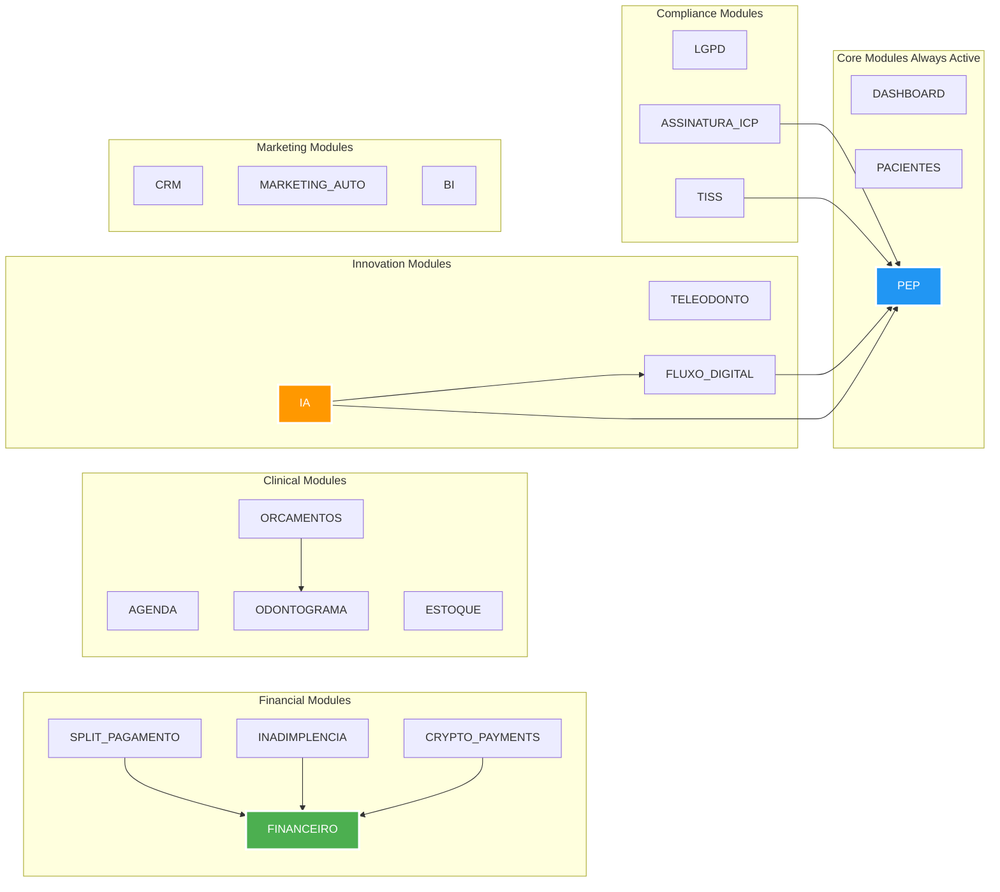

# 🧩 Sistema Modular Plug-and-Play

## Dependências

| Módulo | Depende de |
|--------|------------|
| SPLIT_PAGAMENTO | FINANCEIRO |
| INADIMPLENCIA | FINANCEIRO |
| CRYPTO_PAYMENTS | FINANCEIRO |
| ORCAMENTOS | ODONTOGRAMA |
| ASSINATURA_ICP | PEP |
| TISS | PEP |
| FLUXO_DIGITAL | PEP |
| IA | PEP + FLUXO_DIGITAL |

**Total: 21 módulos**
