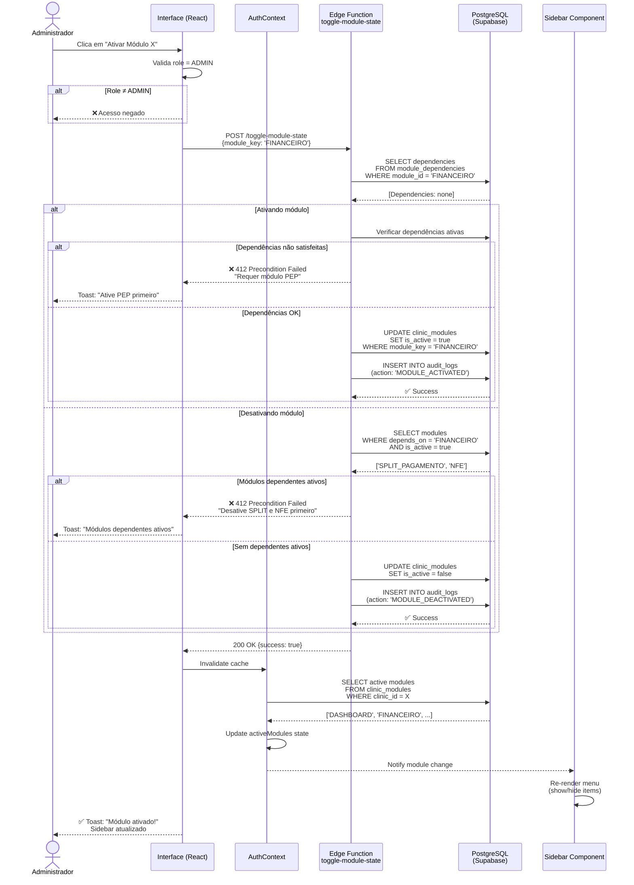
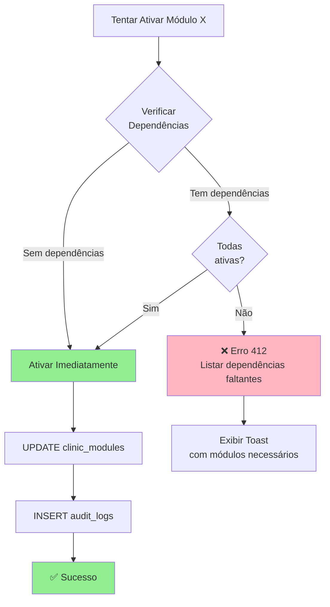
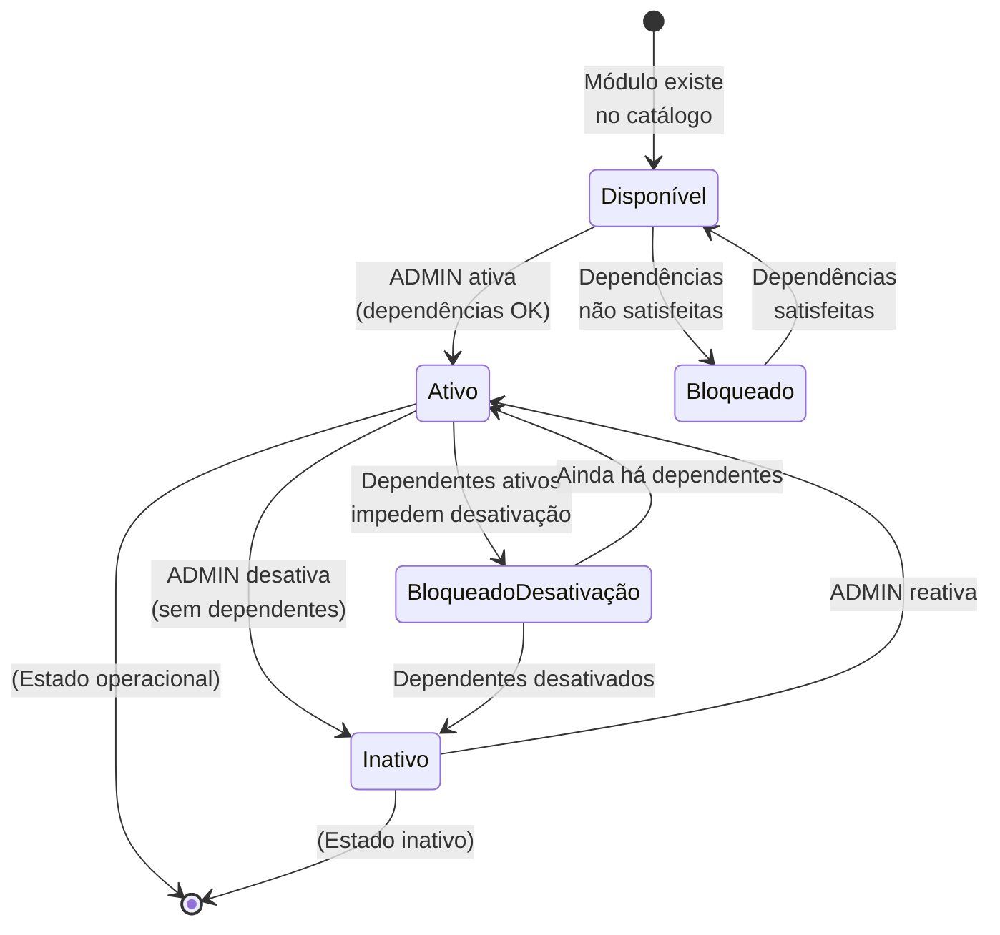
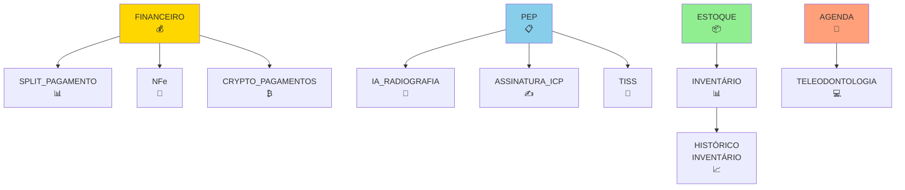

# Diagrama: Fluxo de Ativação de Módulos

**Tipo:** Sequence Diagram  
**Versão:** 4.0.0

---

## Visão Geral

Este diagrama mostra o fluxo completo de ativação/desativação de módulos no sistema, incluindo verificação de dependências e atualização da interface.

---

## Diagrama de Sequência



---

## Fluxo de Verificação de Dependências



---

## Fluxo de Desativação com Bloqueio

```mermaid
graph TD
    A[Tentar Desativar Módulo Y] --> B{Verificar<br/>Dependentes}
    
    B -->|Nenhum ativo| C[Desativar Imediatamente]
    B -->|Tem dependentes| D{Algum<br/>dependente<br/>ativo?}
    
    D -->|Não| C
    D -->|Sim| E[❌ Erro 412<br/>Listar dependentes ativos]
    
    C --> F[UPDATE clinic_modules<br/>SET is_active = false]
    F --> G[INSERT audit_logs]
    G --> H[✅ Sucesso]
    
    E --> I[Exibir Toast<br/>"Desative X, Y, Z primeiro"]
    
    style C fill:#90EE90
    style E fill:#FFB6C1
    style H fill:#90EE90
```

---

## Ativação em Cascata (BFS)

```mermaid
graph LR
    A[Ativar Módulo RAIZ] --> B[Verificar Dependências]
    B --> C{Dependências<br/>inativas?}
    
    C -->|Sim| D[Ativar dependências<br/>automaticamente<br/>BFS]
    C -->|Não| E[Ativar apenas RAIZ]
    
    D --> F[Queue: [DEP1, DEP2]]
    F --> G[Processar DEP1]
    G --> H{DEP1 tem<br/>dependências?}
    
    H -->|Sim| I[Adicionar à Queue]
    H -->|Não| J[Ativar DEP1]
    
    I --> F
    J --> K[Processar DEP2]
    K --> L[Ativar DEP2]
    L --> E
    
    E --> M[✅ Módulo + Dependências<br/>Ativados]
    
    style D fill:#87CEEB
    style M fill:#90EE90
```

---

## Atualização da Sidebar

```mermaid
graph TD
    A[Módulo Ativado/Desativado] --> B[AuthContext.invalidateCache]
    
    B --> C[Fetch active modules<br/>FROM Supabase]
    C --> D[Update activeModules state]
    
    D --> E[Notify Sidebar Component]
    E --> F[Sidebar re-renders]
    
    F --> G{hasModuleAccess<br/>'FINANCEIRO'?}
    
    G -->|Sim| H[Exibir item<br/>"Financeiro" no menu]
    G -->|Não| I[Ocultar item<br/>do menu]
    
    H --> J[Sidebar atualizado<br/>em tempo real]
    I --> J
    
    style J fill:#90EE90
```

---

## Estados de Módulo



---

## Exemplo Prático: Ativar Módulo NFe

### Cenário:
- Administrador quer ativar módulo **NFe**
- **NFe** depende de **FINANCEIRO**
- **FINANCEIRO** está **inativo**

### Fluxo:

```
1️⃣ Admin clica "Ativar NFe"
   ↓
2️⃣ Edge Function verifica dependências
   → NFe requer FINANCEIRO
   ↓
3️⃣ Verifica se FINANCEIRO está ativo
   → Resultado: NÃO (is_active = false)
   ↓
4️⃣ Edge Function retorna erro 412
   {
     "error": "Dependências não satisfeitas",
     "required_modules": ["FINANCEIRO"]
   }
   ↓
5️⃣ UI exibe toast:
   "❌ Para ativar NFe, ative primeiro: FINANCEIRO"
   ↓
6️⃣ Admin clica "Ativar FINANCEIRO"
   ↓
7️⃣ FINANCEIRO ativado (sem dependências)
   ✅ is_active = true
   ↓
8️⃣ Admin clica novamente "Ativar NFe"
   ↓
9️⃣ Dependências OK, NFe ativado
   ✅ is_active = true
   ↓
🔟 Sidebar atualiza: "NFe" aparece no menu
```

---

## Exemplo Prático: Desativar Módulo FINANCEIRO

### Cenário:
- Administrador quer desativar **FINANCEIRO**
- **NFe** e **SPLIT_PAGAMENTO** dependem de **FINANCEIRO**
- Ambos estão **ativos**

### Fluxo:

```
1️⃣ Admin clica "Desativar FINANCEIRO"
   ↓
2️⃣ Edge Function busca módulos dependentes
   → Encontra: NFe (ativo), SPLIT_PAGAMENTO (ativo)
   ↓
3️⃣ Edge Function retorna erro 412
   {
     "error": "Módulos dependentes ativos",
     "blocking_modules": ["NFe", "SPLIT_PAGAMENTO"]
   }
   ↓
4️⃣ UI exibe toast:
   "❌ Desative primeiro: NFe, SPLIT_PAGAMENTO"
   ↓
5️⃣ Admin desativa NFe
   ✅ NFe inativo
   ↓
6️⃣ Admin desativa SPLIT_PAGAMENTO
   ✅ SPLIT_PAGAMENTO inativo
   ↓
7️⃣ Admin clica novamente "Desativar FINANCEIRO"
   ↓
8️⃣ Sem dependentes ativos, FINANCEIRO desativado
   ✅ is_active = false
   ↓
9️⃣ Sidebar atualiza: "Financeiro" desaparece do menu
```

---

## Grafo de Dependências (Exemplo)



**Legenda:**
- 🟡 **Amarelo:** Módulos Financeiros
- 🔵 **Azul:** Módulos Clínicos
- 🟢 **Verde:** Módulos de Gestão
- 🟠 **Laranja:** Módulos de Operação

---

## Referências

- [Guia Técnico: Backend Supabase](../GUIAS-TECNICO/02-BACKEND-SUPABASE.md)
- [Guia Técnico: Edge Functions](../GUIAS-TECNICO/03-EDGE-FUNCTIONS.md)
- [Tutorial: Como Ativar Módulos](../TUTORIAIS/01-COMO-ATIVAR-MODULOS.md)

---

**Última atualização:** 2025-11-17
