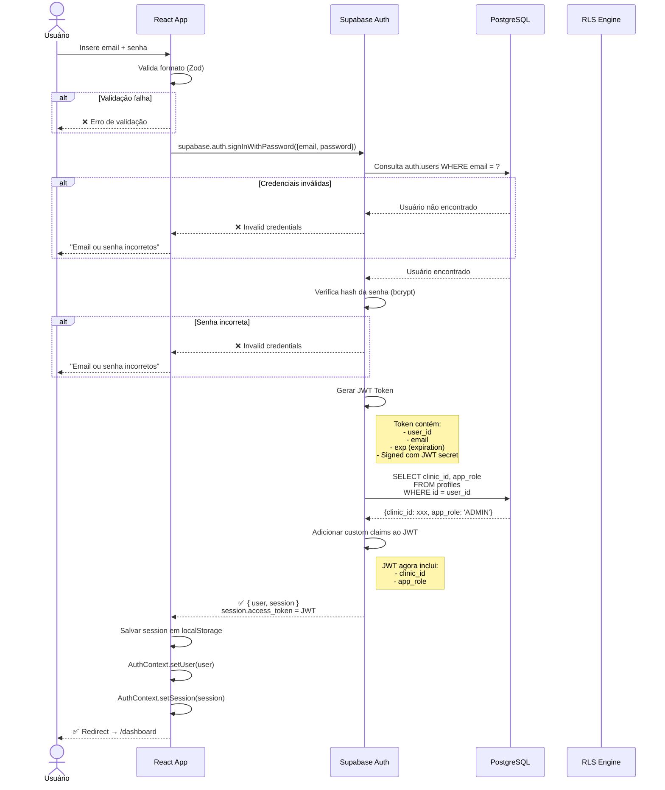
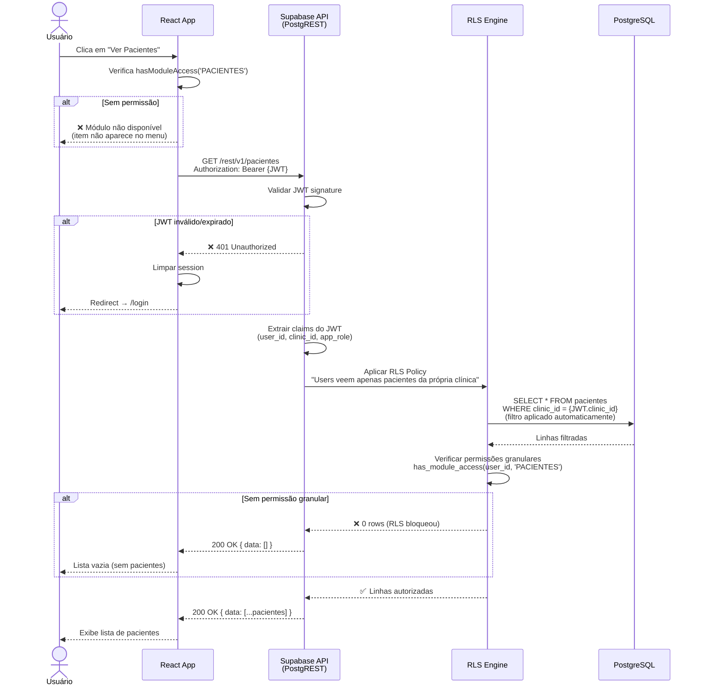
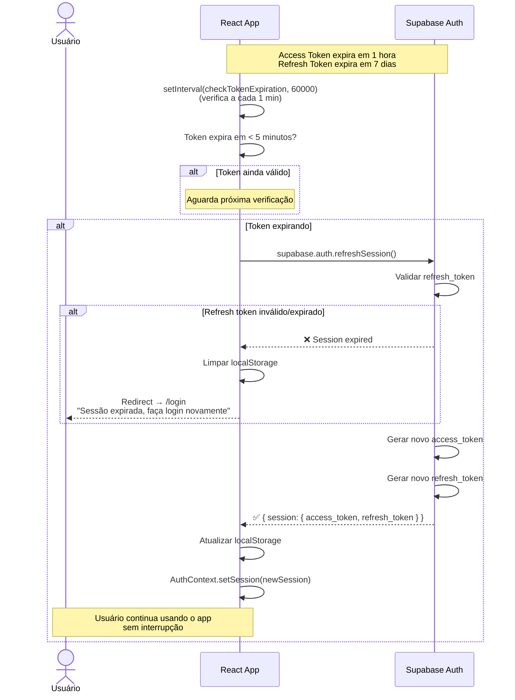
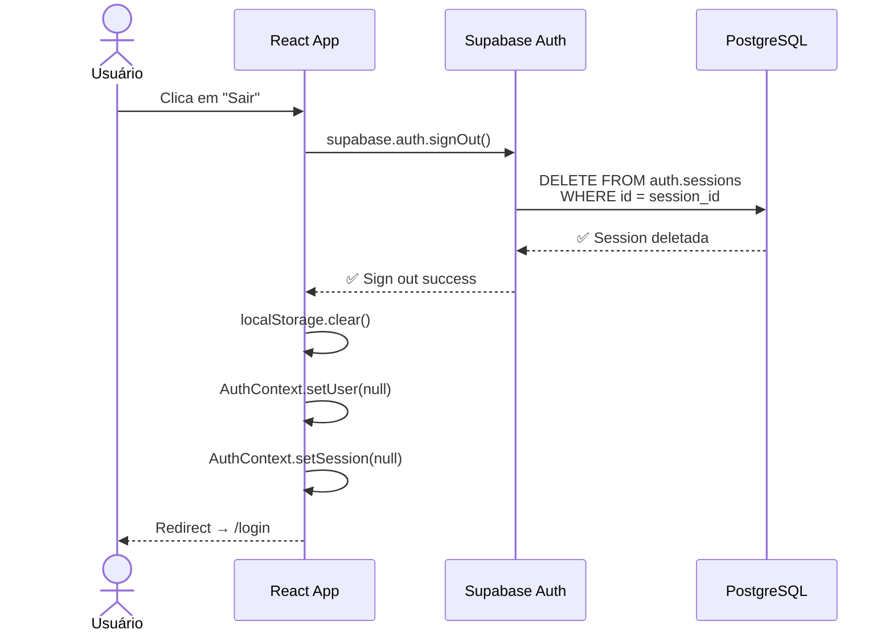
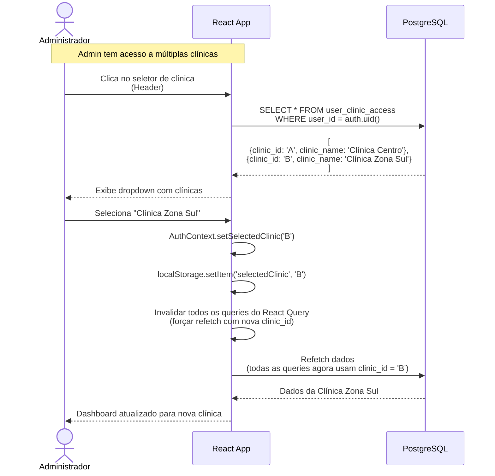
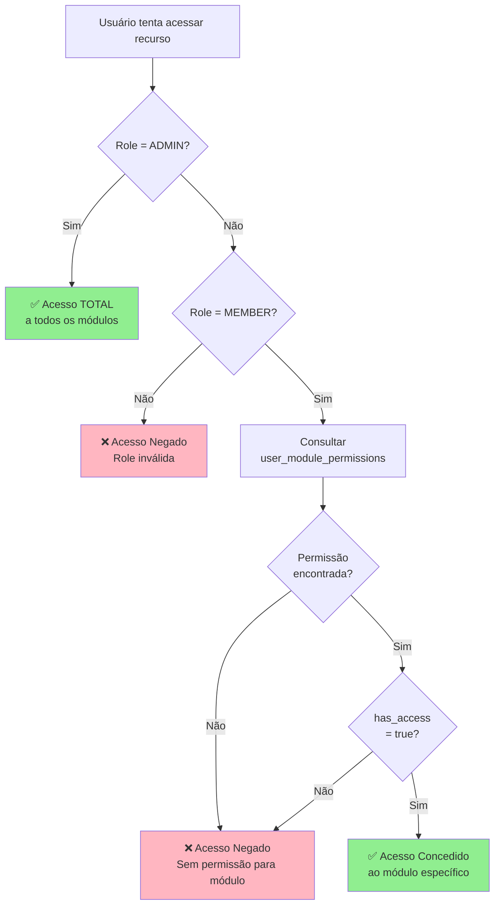

# Diagrama: Fluxo de Autenticação Completo

**Tipo:** Sequence Diagram  
**Versão:** 4.0.0

---

## Visão Geral

Este diagrama detalha o fluxo completo de autenticação no Ortho+, desde o login até a autorização de acesso a recursos, incluindo JWT tokens, RLS policies e permissões granulares.

---

## Fluxo de Login (Email/Senha)



---

## Fluxo de Autorização (Acesso a Recursos)



---

## Fluxo de Refresh Token



---

## Fluxo de Logout



---

## Fluxo de Troca de Clínica (Multi-Clinic)



---

## Verificação de Permissões Granulares



---

## Anatomia do JWT Token

```json
{
  "header": {
    "alg": "HS256",
    "typ": "JWT"
  },
  "payload": {
    "aud": "authenticated",
    "exp": 1705507200,
    "iat": 1705503600,
    "iss": "https://yxpoqjyfgotkytwtifau.supabase.co/auth/v1",
    "sub": "a1b2c3d4-e5f6-7890-abcd-ef1234567890",
    "email": "admin@clinica.com.br",
    "phone": "",
    "app_metadata": {
      "provider": "email",
      "providers": ["email"]
    },
    "user_metadata": {
      "clinic_id": "c7d8e9f0-1234-5678-90ab-cdef12345678",
      "app_role": "ADMIN",
      "full_name": "Dr. Carlos Silva"
    },
    "role": "authenticated",
    "aal": "aal1",
    "amr": [
      {
        "method": "password",
        "timestamp": 1705503600
      }
    ],
    "session_id": "s1s2s3s4-s5s6-s7s8-s9s0-sabcdef12345"
  },
  "signature": "HMACSHA256(base64UrlEncode(header) + '.' + base64UrlEncode(payload), secret)"
}
```

**Como usar no frontend:**
```typescript
const { data: { user, session } } = await supabase.auth.getUser();

const clinicId = session?.user?.user_metadata?.clinic_id;
const appRole = session?.user?.user_metadata?.app_role;

if (appRole === 'ADMIN') {
  // Usuário é admin
}
```

---

## Security Best Practices

### 1. Nunca Expor JWT Secret

❌ **ERRADO:**
```javascript
const JWT_SECRET = "my-secret-key"; // Hardcoded
```

✅ **CORRETO:**
```javascript
const JWT_SECRET = Deno.env.get('SUPABASE_JWT_SECRET');
```

### 2. Sempre Validar Token no Backend

❌ **ERRADO:**
```typescript
// Confiar apenas no frontend
if (user.role === 'ADMIN') {
  deletePatient(); // Sem validação backend
}
```

✅ **CORRETO:**
```typescript
// RLS policy valida automaticamente
CREATE POLICY "Only admins can delete" ON pacientes
FOR DELETE
USING (has_role(auth.uid(), 'ADMIN'));
```

### 3. Refresh Token Rotation

```typescript
// Supabase faz automaticamente
supabase.auth.onAuthStateChange((event, session) => {
  if (event === 'TOKEN_REFRESHED') {
    console.log('Token refreshed:', session);
    // Novo access_token e refresh_token
  }
});
```

### 4. Logout em Todos os Dispositivos

```typescript
// Invalidar todas as sessões do usuário
const { error } = await supabase.auth.admin.deleteUser(userId);

// Ou apenas a sessão atual
await supabase.auth.signOut({ scope: 'local' });

// Ou todas as sessões
await supabase.auth.signOut({ scope: 'global' });
```

---

## Tratamento de Erros Comuns

### 1. JWT Expired

```typescript
supabase.auth.onAuthStateChange((event, session) => {
  if (event === 'SIGNED_OUT') {
    // Token expirou, redirecionar para login
    window.location.href = '/login';
  }
});
```

### 2. Invalid Signature

```typescript
try {
  const { data, error } = await supabase.from('pacientes').select();
  
  if (error && error.code === 'PGRST301') {
    // JWT signature inválida
    await supabase.auth.signOut();
    window.location.href = '/login';
  }
} catch (err) {
  console.error('Auth error:', err);
}
```

### 3. Permission Denied

```typescript
const { data, error } = await supabase.from('pacientes').insert(newPatient);

if (error && error.code === '42501') {
  // Insufficient privileges (RLS blocked)
  toast.error('Você não tem permissão para criar pacientes');
}
```

---

## Monitoramento de Autenticação

### Logs de Autenticação

**Supabase Dashboard → Authentication → Logs**

Eventos rastreados:
- `user_signedup`: Novo cadastro
- `user_signedin`: Login bem-sucedido
- `user_signedout`: Logout
- `token_refreshed`: Token renovado
- `user_deleted`: Usuário deletado

### Audit Trail Custom

```sql
-- Tabela de auditoria customizada
CREATE TABLE auth_audit_log (
  id BIGSERIAL PRIMARY KEY,
  user_id UUID REFERENCES auth.users(id),
  event TEXT NOT NULL,
  ip_address INET,
  user_agent TEXT,
  created_at TIMESTAMPTZ DEFAULT NOW()
);

-- Trigger para registrar logins
CREATE FUNCTION log_user_login()
RETURNS TRIGGER AS $$
BEGIN
  INSERT INTO auth_audit_log (user_id, event, ip_address)
  VALUES (
    NEW.id,
    'LOGIN',
    inet_client_addr()
  );
  RETURN NEW;
END;
$$ LANGUAGE plpgsql SECURITY DEFINER;

CREATE TRIGGER on_user_login
AFTER UPDATE OF last_sign_in_at ON auth.users
FOR EACH ROW
EXECUTE FUNCTION log_user_login();
```

---

## Teste de Autenticação

### Teste Unitário (Vitest)

```typescript
import { describe, it, expect } from 'vitest';
import { supabase } from '@/integrations/supabase/client';

describe('Authentication', () => {
  it('should login with valid credentials', async () => {
    const { data, error } = await supabase.auth.signInWithPassword({
      email: 'test@example.com',
      password: 'Test123!@#'
    });
    
    expect(error).toBeNull();
    expect(data.user).toBeDefined();
    expect(data.session).toBeDefined();
  });
  
  it('should reject invalid credentials', async () => {
    const { error } = await supabase.auth.signInWithPassword({
      email: 'test@example.com',
      password: 'wrong-password'
    });
    
    expect(error).toBeDefined();
    expect(error?.message).toContain('Invalid');
  });
});
```

### Teste E2E (Playwright)

```typescript
import { test, expect } from '@playwright/test';

test('login flow', async ({ page }) => {
  await page.goto('/login');
  
  await page.fill('[name="email"]', 'admin@clinica.com');
  await page.fill('[name="password"]', 'Admin123!');
  await page.click('button[type="submit"]');
  
  await expect(page).toHaveURL('/dashboard');
  await expect(page.locator('text=Bem-vindo')).toBeVisible();
});

test('logout flow', async ({ page }) => {
  // Login primeiro
  await page.goto('/login');
  await page.fill('[name="email"]', 'admin@clinica.com');
  await page.fill('[name="password"]', 'Admin123!');
  await page.click('button[type="submit"]');
  
  // Logout
  await page.click('[data-testid="user-menu"]');
  await page.click('text=Sair');
  
  await expect(page).toHaveURL('/login');
});
```

---

## Referências

- [Supabase Auth Documentation](https://supabase.com/docs/guides/auth)
- [JWT.io - JWT Debugger](https://jwt.io/)
- [OWASP Authentication Cheat Sheet](https://cheatsheetseries.owasp.org/cheatsheets/Authentication_Cheat_Sheet.html)
- [Guia Técnico: RLS Policies](../GUIAS-TECNICO/05-RLS-POLICIES.md)

---

**Última atualização:** 2025-11-17
