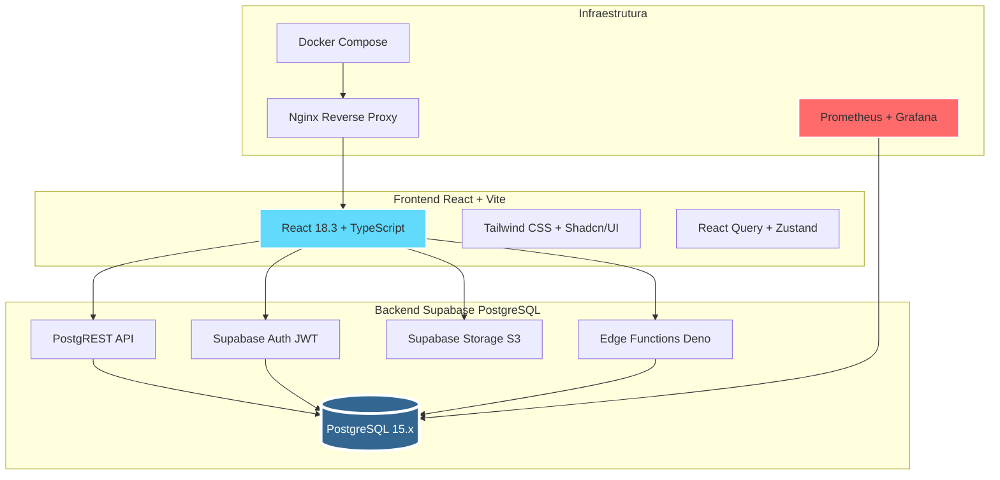
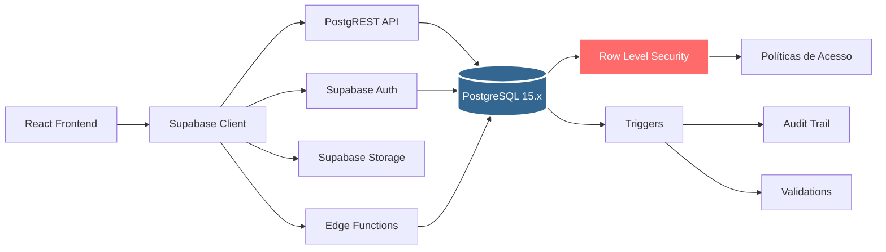
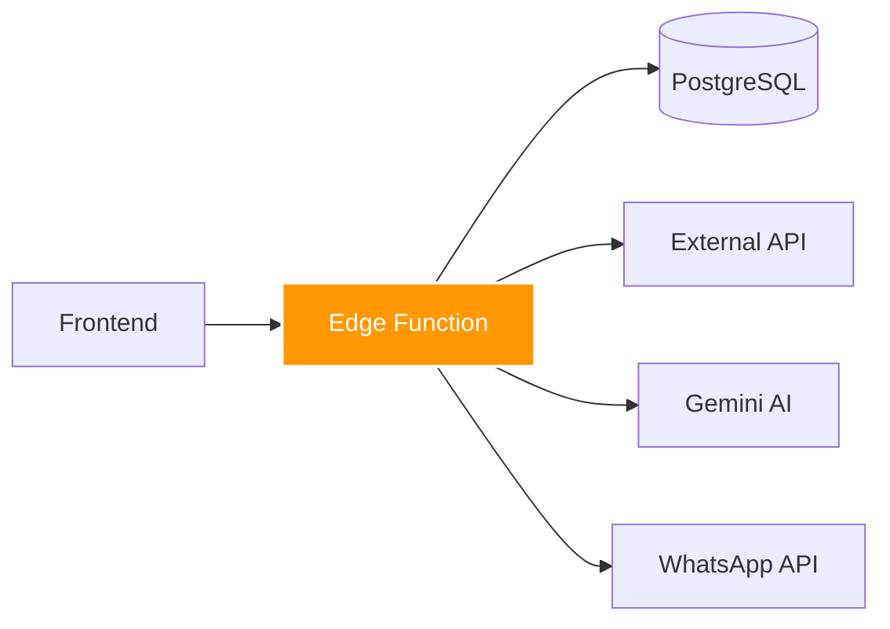
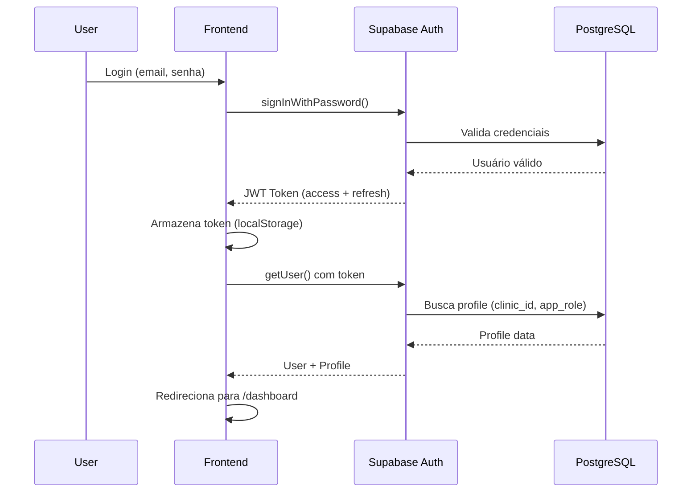
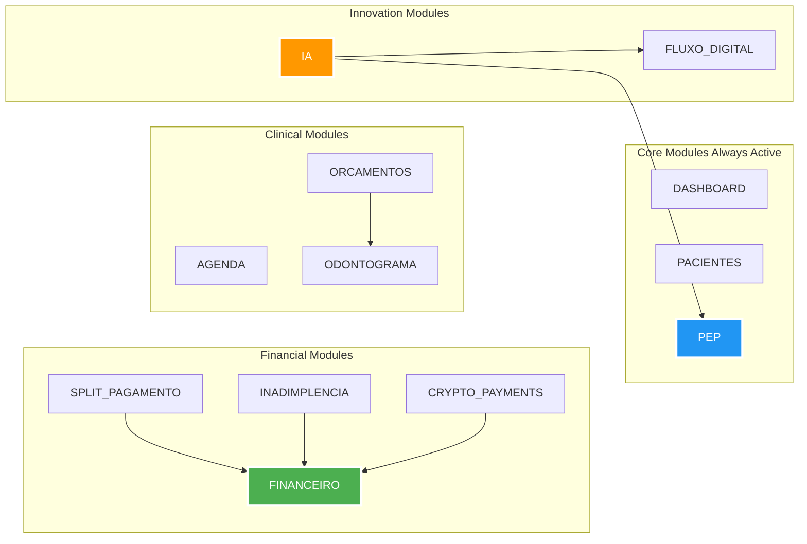
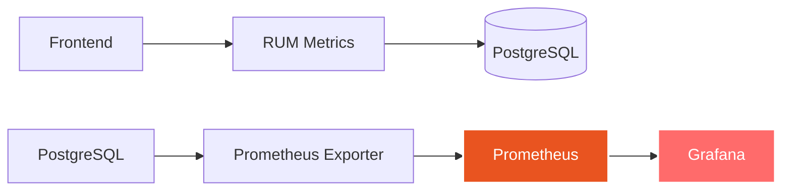

# 🏗️ Arquitetura Geral do Ortho+ SaaS

> Visão completa da arquitetura técnica do sistema

---

## 🎯 Visão Geral

O **Ortho+ SaaS** é um sistema B2B multitenant de gestão odontológica construído com:

- **Frontend**: React 18.3 + Vite + TypeScript
- **Backend**: **PostgreSQL 15.x no Supabase** (100% serverless)
- **Infraestrutura**: Docker Compose + Nginx + Prometheus + Grafana



---

## 🗄️ Backend: PostgreSQL no Supabase

### Por que PostgreSQL?

O Ortho+ **roda 100% em PostgreSQL 15.x** hospedado no Supabase. Isso oferece:

✅ **Banco de dados relacional** robusto e escalável  
✅ **Row Level Security (RLS)** para segurança por linha  
✅ **Triggers, functions e policies** em SQL nativo  
✅ **Auto-scaling gerenciado** pelo Supabase  
✅ **Backups automáticos diários**  
✅ **PostgREST API** gerada automaticamente  
✅ **Realtime subscriptions** via WebSockets  
✅ **Storage integrado** para arquivos (radiografias, PEP)  

### Arquitetura Detalhada



### Tabelas Principais

#### Multitenancy (Isolamento de Dados)

```sql
-- Tenant (Clínica)
CREATE TABLE public.clinics (
  id UUID PRIMARY KEY DEFAULT gen_random_uuid(),
  name TEXT NOT NULL,
  created_at TIMESTAMPTZ DEFAULT now()
);

-- Usuários (RBAC - Role-Based Access Control)
CREATE TABLE public.profiles (
  id UUID PRIMARY KEY REFERENCES auth.users(id),
  clinic_id UUID REFERENCES clinics(id),
  app_role TEXT NOT NULL DEFAULT 'MEMBER', -- 'ADMIN' | 'MEMBER'
  display_name TEXT,
  avatar_url TEXT
);
```

#### Core Tables (Atendimento Clínico)

```sql
-- Pacientes
CREATE TABLE public.patients (
  id UUID PRIMARY KEY,
  clinic_id UUID REFERENCES clinics(id),
  nome TEXT NOT NULL,
  cpf TEXT UNIQUE,
  data_nascimento DATE,
  risco_cirurgico TEXT, -- 'BAIXO' | 'MEDIO' | 'ALTO'
  created_at TIMESTAMPTZ DEFAULT now()
);

-- Prontuários (PEP)
CREATE TABLE public.prontuarios (
  id UUID PRIMARY KEY,
  clinic_id UUID REFERENCES clinics(id),
  patient_id UUID REFERENCES patients(id),
  numero TEXT UNIQUE,
  anamnese JSONB,
  created_at TIMESTAMPTZ DEFAULT now()
);

-- Agendamentos
CREATE TABLE public.appointments (
  id UUID PRIMARY KEY,
  clinic_id UUID REFERENCES clinics(id),
  patient_id UUID REFERENCES patients(id),
  dentist_id UUID REFERENCES profiles(id),
  start_time TIMESTAMPTZ NOT NULL,
  end_time TIMESTAMPTZ NOT NULL,
  status TEXT, -- 'AGENDADO' | 'CONFIRMADO' | 'CONCLUIDO' | 'CANCELADO'
  created_at TIMESTAMPTZ DEFAULT now()
);
```

### Row Level Security (RLS)

**RLS é o firewall do banco de dados**. Cada query SQL é automaticamente filtrada.

#### Exemplo: Isolamento por Clínica

```sql
-- Habilitar RLS
ALTER TABLE public.patients ENABLE ROW LEVEL SECURITY;

-- Política: Usuários só veem pacientes da sua clínica
CREATE POLICY "users_see_own_clinic_patients"
  ON public.patients
  FOR SELECT
  USING (clinic_id = (SELECT clinic_id FROM public.profiles WHERE id = auth.uid()));

-- Política: Apenas ADMIN pode deletar pacientes
CREATE POLICY "only_admin_can_delete_patients"
  ON public.patients
  FOR DELETE
  USING (
    clinic_id = (SELECT clinic_id FROM public.profiles WHERE id = auth.uid())
    AND
    EXISTS (SELECT 1 FROM public.profiles WHERE id = auth.uid() AND app_role = 'ADMIN')
  );
```

#### Exemplo Prático em TypeScript

```typescript
// ❌ SEM RLS (PERIGOSO - qualquer usuário vê todos os pacientes)
const { data } = await supabase.from('patients').select('*');

// ✅ COM RLS (SEGURO - usuário só vê pacientes da sua clínica)
const { data } = await supabase.from('patients').select('*');
// RLS automaticamente adiciona: WHERE clinic_id = current_user.clinic_id
```

---

## 🎨 Frontend: React 18.3 + Vite

### Stack Frontend

```
React 18.3 (Concurrent Features)
    ↓
TypeScript 5.x (Type Safety)
    ↓
Vite 5.x (Build Tool - Hot Module Replacement)
    ↓
Tailwind CSS 3.x (Utility-First CSS)
    ↓
Shadcn/UI (Component Library)
    ↓
React Query 5.x (Server State)
    ↓
Zustand (Client State)
    ↓
React Router v6 (Routing)
```

### Arquitetura de Pastas

```
src/
├── components/          # Componentes reutilizáveis
│   ├── ui/             # Componentes Shadcn/UI
│   ├── layout/         # Layout (Sidebar, Header)
│   └── modules/        # Componentes específicos de módulos
│
├── pages/              # Páginas (rotas)
│   ├── Dashboard.tsx
│   ├── Pacientes.tsx
│   ├── PEP.tsx
│   └── ...
│
├── hooks/              # Custom hooks
│   ├── usePacientes.ts
│   ├── useAgendamentos.ts
│   └── ...
│
├── domain/             # Domain-Driven Design
│   ├── entities/       # Entidades de domínio
│   ├── repositories/   # Interfaces de repositórios
│   └── use-cases/      # Casos de uso (lógica de negócio)
│
├── infrastructure/     # Implementações de infraestrutura
│   └── repositories/   # Repositórios Supabase
│
├── lib/                # Utilitários
│   ├── supabase.ts     # Cliente Supabase
│   └── utils.ts
│
└── integrations/       # Integrações externas
    └── supabase/       # Types auto-gerados
```

### Data Fetching (React Query)

```typescript
// hooks/usePacientes.ts
import { useQuery } from '@tanstack/react-query';
import { supabase } from '@/integrations/supabase/client';

export const usePacientes = () => {
  return useQuery({
    queryKey: ['patients'],
    queryFn: async () => {
      const { data, error } = await supabase
        .from('patients')
        .select('*')
        .order('created_at', { ascending: false });
      
      if (error) throw error;
      return data;
    },
    staleTime: 5 * 60 * 1000, // 5 minutos
    gcTime: 10 * 60 * 1000,    // 10 minutos
  });
};

// components/PacientesList.tsx
import { usePacientes } from '@/hooks/usePacientes';

export const PacientesList = () => {
  const { data: patients, isLoading, error } = usePacientes();
  
  if (isLoading) return <LoadingSpinner />;
  if (error) return <ErrorAlert message={error.message} />;
  
  return (
    <Table>
      {patients?.map(patient => (
        <TableRow key={patient.id}>
          <TableCell>{patient.nome}</TableCell>
          <TableCell>{patient.cpf}</TableCell>
        </TableRow>
      ))}
    </Table>
  );
};
```

---

## ⚡ Edge Functions (Serverless Deno)

### O que são Edge Functions?

Edge Functions são **funções serverless** que rodam no **Deno runtime** (alternativa ao Node.js).

**Casos de uso:**
- 🔒 Lógica de negócio sensível (não expor no frontend)
- 🔗 Integração com APIs externas (WhatsApp, Stripe, Bitcoin)
- 📧 Envio de emails transacionais
- 🤖 Processamento de IA (Gemini Vision)
- 📊 Cálculos complexos (risco cirúrgico, split de pagamento)

### Arquitetura



### Exemplo: `get-my-modules` (Sistema Modular)

```typescript
// supabase/functions/get-my-modules/index.ts
import { createClient } from '@supabase/supabase-js';

Deno.serve(async (req) => {
  const supabase = createClient(
    Deno.env.get('SUPABASE_URL')!,
    Deno.env.get('SUPABASE_SERVICE_ROLE_KEY')!
  );

  // 1. Buscar módulos contratados pela clínica
  const { data: clinicModules } = await supabase
    .from('clinic_modules')
    .select(`
      *,
      module_catalog (*)
    `)
    .eq('clinic_id', clinicId);

  // 2. Buscar dependências de módulos
  const { data: dependencies } = await supabase
    .from('module_dependencies')
    .select('*');

  // 3. Calcular can_activate e can_deactivate para cada módulo
  const modulesWithMetadata = clinicModules.map(module => ({
    ...module,
    can_activate: checkDependencies(module, activeModules, dependencies),
    can_deactivate: checkNoDependents(module, activeModules, dependencies),
  }));

  return new Response(JSON.stringify(modulesWithMetadata), {
    headers: { 'Content-Type': 'application/json' },
  });
});
```

---

## 🔐 Autenticação e Autorização

### Fluxo de Autenticação



### JWT Token Structure

```json
{
  "sub": "550e8400-e29b-41d4-a716-446655440000",
  "email": "dentista@clinica.com.br",
  "role": "authenticated",
  "clinic_id": "123e4567-e89b-12d3-a456-426614174000",
  "app_role": "ADMIN",
  "iat": 1700000000,
  "exp": 1700003600
}
```

### RBAC (Role-Based Access Control)

```typescript
// AuthProvider.tsx
const hasModuleAccess = (moduleKey: string) => {
  const { activeModules } = useAuth();
  return activeModules.includes(moduleKey);
};

// Sidebar.tsx
{hasModuleAccess('FINANCEIRO') && (
  <NavLink to="/financeiro">Financeiro</NavLink>
)}

// Protected Route
<Route path="/financeiro" element={
  <ProtectedRoute requiredModule="FINANCEIRO">
    <FinanceiroPage />
  </ProtectedRoute>
} />
```

---

## 📦 Sistema Modular Plug-and-Play

### Arquitetura de Módulos

O Ortho+ implementa um **sistema modular** onde cada funcionalidade é um **módulo** que pode ser **ativado/desativado** dinamicamente.



### Dependências de Módulos

```sql
-- Tabela de Catálogo de Módulos
CREATE TABLE module_catalog (
  id SERIAL PRIMARY KEY,
  module_key TEXT UNIQUE NOT NULL,
  name TEXT NOT NULL,
  description TEXT,
  category TEXT,
  icon TEXT
);

-- Tabela de Dependências
CREATE TABLE module_dependencies (
  id SERIAL PRIMARY KEY,
  module_id INT REFERENCES module_catalog(id),
  depends_on_module_id INT REFERENCES module_catalog(id),
  UNIQUE (module_id, depends_on_module_id)
);

-- Módulos Contratados pela Clínica
CREATE TABLE clinic_modules (
  id SERIAL PRIMARY KEY,
  clinic_id UUID REFERENCES clinics(id),
  module_catalog_id INT REFERENCES module_catalog(id),
  is_active BOOLEAN DEFAULT true,
  subscribed_at TIMESTAMPTZ DEFAULT now(),
  UNIQUE (clinic_id, module_catalog_id)
);
```

### Regras de Ativação

1. **Antes de Ativar**: Verificar se todas as dependências estão ativas
2. **Antes de Desativar**: Verificar se nenhum outro módulo ativo depende dele
3. **Edge Function `toggleModuleState`** implementa a lógica

Veja detalhes em: [05-MODULOS-DEPENDENCIAS](./05-MODULOS-DEPENDENCIAS.md)

---

## 🚀 Performance e Otimizações

### Métricas Alvo (Web Vitals)

| Métrica | Alvo | Valor Atual |
|---------|------|-------------|
| **LCP** (Largest Contentful Paint) | < 2.5s | **1.8s** ✅ |
| **FID** (First Input Delay) | < 100ms | **45ms** ✅ |
| **CLS** (Cumulative Layout Shift) | < 0.1 | **0.05** ✅ |
| **Lighthouse Score** | > 90 | **94** ✅ |

### Otimizações Implementadas

#### 1. Lazy Loading de Componentes

```typescript
// App.tsx
const Dashboard = lazy(() => import('@/pages/Dashboard'));
const PEP = lazy(() => import('@/pages/PEP'));

<Route path="/dashboard" element={
  <Suspense fallback={<LoadingSpinner />}>
    <Dashboard />
  </Suspense>
} />
```

#### 2. Code Splitting Automático (Vite)

```
dist/
├── index.html
├── assets/
│   ├── index-abc123.js       # 45 KB (main bundle)
│   ├── Dashboard-def456.js   # 12 KB
│   ├── PEP-ghi789.js         # 18 KB
│   └── ...
```

#### 3. React Query Cache

```typescript
staleTime: 5 * 60 * 1000,   // 5min - dados considerados frescos
gcTime: 10 * 60 * 1000,      // 10min - garbage collection
refetchOnWindowFocus: false  // Não revalidar ao focar janela
```

#### 4. Virtual Scrolling (React Window)

```typescript
import { FixedSizeList } from 'react-window';

<FixedSizeList
  height={600}
  itemCount={1000}
  itemSize={50}
  width="100%"
>
  {({ index, style }) => (
    <div style={style}>{patients[index].nome}</div>
  )}
</FixedSizeList>
```

#### 5. Índices PostgreSQL

```sql
CREATE INDEX idx_patients_clinic_id ON patients(clinic_id);
CREATE INDEX idx_prontuarios_patient_id ON prontuarios(patient_id);
CREATE INDEX idx_appointments_start_time ON appointments(start_time);
```

---

## 📊 Monitoramento e Observabilidade

### Stack de Monitoramento



### Dashboards Grafana

1. **PostgreSQL Performance**
   - Query latency
   - Connections pool
   - Slow queries

2. **Application Metrics**
   - LCP, FID, CLS
   - API response times
   - Error rates

3. **Business Metrics**
   - Usuários ativos
   - Agendamentos criados
   - Faturamento

---

## 📚 Documentação Relacionada

- **[02-BACKEND-SUPABASE](./02-BACKEND-SUPABASE.md)** - Detalhes do PostgreSQL
- **[03-EDGE-FUNCTIONS](./03-EDGE-FUNCTIONS.md)** - Funções serverless
- **[04-AUTENTICACAO-RLS](./04-AUTENTICACAO-RLS.md)** - Auth + RLS
- **[05-MODULOS-DEPENDENCIAS](./05-MODULOS-DEPENDENCIAS.md)** - Sistema modular
- **[06-PERFORMANCE](./06-PERFORMANCE.md)** - Otimizações e métricas

---

**Última atualização:** 15/Novembro/2025  
**Versão:** v4.0.0
