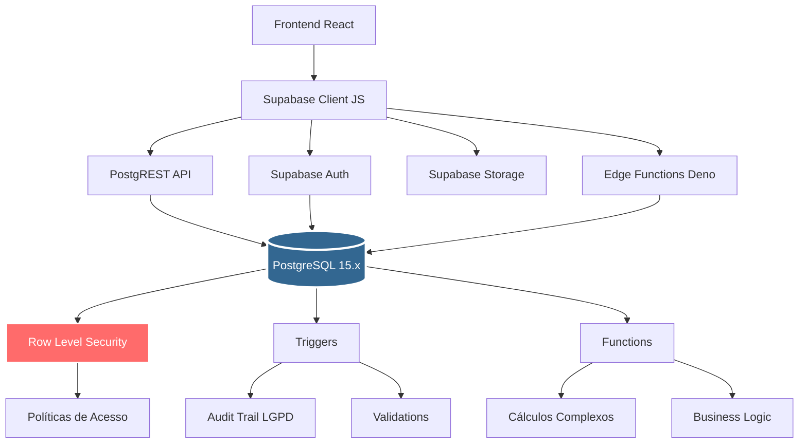
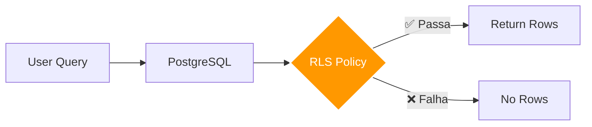

# 🗄️ Backend: PostgreSQL no Supabase

> Documentação técnica completa do backend

---

## 🎯 Visão Geral

O **Ortho+ SaaS** utiliza **PostgreSQL 15.x hospedado no Supabase** como backend principal.

### Por que PostgreSQL + Supabase?

✅ **PostgreSQL 15.x**: Banco de dados relacional robusto, open-source  
✅ **Row Level Security (RLS)**: Segurança por linha nativa do PostgreSQL  
✅ **PostgREST**: API REST gerada automaticamente a partir do schema  
✅ **Supabase Auth**: JWT authentication integrado  
✅ **Supabase Storage**: S3-compatible file storage  
✅ **Realtime**: WebSocket subscriptions para dados em tempo real  
✅ **Auto-scaling**: Gerenciado pelo Supabase  
✅ **Backups automáticos**: Diários + point-in-time recovery  

---

## 🏗️ Arquitetura do Backend



---

## 📊 Schema do Banco de Dados

### Multitenancy (Isolamento de Dados)

O sistema é **multitenant**, onde cada clínica é um **tenant** isolado.

```sql
-- Tenant (Clínica)
CREATE TABLE public.clinics (
  id UUID PRIMARY KEY DEFAULT gen_random_uuid(),
  name TEXT NOT NULL,
  cnpj TEXT UNIQUE,
  email TEXT,
  phone TEXT,
  address JSONB,
  settings JSONB DEFAULT '{}'::jsonb,
  created_at TIMESTAMPTZ DEFAULT now(),
  updated_at TIMESTAMPTZ DEFAULT now()
);

ALTER TABLE public.clinics ENABLE ROW LEVEL SECURITY;

-- Política: Usuários só veem sua própria clínica
CREATE POLICY "users_see_own_clinic"
  ON public.clinics FOR SELECT
  USING (id = (SELECT clinic_id FROM public.profiles WHERE id = auth.uid()));
```

### Usuários e RBAC (Role-Based Access Control)

```sql
-- Perfil do Usuário (complementa auth.users do Supabase)
CREATE TABLE public.profiles (
  id UUID PRIMARY KEY REFERENCES auth.users(id) ON DELETE CASCADE,
  clinic_id UUID REFERENCES clinics(id) ON DELETE CASCADE,
  app_role TEXT NOT NULL DEFAULT 'MEMBER', -- 'ADMIN' | 'MEMBER'
  display_name TEXT,
  avatar_url TEXT,
  cpf TEXT,
  cro TEXT, -- Registro CRO (dentistas)
  specialties TEXT[], -- Especialidades
  is_active BOOLEAN DEFAULT true,
  created_at TIMESTAMPTZ DEFAULT now(),
  updated_at TIMESTAMPTZ DEFAULT now()
);

ALTER TABLE public.profiles ENABLE ROW LEVEL SECURITY;

-- Política: Usuários veem perfis da mesma clínica
CREATE POLICY "users_see_same_clinic_profiles"
  ON public.profiles FOR SELECT
  USING (clinic_id = (SELECT clinic_id FROM public.profiles WHERE id = auth.uid()));

-- Política: Apenas ADMIN pode inserir novos usuários
CREATE POLICY "only_admin_can_insert_users"
  ON public.profiles FOR INSERT
  WITH CHECK (
    EXISTS (
      SELECT 1 FROM public.profiles
      WHERE id = auth.uid() AND app_role = 'ADMIN' AND clinic_id = clinic_id
    )
  );
```

### Core Tables (Atendimento Clínico)

#### Pacientes

```sql
CREATE TABLE public.patients (
  id UUID PRIMARY KEY DEFAULT gen_random_uuid(),
  clinic_id UUID NOT NULL REFERENCES clinics(id) ON DELETE CASCADE,
  nome TEXT NOT NULL,
  cpf TEXT,
  rg TEXT,
  data_nascimento DATE,
  sexo TEXT CHECK (sexo IN ('M', 'F', 'OUTRO')),
  email TEXT,
  telefone TEXT,
  celular TEXT,
  endereco JSONB,
  
  -- Ficha de Anamnese
  anamnese JSONB,
  risco_cirurgico TEXT CHECK (risco_cirurgico IN ('BAIXO', 'MEDIO', 'ALTO')),
  
  -- Convênio
  convenio_nome TEXT,
  convenio_numero TEXT,
  
  -- Metadata
  is_active BOOLEAN DEFAULT true,
  created_at TIMESTAMPTZ DEFAULT now(),
  updated_at TIMESTAMPTZ DEFAULT now(),
  created_by UUID REFERENCES auth.users(id),
  
  -- Constraints
  UNIQUE (clinic_id, cpf)
);

ALTER TABLE public.patients ENABLE ROW LEVEL SECURITY;

-- Política: Usuários veem pacientes da sua clínica
CREATE POLICY "users_see_own_clinic_patients"
  ON public.patients FOR SELECT
  USING (clinic_id = (SELECT clinic_id FROM public.profiles WHERE id = auth.uid()));

-- Política: Usuários podem inserir pacientes na sua clínica
CREATE POLICY "users_insert_patients_own_clinic"
  ON public.patients FOR INSERT
  WITH CHECK (clinic_id = (SELECT clinic_id FROM public.profiles WHERE id = auth.uid()));

-- Índices para performance
CREATE INDEX idx_patients_clinic_id ON patients(clinic_id);
CREATE INDEX idx_patients_cpf ON patients(cpf);
CREATE INDEX idx_patients_nome ON patients USING gin(to_tsvector('portuguese', nome));
```

#### Prontuários (PEP - Prontuário Eletrônico do Paciente)

```sql
CREATE TABLE public.prontuarios (
  id UUID PRIMARY KEY DEFAULT gen_random_uuid(),
  clinic_id UUID NOT NULL REFERENCES clinics(id) ON DELETE CASCADE,
  patient_id UUID NOT NULL REFERENCES patients(id) ON DELETE CASCADE,
  numero TEXT UNIQUE NOT NULL, -- Número sequencial por clínica
  
  -- Dados clínicos
  queixa_principal TEXT,
  historia_doenca_atual TEXT,
  exame_fisico JSONB,
  diagnostico TEXT,
  plano_tratamento JSONB,
  observacoes TEXT,
  
  -- Metadata
  is_active BOOLEAN DEFAULT true,
  created_at TIMESTAMPTZ DEFAULT now(),
  updated_at TIMESTAMPTZ DEFAULT now(),
  created_by UUID REFERENCES auth.users(id),
  
  UNIQUE (clinic_id, patient_id)
);

ALTER TABLE public.prontuarios ENABLE ROW LEVEL SECURITY;

-- Política: Usuários veem prontuários da sua clínica
CREATE POLICY "users_see_own_clinic_prontuarios"
  ON public.prontuarios FOR SELECT
  USING (clinic_id = (SELECT clinic_id FROM public.profiles WHERE id = auth.uid()));

-- Índices
CREATE INDEX idx_prontuarios_clinic_id ON prontuarios(clinic_id);
CREATE INDEX idx_prontuarios_patient_id ON prontuarios(patient_id);
```

#### Agendamentos

```sql
CREATE TABLE public.appointments (
  id UUID PRIMARY KEY DEFAULT gen_random_uuid(),
  clinic_id UUID NOT NULL REFERENCES clinics(id) ON DELETE CASCADE,
  patient_id UUID NOT NULL REFERENCES patients(id) ON DELETE CASCADE,
  dentist_id UUID NOT NULL REFERENCES profiles(id) ON DELETE RESTRICT,
  
  -- Horário
  start_time TIMESTAMPTZ NOT NULL,
  end_time TIMESTAMPTZ NOT NULL,
  
  -- Detalhes
  title TEXT NOT NULL,
  description TEXT,
  treatment_id UUID REFERENCES pep_tratamentos(id),
  
  -- Status
  status TEXT NOT NULL DEFAULT 'AGENDADO' CHECK (
    status IN ('AGENDADO', 'CONFIRMADO', 'EM_ATENDIMENTO', 'CONCLUIDO', 'CANCELADO', 'FALTOU')
  ),
  
  -- Metadata
  created_at TIMESTAMPTZ DEFAULT now(),
  updated_at TIMESTAMPTZ DEFAULT now(),
  created_by UUID REFERENCES auth.users(id),
  
  -- Constraints
  CHECK (end_time > start_time)
);

ALTER TABLE public.appointments ENABLE ROW LEVEL SECURITY;

-- Política: Usuários veem agendamentos da sua clínica
CREATE POLICY "users_see_own_clinic_appointments"
  ON public.appointments FOR SELECT
  USING (clinic_id = (SELECT clinic_id FROM public.profiles WHERE id = auth.uid()));

-- Índices
CREATE INDEX idx_appointments_clinic_id ON appointments(clinic_id);
CREATE INDEX idx_appointments_patient_id ON appointments(patient_id);
CREATE INDEX idx_appointments_dentist_id ON appointments(dentist_id);
CREATE INDEX idx_appointments_start_time ON appointments(start_time);
CREATE INDEX idx_appointments_status ON appointments(status);
```

---

## 🔐 Row Level Security (RLS)

### O que é RLS?

**Row Level Security (RLS)** é um recurso nativo do PostgreSQL que permite **filtrar automaticamente** as linhas retornadas em uma query baseado no **contexto do usuário**.

### Como funciona?



### Exemplo Prático

```typescript
// Frontend: Query simples (sem WHERE clause)
const { data } = await supabase
  .from('patients')
  .select('*');

// PostgreSQL executa (RLS adiciona filtro automático):
// SELECT * FROM patients WHERE clinic_id = current_user.clinic_id;
```

### Políticas Comuns

#### 1. SELECT (Leitura)

```sql
-- Usuários veem apenas dados da sua clínica
CREATE POLICY "users_see_own_clinic_data"
  ON <table_name> FOR SELECT
  USING (clinic_id = (SELECT clinic_id FROM public.profiles WHERE id = auth.uid()));
```

#### 2. INSERT (Criação)

```sql
-- Usuários só podem inserir dados na sua clínica
CREATE POLICY "users_insert_own_clinic_data"
  ON <table_name> FOR INSERT
  WITH CHECK (clinic_id = (SELECT clinic_id FROM public.profiles WHERE id = auth.uid()));
```

#### 3. UPDATE (Atualização)

```sql
-- Usuários só podem atualizar dados da sua clínica
CREATE POLICY "users_update_own_clinic_data"
  ON <table_name> FOR UPDATE
  USING (clinic_id = (SELECT clinic_id FROM public.profiles WHERE id = auth.uid()));
```

#### 4. DELETE (Exclusão) - Apenas ADMIN

```sql
-- Apenas ADMIN pode deletar
CREATE POLICY "only_admin_can_delete"
  ON <table_name> FOR DELETE
  USING (
    clinic_id = (SELECT clinic_id FROM public.profiles WHERE id = auth.uid())
    AND
    EXISTS (SELECT 1 FROM public.profiles WHERE id = auth.uid() AND app_role = 'ADMIN')
  );
```

### Função Helper: `auth.clinic_id()`

Para simplificar as políticas, criamos uma função helper:

```sql
CREATE OR REPLACE FUNCTION auth.clinic_id()
RETURNS UUID
LANGUAGE sql
SECURITY DEFINER
SET search_path = public
STABLE
AS $$
  SELECT clinic_id FROM public.profiles WHERE id = auth.uid();
$$;

-- Uso simplificado nas policies
CREATE POLICY "users_see_own_clinic_data"
  ON <table_name> FOR SELECT
  USING (clinic_id = auth.clinic_id());
```

---

## 🔄 Triggers e Functions

### 1. Audit Trail (LGPD Compliance)

Registra **todas** as alterações em tabelas sensíveis.

```sql
-- Tabela de Audit Trail
CREATE TABLE public.audit_trail (
  id BIGSERIAL PRIMARY KEY,
  timestamp TIMESTAMPTZ DEFAULT now(),
  user_id UUID REFERENCES auth.users(id),
  clinic_id UUID REFERENCES clinics(id),
  entity_type TEXT NOT NULL,
  entity_id TEXT,
  action TEXT NOT NULL CHECK (action IN ('INSERT', 'UPDATE', 'DELETE')),
  old_values JSONB,
  new_values JSONB,
  ip_address INET,
  user_agent TEXT,
  sensitivity_level TEXT DEFAULT 'NORMAL' CHECK (sensitivity_level IN ('LOW', 'NORMAL', 'HIGH', 'CRITICAL'))
);

-- Function para log de auditoria
CREATE OR REPLACE FUNCTION log_audit_trail()
RETURNS TRIGGER
LANGUAGE plpgsql
SECURITY DEFINER
SET search_path = public
AS $$
BEGIN
  IF TG_OP = 'DELETE' THEN
    INSERT INTO audit_trail (user_id, clinic_id, entity_type, entity_id, action, old_values, sensitivity_level)
    VALUES (auth.uid(), OLD.clinic_id, TG_TABLE_NAME, OLD.id::text, 'DELETE', to_jsonb(OLD), 'HIGH');
    RETURN OLD;
  ELSIF TG_OP = 'UPDATE' THEN
    INSERT INTO audit_trail (user_id, clinic_id, entity_type, entity_id, action, old_values, new_values, sensitivity_level)
    VALUES (auth.uid(), NEW.clinic_id, TG_TABLE_NAME, NEW.id::text, 'UPDATE', to_jsonb(OLD), to_jsonb(NEW), 'NORMAL');
    RETURN NEW;
  ELSIF TG_OP = 'INSERT' THEN
    INSERT INTO audit_trail (user_id, clinic_id, entity_type, entity_id, action, new_values, sensitivity_level)
    VALUES (auth.uid(), NEW.clinic_id, TG_TABLE_NAME, NEW.id::text, 'INSERT', to_jsonb(NEW), 'LOW');
    RETURN NEW;
  END IF;
END;
$$;

-- Aplicar trigger em tabelas sensíveis
CREATE TRIGGER audit_trail_patients
AFTER INSERT OR UPDATE OR DELETE ON patients
FOR EACH ROW EXECUTE FUNCTION log_audit_trail();

CREATE TRIGGER audit_trail_prontuarios
AFTER INSERT OR UPDATE OR DELETE ON prontuarios
FOR EACH ROW EXECUTE FUNCTION log_audit_trail();
```

### 2. Auto-atualizar `updated_at`

```sql
CREATE OR REPLACE FUNCTION update_updated_at_column()
RETURNS TRIGGER
LANGUAGE plpgsql
AS $$
BEGIN
  NEW.updated_at = now();
  RETURN NEW;
END;
$$;

-- Aplicar em todas as tabelas com updated_at
CREATE TRIGGER update_patients_updated_at
BEFORE UPDATE ON patients
FOR EACH ROW EXECUTE FUNCTION update_updated_at_column();
```

### 3. Gerar Número Sequencial de Prontuário

```sql
CREATE OR REPLACE FUNCTION generate_prontuario_numero()
RETURNS TRIGGER
LANGUAGE plpgsql
AS $$
DECLARE
  next_numero INT;
BEGIN
  -- Buscar próximo número para a clínica
  SELECT COALESCE(MAX(CAST(REGEXP_REPLACE(numero, '[^0-9]', '', 'g') AS INT)), 0) + 1
  INTO next_numero
  FROM prontuarios
  WHERE clinic_id = NEW.clinic_id;
  
  -- Formato: PRONT-000001
  NEW.numero := 'PRONT-' || LPAD(next_numero::TEXT, 6, '0');
  
  RETURN NEW;
END;
$$;

CREATE TRIGGER generate_prontuario_numero_trigger
BEFORE INSERT ON prontuarios
FOR EACH ROW
WHEN (NEW.numero IS NULL)
EXECUTE FUNCTION generate_prontuario_numero();
```

---

## 📦 PostgREST API

### Como funciona?

O **Supabase** usa **PostgREST** para gerar automaticamente uma **REST API** a partir do schema do PostgreSQL.

```
PostgreSQL Schema → PostgREST → REST API
```

### Exemplos de Uso

#### 1. SELECT (GET)

```typescript
// Buscar todos os pacientes
const { data, error } = await supabase
  .from('patients')
  .select('*');

// Filtro
const { data } = await supabase
  .from('patients')
  .select('*')
  .eq('risco_cirurgico', 'ALTO');

// Joins (Foreign Keys)
const { data } = await supabase
  .from('appointments')
  .select(`
    *,
    patient:patients(*),
    dentist:profiles(*)
  `);
```

#### 2. INSERT (POST)

```typescript
const { data, error } = await supabase
  .from('patients')
  .insert({
    nome: 'João Silva',
    cpf: '123.456.789-00',
    data_nascimento: '1990-05-15',
    clinic_id: clinicId // RLS valida automaticamente
  });
```

#### 3. UPDATE (PATCH)

```typescript
const { data, error } = await supabase
  .from('patients')
  .update({ telefone: '(11) 98765-4321' })
  .eq('id', patientId);
```

#### 4. DELETE

```typescript
const { error } = await supabase
  .from('patients')
  .delete()
  .eq('id', patientId);
```

---

## 📈 Performance e Otimizações

### 1. Índices

Criamos índices para **queries frequentes**:

```sql
-- Busca por clinic_id (multitenancy)
CREATE INDEX idx_patients_clinic_id ON patients(clinic_id);
CREATE INDEX idx_appointments_clinic_id ON appointments(clinic_id);

-- Busca por paciente
CREATE INDEX idx_appointments_patient_id ON appointments(patient_id);
CREATE INDEX idx_prontuarios_patient_id ON prontuarios(patient_id);

-- Busca por data (agenda)
CREATE INDEX idx_appointments_start_time ON appointments(start_time);

-- Full-text search (busca por nome)
CREATE INDEX idx_patients_nome_fts ON patients USING gin(to_tsvector('portuguese', nome));
```

### 2. Explain Analyze

Para analisar performance de queries:

```sql
EXPLAIN ANALYZE
SELECT * FROM patients WHERE clinic_id = '...' AND nome ILIKE '%Silva%';
```

### 3. Connection Pooling

Supabase usa **Supavisor** (Postgres connection pooler) para gerenciar conexões eficientemente.

---

## 🔄 Realtime Subscriptions

### Habilitar Realtime em Tabela

```sql
-- Habilitar publicação realtime
ALTER PUBLICATION supabase_realtime ADD TABLE public.appointments;
```

### Subscribe no Frontend

```typescript
const channel = supabase
  .channel('appointments')
  .on(
    'postgres_changes',
    {
      event: '*', // INSERT | UPDATE | DELETE | *
      schema: 'public',
      table: 'appointments',
      filter: `clinic_id=eq.${clinicId}`
    },
    (payload) => {
      console.log('Appointment changed:', payload);
      // Atualizar UI automaticamente
    }
  )
  .subscribe();
```

---

## 📊 Monitoring (Prometheus + pg_stat_statements)

### Habilitar pg_stat_statements

```sql
CREATE EXTENSION IF NOT EXISTS pg_stat_statements;

-- Top 10 queries mais lentas
SELECT 
  query,
  calls,
  mean_exec_time,
  total_exec_time
FROM pg_stat_statements
ORDER BY total_exec_time DESC
LIMIT 10;
```

---

## 📚 Documentação Relacionada

- **[01-ARQUITETURA-GERAL](./01-ARQUITETURA-GERAL.md)** - Visão geral
- **[03-EDGE-FUNCTIONS](./03-EDGE-FUNCTIONS.md)** - Funções serverless
- **[04-AUTENTICACAO-RLS](./04-AUTENTICACAO-RLS.md)** - Auth + RLS detalhado
- **[06-PERFORMANCE](./06-PERFORMANCE.md)** - Otimizações avançadas

---

**Última atualização:** 15/Novembro/2025  
**Versão:** v4.0.0
