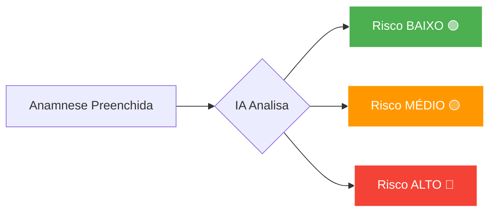

# 📘 Como Cadastrar Pacientes no Ortho+

> Guia completo para adicionar e gerenciar pacientes

---

## 🎯 O que você vai aprender

✅ Como adicionar um novo paciente  
✅ Como preencher a ficha de anamnese  
✅ Como o sistema calcula o risco cirúrgico automaticamente  
✅ Como anexar documentos (RG, CPF, carteirinha de convênio)  
✅ Como editar e visualizar histórico do paciente  

---

## 📝 Passo a Passo: Cadastrar Novo Paciente

### 1. Acessar o Módulo de Pacientes

1. Faça login no sistema
2. No **menu lateral esquerdo**, clique em **"👥 Pacientes"**
3. Clique no botão **"+ Novo Paciente"** (canto superior direito)


---

### 2. Preencher Dados Básicos

Você verá um formulário dividido em abas:

#### **Aba 1: Dados Pessoais**
```
📋 Campos obrigatórios (marcados com *)

✅ Nome completo*
✅ CPF* (formato: 123.456.789-00)
✅ Data de nascimento*
✅ Sexo* (Masculino / Feminino / Outro)
✅ Email*
✅ Telefone* (formato: (11) 98765-4321)
```

> 💡 **Dica:** O campo CPF valida automaticamente se o número é válido. Se o CPF já estiver cadastrado, o sistema avisa!

#### **Aba 2: Endereço**
```
🏠 Endereço completo (opcional)

CEP → O sistema preenche automaticamente rua, bairro, cidade e estado!
Número
Complemento
```

> 💡 **Dica:** Digite o CEP e pressione TAB. O sistema busca o endereço automaticamente!

#### **Aba 3: Dados Adicionais**
```
📄 Informações extras

- RG
- Profissão
- Estado civil
- Nome de emergência
- Telefone de emergência
```

---

### 3. Preencher Anamnese (Ficha de Saúde)

Esta é a parte mais importante para garantir a segurança do paciente!

#### **Pergunta 1: Problemas de Saúde**
```
O paciente tem algum problema de saúde?

☐ Diabetes
☐ Hipertensão
☐ Problemas cardíacos
☐ Problemas renais
☐ Asma
☐ HIV/AIDS
☐ Hepatite
☐ Outro (especifique)
```

#### **Pergunta 2: Medicamentos**
```
Faz uso de algum medicamento?

☐ Anticoagulantes (AAS, Clopidogrel)
☐ Anti-hipertensivos
☐ Antidiabéticos (Insulina, Metformina)
☐ Antidepressivos
☐ Outro (especifique)
```

#### **Pergunta 3: Alergias**
```
Tem alergia a algum medicamento ou substância?

☐ Anestésicos locais (Lidocaína, Articaína)
☐ Penicilina
☐ Latex
☐ Outro (especifique)
```

#### **Pergunta 4: Gestação** (apenas para mulheres)
```
☐ Está grávida?
☐ Amamentando?
```

---

### 4. Cálculo Automático de Risco Cirúrgico 🤖

Após preencher a anamnese, o sistema **calcula automaticamente** o **risco cirúrgico** do paciente:



#### **Níveis de Risco**

| Nível | Ícone | Descrição | Exemplos |
|-------|-------|-----------|----------|
| **BAIXO** | 🟢 | Paciente saudável, sem comorbidades | Jovem, sem doenças crônicas |
| **MÉDIO** | 🟡 | Paciente com condições controladas | Hipertensão controlada, diabetes tipo 2 |
| **ALTO** | 🔴 | Paciente com múltiplas comorbidades | Anticoagulantes + diabetes + cardiopatia |

> ⚠️ **Importante:** Para pacientes de **risco ALTO**, o sistema exige **liberação médica** antes de procedimentos cirúrgicos!

---

### 5. Anexar Documentos 📎

Você pode anexar documentos digitalizados do paciente:

**Tipos de documentos aceitos:**
- 📄 RG (frente e verso)
- 📄 CPF
- 📄 Comprovante de residência
- 📄 Carteirinha de convênio
- 📄 Exames (radiografias, laudos médicos)

**Como anexar:**
1. Clique na aba **"Anexos"**
2. Clique em **"+ Adicionar Arquivo"**
3. Selecione o arquivo no seu computador
4. Digite uma descrição (ex: "RG frente")
5. Clique em **"Enviar"**

> 💡 **Dica:** Formatos aceitos: PDF, JPG, PNG. Tamanho máximo: 10MB por arquivo.

---

### 6. Salvar Cadastro

Após preencher todos os dados:
1. Revise as informações
2. Clique no botão **"Salvar Paciente"** (canto inferior direito)
3. Aguarde a confirmação: **"Paciente cadastrado com sucesso!"** ✅

---

## 🔍 Buscar e Visualizar Pacientes

### Busca Rápida
Na tela de **"Pacientes"**, use a **barra de busca** no topo:
- Digite **nome**, **CPF**, **email** ou **telefone**
- Os resultados aparecem instantaneamente

### Filtros Avançados
Clique no ícone **🔽 Filtros** para filtrar por:
- ☑️ Status (Ativo / Inativo)
- 🟢🟡🔴 Risco cirúrgico
- 📅 Data de cadastro
- 🏥 Convênio

---

## ✏️ Editar Paciente

1. Na lista de pacientes, clique no paciente desejado
2. Clique no botão **"✏️ Editar"** (canto superior direito)
3. Altere as informações necessárias
4. Clique em **"Salvar Alterações"**

> ⚠️ **Nota:** Todas as edições ficam registradas no **histórico de auditoria** (compliance LGPD).

---

## 🗑️ Inativar Paciente

Caso o paciente não seja mais atendido na clínica:

1. Abra o cadastro do paciente
2. Clique em **"⚙️ Ações"** → **"Inativar Paciente"**
3. Digite o motivo (ex: "Mudou de cidade")
4. Confirme a ação

> 💡 **Dica:** Pacientes **inativos** não aparecem na busca padrão, mas os dados são mantidos por **10 anos** (exigência do CFO).

---

## 📊 Histórico do Paciente

Para ver o histórico completo:

1. Abra o cadastro do paciente
2. Clique na aba **"Histórico"**

Você verá:
- 📅 **Consultas realizadas** (data, dentista, procedimento)
- 💰 **Orçamentos** (status: aprovado, rejeitado, expirado)
- 💳 **Pagamentos** (valor, data, forma de pagamento)
- 📝 **Prontuários** (evoluções clínicas)
- 🦷 **Odontogramas** (histórico de tratamentos por dente)

---

## ❓ Perguntas Frequentes

### **Posso cadastrar pacientes menores de idade?**
✅ Sim! Basta preencher o campo **"Responsável"** com o nome e CPF do pai/mãe ou tutor legal.

### **O sistema aceita pacientes estrangeiros (sem CPF)?**
✅ Sim! Caso não tenha CPF, use o campo **"Passaporte"** e marque a opção **"Estrangeiro"**.

### **Como sei se o CPF já está cadastrado?**
🤖 O sistema valida automaticamente. Se o CPF já existir, exibe uma mensagem: **"Paciente já cadastrado!"**

### **Posso importar pacientes de outro sistema?**
✅ Sim! Vá em **Configurações → Importar Dados → Pacientes** e faça upload de uma planilha Excel/CSV.

### **Como garantir a segurança dos dados (LGPD)?**
🔒 Todos os dados são criptografados e apenas usuários autorizados têm acesso. Veja mais em [12-LGPD-COMPLIANCE](./12-LGPD-COMPLIANCE.md).

---

## 🎥 Vídeo Tutorial

📹 **[Assistir no YouTube: Como Cadastrar Pacientes (5min)](https://youtube.com/orthoplus-cadastro)**

---

## 📞 Precisa de Ajuda?

📧 Email: suporte@orthoplus.com.br  
📱 WhatsApp: (11) 98765-4321  
🕐 Seg-Sex 8h-18h

---

## 🎓 Próximos Passos

Após cadastrar o paciente, você pode:
- **[02-AGENDAMENTO](./02-AGENDAMENTO.md)** - Agendar primeira consulta
- **[03-PRONTUARIO-ELETRONICO](./03-PRONTUARIO-ELETRONICO.md)** - Criar prontuário
- **[05-ORCAMENTOS-CONTRATOS](./05-ORCAMENTOS-CONTRATOS.md)** - Fazer orçamento

**Bom trabalho! 🦷✨**
