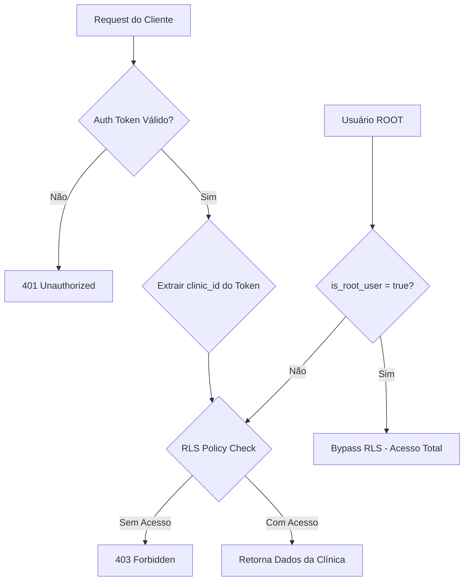
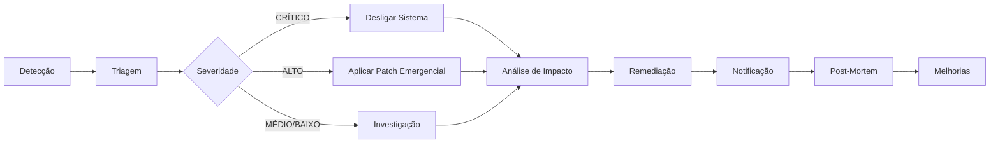

# 🔒 Guia de Segurança - Ortho+ Enterprise v2.0

**Data:** 2025-01-15  
**Versão:** 1.0 (FASE 1 - Fundação)  
**Status:** ✅ Implementado

---

## 📋 Índice

1. [Visão Geral](#visão-geral)
2. [Arquitetura de Segurança](#arquitetura-de-segurança)
3. [Roles e Permissões](#roles-e-permissões)
4. [Proteções Implementadas](#proteções-implementadas)
5. [Boas Práticas](#boas-práticas)
6. [Checklist de Deploy](#checklist-de-deploy)
7. [Incidentes de Segurança](#incidentes-de-segurança)
8. [Compliance (LGPD)](#compliance-lgpd)
9. [Contato](#contato)

---

## 🎯 Visão Geral

O Ortho+ Enterprise v2.0 é um SaaS B2B multitenant para clínicas odontológicas que implementa **segurança em múltiplas camadas**:

- ✅ **Multi-Tenancy:** Isolamento completo de dados entre clínicas via RLS
- ✅ **RBAC:** Controle de acesso baseado em roles (ROOT, ADMIN, MEMBER, PATIENT)
- ✅ **Rate Limiting:** Proteção contra abuse de API e ataques DDoS
- ✅ **Audit Logs:** Rastreabilidade completa de ações (LGPD compliance)
- ✅ **Password Strength:** Validação client-side e server-side
- ✅ **Input Validation:** Sanitização de inputs com Zod
- ✅ **SQL Injection Protection:** Prepared statements + RLS policies

---

## 🏗️ Arquitetura de Segurança

### Multi-Tenancy com Row Level Security (RLS)

**Princípio:** "Cada clínica só vê seus próprios dados"



**Implementação:**

```sql
-- Exemplo: Tabela patients com RLS
ALTER TABLE public.patients ENABLE ROW LEVEL SECURITY;

-- Policy: Usuários só veem pacientes de sua clínica
CREATE POLICY "Users can view own clinic patients"
ON public.patients
FOR SELECT
TO authenticated
USING (
  clinic_id = (
    SELECT clinic_id FROM profiles WHERE id = auth.uid()
  )
);

-- Policy: ROOT tem acesso total (bypass)
CREATE POLICY "Root has full access to patients"
ON public.patients
FOR ALL
TO authenticated
USING (is_root_user())
WITH CHECK (is_root_user());
```

---

## 👥 Roles e Permissões

### Hierarquia de Roles

```
ROOT (Superusuário)
  ↓
ADMIN (Administrador da Clínica)
  ↓
MEMBER (Dentista, Recepcionista)
  ↓
PATIENT (Paciente)
```

### Matriz de Permissões

| Recurso | ROOT | ADMIN | MEMBER | PATIENT |
|---------|------|-------|--------|---------|
| **Gerenciar Módulos** | ✅ | ✅ | ❌ | ❌ |
| **Criar Usuários** | ✅ | ✅ | ❌ | ❌ |
| **Ver Todas as Clínicas** | ✅ | ❌ | ❌ | ❌ |
| **CRUD Pacientes** | ✅ | ✅ | ✅ | ❌ |
| **Ver Próprio Prontuário** | ✅ | ✅ | ✅ | ✅ |
| **Editar Prontuário** | ✅ | ✅ | ✅ | ❌ |
| **Ver Financeiro** | ✅ | ✅ | ✅* | ❌ |
| **Criar Orçamentos** | ✅ | ✅ | ✅ | ❌ |
| **Acessar Audit Logs** | ✅ | ✅ | ❌ | ❌ |

\* _MEMBER pode ver financeiro apenas se tiver split de pagamento configurado_

### Como Verificar Role no Frontend

```typescript
import { useAuth } from '@/contexts/AuthContext';

function MyComponent() {
  const { hasRole, isAdmin } = useAuth();
  
  if (!hasRole('ADMIN')) {
    return <AccessDenied />;
  }
  
  return (
    <div>
      {isAdmin && <AdminPanel />}
      {hasRole('MEMBER') && <MemberPanel />}
    </div>
  );
}
```

### Como Verificar Role no Backend (Edge Functions)

```typescript
import { createClient } from 'https://esm.sh/@supabase/supabase-js@2';

const supabase = createClient(
  Deno.env.get('SUPABASE_URL')!,
  Deno.env.get('SUPABASE_SERVICE_ROLE_KEY')!
);

// Verificar se usuário é admin
const { data: profile } = await supabase
  .from('profiles')
  .select('app_role')
  .eq('id', userId)
  .single();

if (profile?.app_role !== 'ADMIN') {
  return new Response('Forbidden', { status: 403 });
}
```

---

## 🛡️ Proteções Implementadas

### 1. Rate Limiting

**Objetivo:** Prevenir abuse de API, ataques DDoS e uso excessivo de recursos

**Configurações por Tipo de Endpoint:**

| Tipo | Exemplo | Limite/Usuário | Limite/IP | Janela |
|------|---------|----------------|-----------|--------|
| **Auth** | login, signup | 5 req | 10 req | 5 min |
| **Data Read** | get-patients | 100 req | 200 req | 15 min |
| **Data Write** | create-patient | 30 req | 60 req | 15 min |
| **Heavy Ops** | export-data | 5 req | 10 req | 60 min |
| **ROOT Ops** | create-root-user | 1 req | 2 req | 24 horas |

**Como Usar em Edge Functions:**

```typescript
import { checkRateLimit, getClientIp } from '../_shared/rateLimiter.ts';

const supabase = createClient(/*...*/);
const ipAddress = getClientIp(req);

const rateLimitResult = await checkRateLimit(
  supabase,
  userId,
  ipAddress,
  'endpoint-name'
);

if (!rateLimitResult.allowed) {
  return new Response(
    JSON.stringify({ error: 'Rate limit exceeded', ...rateLimitResult }),
    { status: 429, headers: corsHeaders }
  );
}
```

**Monitoramento de Abuse:**

```sql
-- Ver top IPs com mais requisições (últimas 24h)
SELECT 
  ip_address,
  COUNT(DISTINCT endpoint) as endpoints_acessados,
  SUM(request_count) as total_requests
FROM public.rate_limit_log
WHERE window_start > NOW() - INTERVAL '24 hours'
GROUP BY ip_address
ORDER BY total_requests DESC
LIMIT 20;

-- Ver abuse reports não resolvidos
SELECT * FROM public.abuse_reports
WHERE NOT resolved
ORDER BY severity DESC, created_at DESC;
```

---

### 2. Validação de Senhas Fortes

**Política de Senhas:**

- ✅ Mínimo 12 caracteres
- ✅ Pelo menos 1 letra maiúscula (A-Z)
- ✅ Pelo menos 1 letra minúscula (a-z)
- ✅ Pelo menos 1 número (0-9)
- ✅ Pelo menos 1 símbolo (@$!%*?&#)

**Validação Client-Side:**

```typescript
import { PasswordStrengthIndicator } from '@/components/auth/PasswordStrengthIndicator';

function SignupForm() {
  const [password, setPassword] = useState('');
  
  return (
    <div>
      <Input
        type="password"
        value={password}
        onChange={(e) => setPassword(e.target.value)}
      />
      
      <PasswordStrengthIndicator password={password} />
    </div>
  );
}
```

**Validação Server-Side:**

```sql
-- Função SQL para validar força da senha
SELECT public.validate_password_strength('MinhaSenha123!@#');
-- Retorna: true/false
```

```typescript
// Edge Function: Validar antes de criar usuário
const isPasswordStrong = await supabase.rpc('validate_password_strength', { 
  password 
});

if (!isPasswordStrong) {
  return new Response('Senha não atende aos requisitos mínimos', { 
    status: 400 
  });
}
```

---

### 3. Input Validation (Zod)

**CRÍTICO:** Sempre valide inputs client-side E server-side

**Exemplo Client-Side:**

```typescript
import { z } from 'zod';

const patientSchema = z.object({
  full_name: z.string()
    .trim()
    .min(3, 'Nome deve ter no mínimo 3 caracteres')
    .max(100, 'Nome deve ter no máximo 100 caracteres'),
  email: z.string()
    .email('Email inválido')
    .max(255),
  phone: z.string()
    .regex(/^\+?\d{10,15}$/, 'Telefone inválido')
    .optional(),
  cpf: z.string()
    .regex(/^\d{11}$/, 'CPF deve ter 11 dígitos')
});

// Validar antes de enviar
try {
  const validatedData = patientSchema.parse(formData);
  await createPatient(validatedData);
} catch (error) {
  if (error instanceof z.ZodError) {
    error.errors.forEach(err => toast.error(err.message));
  }
}
```

**Exemplo Server-Side (Edge Function):**

```typescript
import { z } from 'https://esm.sh/zod@3';

const createPatientSchema = z.object({
  full_name: z.string().trim().min(3).max(100),
  email: z.string().email().max(255),
  clinic_id: z.string().uuid()
});

serve(async (req) => {
  const body = await req.json();
  
  // Validar com Zod
  const validation = createPatientSchema.safeParse(body);
  
  if (!validation.success) {
    return new Response(
      JSON.stringify({ 
        error: 'Validation failed', 
        details: validation.error.errors 
      }),
      { status: 400, headers: corsHeaders }
    );
  }
  
  const { full_name, email, clinic_id } = validation.data;
  
  // Usar dados validados...
});
```

---

### 4. SQL Injection Protection

**NUNCA use concatenação de strings em queries SQL!**

**❌ ERRADO:**
```typescript
// NUNCA FAÇA ISSO!
const query = `SELECT * FROM patients WHERE name = '${userInput}'`;
await supabase.rpc('execute_sql', { query });
```

**✅ CORRETO:**
```typescript
// Use o query builder do Supabase
const { data, error } = await supabase
  .from('patients')
  .select('*')
  .eq('full_name', userInput); // Prepared statement automático
```

**RLS como Camada Adicional:**
- Mesmo que haja SQL injection, RLS limita acesso aos dados
- Usuário só vê dados de sua clínica

---

### 5. Audit Logs (LGPD Compliance)

**Todas as ações críticas são registradas:**

```typescript
// Exemplo: Registrar criação de paciente
await supabase.from('audit_logs').insert({
  clinic_id,
  user_id: auth.uid(),
  action: 'PATIENT_CREATED',
  action_type: 'CREATE',
  details: {
    patient_id: newPatient.id,
    patient_name: newPatient.full_name,
    timestamp: new Date().toISOString()
  },
  ip_address: clientIp,
  user_agent: req.headers.get('user-agent')
});
```

**Consultar Logs:**

```sql
-- Ações de um usuário específico (últimos 30 dias)
SELECT 
  al.action,
  al.action_type,
  al.details,
  al.created_at,
  al.ip_address
FROM public.audit_logs al
WHERE al.user_id = '<USER_ID>'
  AND al.created_at > NOW() - INTERVAL '30 days'
ORDER BY al.created_at DESC;

-- Exportar logs de uma clínica (LGPD - Direito de Acesso)
SELECT * FROM public.audit_logs
WHERE clinic_id = '<CLINIC_ID>'
ORDER BY created_at DESC;
```

---

## 🔐 Boas Práticas

### Para Desenvolvedores

1. **Nunca exponha `SUPABASE_SERVICE_ROLE_KEY` no frontend**
   - Use apenas em Edge Functions (backend)
   - Frontend deve usar `SUPABASE_ANON_KEY`

2. **Sempre use RLS policies para controle de acesso**
   - Não confie apenas em lógica de frontend
   - RLS é a última linha de defesa

3. **Valide inputs em TODAS as camadas**
   - Client-side: UX (feedback imediato)
   - Server-side: Segurança (não confie no cliente)

4. **Use prepared statements**
   - Supabase query builder faz isso automaticamente
   - Nunca concatene strings SQL

5. **Rotate secrets periodicamente**
   - API keys, passwords, tokens
   - Mínimo: a cada 90 dias

6. **Monitore audit_logs regularmente**
   - Configure alertas para ações suspeitas
   - Revise logs semanalmente

### Para Administradores

1. **Habilite MFA (Multi-Factor Authentication)**
   - Obrigatório para contas ADMIN e ROOT
   - Supabase suporta TOTP (Google Authenticator)

2. **Configure alertas de segurança**
   - Rate limit exceeded
   - Failed login attempts (>5 em 15 min)
   - ROOT user login
   - Abuse reports criados

3. **Backups regulares**
   - Automáticos: Diários (Supabase faz isso)
   - Testes de restore: Mensais
   - Retention: 30 dias (LGPD: mínimo 6 meses para auditorias)

4. **Revise permissões trimestralmente**
   - Remova usuários inativos
   - Downgrade de roles não utilizadas
   - Revogue acesso ROOT temporário

---

## ✅ Checklist de Deploy (Produção)

### Antes do Deploy

- [ ] **Habilitar "Leaked Password Protection"** no Supabase Auth
- [ ] **Configurar alertas de segurança** (email para admins)
- [ ] **Backup automático configurado** e testado
- [ ] **SSL/TLS habilitado** (Lovable faz automaticamente)
- [ ] **Rate limits testados** em staging
- [ ] **Todos os secrets rotacionados** (não usar defaults)
- [ ] **RLS habilitado em TODAS as tabelas** públicas
- [ ] **Audit logs funcionando** (testar insert manual)
- [ ] **Documentação atualizada** (README, SECURITY.md)

### Pós-Deploy

- [ ] **Smoke tests** (endpoints críticos funcionando)
- [ ] **Revisar logs** das primeiras 24 horas
- [ ] **Testar rate limiting** com tráfego real
- [ ] **Configurar monitoramento** (Uptime Robot, Sentry)
- [ ] **Notificar equipe** sobre novo ambiente

### Monitoramento Contínuo

- [ ] **Revisar abuse_reports** (diariamente)
- [ ] **Revisar audit_logs** (semanalmente)
- [ ] **Atualizar dependências** (mensalmente)
- [ ] **Penetration testing** (anualmente)
- [ ] **Security audit** (semestralmente)

---

## 🚨 Incidentes de Segurança

### Classificação de Severidade

| Nível | Exemplo | Tempo de Resposta | Ação Imediata |
|-------|---------|-------------------|---------------|
| **CRÍTICO** | Brecha de dados, RCE | < 1 hora | Desligar sistema afetado |
| **ALTO** | XSS, CSRF, SQLi | < 4 horas | Aplicar patch, notificar usuários |
| **MÉDIO** | Rate limit exceeded | < 24 horas | Investigar, criar regra |
| **BAIXO** | Login attempt suspeito | < 7 dias | Monitorar, revisar logs |

### Processo de Incident Response



### Passo a Passo

#### 1. **Detecção** (0-5 min)
- Alerta automático (abuse_report, monitoring tool)
- Relatório de usuário
- Descoberta em audit logs

#### 2. **Triagem** (5-15 min)
- Classificar severidade (CRÍTICO, ALTO, MÉDIO, BAIXO)
- Identificar sistema afetado
- Avaliar impacto (número de usuários, dados expostos)

#### 3. **Contenção** (15 min - 1 hora)
- **CRÍTICO:** Desligar sistema afetado imediatamente
- **ALTO:** Aplicar patch emergencial, bloquear IPs maliciosos
- **MÉDIO:** Aumentar rate limits, criar regra de firewall
- **BAIXO:** Monitorar, adicionar alertas

#### 4. **Análise de Impacto** (1-4 horas)
```sql
-- Identificar usuários afetados
SELECT DISTINCT user_id, ip_address, details
FROM public.audit_logs
WHERE created_at BETWEEN '<INCIDENT_START>' AND '<INCIDENT_END>'
  AND (action LIKE '%UNAUTHORIZED%' OR details->>'suspicious' = 'true');

-- Identificar dados acessados
SELECT table_name, COUNT(*) as access_count
FROM public.audit_logs
WHERE created_at BETWEEN '<INCIDENT_START>' AND '<INCIDENT_END>'
GROUP BY table_name
ORDER BY access_count DESC;
```

#### 5. **Remediação** (4-24 horas)
- Aplicar patch definitivo
- Revisar RLS policies
- Atualizar dependências vulneráveis
- Rotar secrets comprometidos

#### 6. **Notificação** (24 horas)
- **LGPD:** Notificar ANPD se dados pessoais foram expostos (72 horas)
- **Usuários afetados:** Email detalhando o incidente
- **Equipe:** Post-mortem interno

#### 7. **Post-Mortem** (1 semana)
- Documentar o incidente (SECURITY_INCIDENTS.md)
- Identificar root cause
- Propor melhorias (novas proteções, treinamento)
- Atualizar runbook de incident response

### Contatos de Emergência

**Incidentes de Segurança:**
- 🆘 E-mail: security@orthoplus.com
- 📱 Telefone: +55 (XX) XXXX-XXXX (24/7)
- 💬 Slack: #security-incidents
- 🔗 Jira: [Security Issue Tracker](https://orthoplus.atlassian.net/secure/Dashboard.jspa)

**Suporte Técnico:**
- 📧 E-mail: support@orthoplus.com
- 📖 Docs: https://docs.orthoplus.com
- 🐛 Bug Report: https://github.com/orthoplus/issues

---

## 📜 Compliance (LGPD)

### Princípios Implementados

1. **Transparência:** Audit logs completos de todas as ações
2. **Segurança:** RLS, rate limiting, password policies
3. **Direito de Acesso:** Exportação de dados (`export-patient-data` Edge Function)
4. **Direito ao Esquecimento:** Anonimização (`anonymize-patient` Edge Function)
5. **Portabilidade:** Export em JSON/PDF

### Relatórios LGPD

**Gerar Relatório de Conformidade:**

```sql
-- Consentimentos LGPD da clínica (últimos 12 meses)
SELECT 
  lc.consent_type,
  lc.consent_given,
  lc.consent_date,
  lc.ip_address,
  p.full_name as patient_name
FROM public.lgpd_consents lc
JOIN public.patients p ON p.id = lc.patient_id
WHERE lc.clinic_id = '<CLINIC_ID>'
  AND lc.consent_date > NOW() - INTERVAL '12 months'
ORDER BY lc.consent_date DESC;

-- Solicitações de exportação de dados
SELECT 
  dr.request_type,
  dr.status,
  dr.requested_at,
  dr.completed_at,
  p.full_name as patient_name
FROM public.lgpd_data_requests dr
JOIN public.patients p ON p.id = dr.patient_id
WHERE dr.clinic_id = '<CLINIC_ID>'
ORDER BY dr.requested_at DESC;
```

### Checklist LGPD

- [x] **Termo de Consentimento** implementado (signup)
- [x] **Audit Logs** com IP e timestamp
- [x] **Exportação de dados** (JSON/PDF)
- [x] **Anonimização** (direito ao esquecimento)
- [x] **Política de Privacidade** disponível
- [ ] **DPO nomeado** (Data Protection Officer)
- [ ] **Treinamento LGPD** para equipe (anual)
- [ ] **RIPD** (Relatório de Impacto à Proteção de Dados)

---

## 📞 Contato

**Equipe de Segurança:**
- 📧 E-mail: security@orthoplus.com
- 🔐 PGP Key: [Download](https://orthoplus.com/security.asc)
- 🐛 Bug Bounty: [HackerOne](https://hackerone.com/orthoplus)

**Reportar Vulnerabilidade:**
1. **NÃO** divulgue publicamente antes de resolvermos
2. Envie detalhes para: security@orthoplus.com
3. Inclua: Steps to reproduce, impacto, PoC (se aplicável)
4. Tempo de resposta: < 48 horas

**Reconhecimentos:**
- Hall of Fame: [Security Researchers](https://orthoplus.com/security/hall-of-fame)

---

**Última Atualização:** 2025-01-15  
**Versão:** 1.0 (FASE 1 - Fundação)  
**Próxima Revisão:** 2025-04-15 (trimestral)
