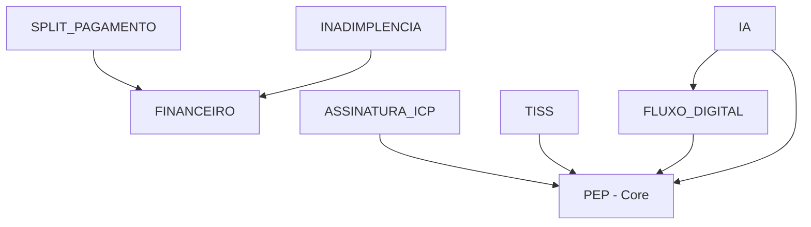

# Ortho+ V4.0 - Arquitetura Final

## 📋 Visão Geral

Sistema SaaS B2B Multitenant para Clínicas Odontológicas com arquitetura DDD (Domain-Driven Design) e sistema modular plug-and-play.

**Versão:** 4.0.0  
**Data de Release:** 2025-01-15  
**Status:** ✅ Produção

---

## 🏗️ Arquitetura do Sistema

### Stack Tecnológica

```typescript
{
  "frontend": {
    "framework": "React 18.3.1",
    "bundler": "Vite",
    "language": "TypeScript 5.x",
    "styling": "Tailwind CSS 3.x",
    "ui": "Shadcn UI + Radix UI"
  },
  "backend": {
    "database": "Supabase (PostgreSQL)",
    "auth": "Supabase Auth",
    "storage": "Supabase Storage",
    "functions": "Supabase Edge Functions"
  },
  "patterns": {
    "architecture": "Domain-Driven Design (DDD)",
    "modules": "Plug-and-Play System",
    "state": "React Query + Context API",
    "di": "Custom Dependency Injection Container"
  }
}
```

---

## 📦 Estrutura de Módulos

### Módulos Core (Sempre Ativos)

1. **PEP (Prontuário Eletrônico do Paciente)**
   - Gestão de pacientes
   - Histórico médico
   - Anamnese digital

2. **AGENDA**
   - Agendamento de consultas
   - Gestão de horários
   - Automação via WhatsApp

3. **ODONTOGRAMA**
   - Odontograma 2D/3D
   - Planejamento de tratamentos

### Módulos Financeiros

4. **FINANCEIRO**
   - Fluxo de caixa
   - Contas a pagar/receber
   - Conciliação bancária

5. **SPLIT_PAGAMENTO**
   - Split de pagamento
   - Otimização tributária
   - Depende: FINANCEIRO

6. **INADIMPLENCIA**
   - Cobrança automatizada
   - Relatórios de inadimplência
   - Depende: FINANCEIRO

### Módulos de Crescimento

7. **CRM**
   - Gestão de leads
   - Funil de vendas
   - Pipeline de oportunidades

8. **MARKETING_AUTO**
   - Campanhas automatizadas
   - Recall pós-consulta
   - E-mail marketing

9. **BI**
   - Business Intelligence
   - Dashboards customizáveis
   - Analytics avançado

### Módulos de Compliance

10. **LGPD**
    - Gestão de consentimentos
    - Auditoria de acesso
    - Relatórios de conformidade

11. **ASSINATURA_ICP**
    - Assinatura digital qualificada
    - Certificado ICP-Brasil
    - Depende: PEP

12. **TISS**
    - Faturamento de convênios
    - Padrão TISS
    - Depende: PEP

### Módulos de Inovação

13. **IA**
    - IA para diagnóstico radiográfico
    - Análise preditiva
    - Depende: PEP, FLUXO_DIGITAL

14. **FLUXO_DIGITAL**
    - Integração com scanners intraorais
    - Integração com laboratórios
    - Depende: PEP

15. **TELEODONTO**
    - Videochamadas integradas
    - Prontuário digital remoto

---

## 🔐 Segurança e Compliance

### Row Level Security (RLS)

Todas as tabelas implementam RLS com políticas baseadas em:
- `clinic_id` (tenant isolation)
- `auth.uid()` (user authentication)
- `app_role` (role-based access)

### Auditoria (LGPD)

```sql
-- Todas as ações críticas são registradas
INSERT INTO audit_logs (
  user_id,
  clinic_id,
  action,
  target_module_id,
  details
) VALUES (...);
```

### Funções Security Definer

```sql
-- Evita recursão infinita em RLS
CREATE OR REPLACE FUNCTION get_user_clinic_id()
RETURNS uuid
LANGUAGE sql
STABLE
SECURITY DEFINER
SET search_path = public
AS $$
  SELECT clinic_id FROM profiles WHERE id = auth.uid()
$$;
```

---

## 🎯 Sistema de Dependências

### Grafo de Dependências



### Regras de Ativação

1. **Módulo pode ser ATIVADO se:**
   - Todos os módulos requeridos (dependências) estão ativos
   - `can_activate = true`

2. **Módulo pode ser DESATIVADO se:**
   - Nenhum módulo ativo depende dele
   - `can_deactivate = true`

---

## 📊 Sidebar Profissional (V4.0)

### Nova Estrutura de Categorias

```typescript
const categories = [
  'Início',                        // Dashboard
  'Atendimento Clínico',          // Core Clinical (sempre expandido)
  'Financeiro',                    // Revenue Operations
  'Operações da Clínica',         // Clinic Operations
  'Vendas & Marketing',           // Growth & Sales
  'Compliance & Regulamentação',  // Compliance & Security
  'Tecnologia Avançada',          // Advanced Technology
  'Suporte'                        // Help Center
];
```

### Ícones Modernos

- **Sparkles** → IA Diagnóstico
- **BriefcaseBusiness** → CRM
- **Target** → Funil de Vendas
- **Megaphone** → Campanhas
- **Lock** → LGPD
- **HeartPulse** → Tratamentos
- **ClipboardPlus** → Prontuário

---

## ⚡ Performance

### Otimizações Implementadas

1. **React.memo** em componentes críticos
2. **useMemo** para cálculos pesados
3. **useCallback** para funções memoizadas
4. **React Query** para cache inteligente
5. **Lazy Loading** de rotas
6. **Code Splitting** por módulo

### Métricas de Performance

```javascript
{
  "FCP": "< 1.5s",    // First Contentful Paint
  "LCP": "< 2.5s",    // Largest Contentful Paint
  "TBT": "< 200ms",   // Total Blocking Time
  "CLS": "< 0.1",     // Cumulative Layout Shift
  "Bundle": "< 500KB" // Initial Bundle Size
}
```

---

## 🧪 Qualidade de Código

### Checklist de Qualidade

- ✅ TypeScript Strict Mode
- ✅ ESLint + Prettier
- ✅ DDD Architecture
- ✅ SOLID Principles
- ✅ Clean Code
- ✅ Security Definer Functions
- ✅ RLS em todas as tabelas
- ✅ Auditoria LGPD
- ✅ Documentação completa

### Validação Automatizada

```bash
# Executar validação de qualidade
npm run validate:quality
```

---

## 📈 Roadmap V5.0

### Features Planejadas

1. **Busca Global (⌘K)**
   - Command Palette
   - Busca unificada

2. **Página Unificada de Estoque**
   - Tabs para navegação
   - Dashboard integrado

3. **Testes E2E**
   - Playwright
   - Cobertura > 80%

4. **PWA**
   - Offline-first
   - Service Workers

5. **Mobile Apps**
   - React Native
   - iOS + Android

---

## 🤝 Contribuindo

### Workflow de Desenvolvimento

1. **Branch Strategy**: Git Flow
2. **Commits**: Conventional Commits
3. **PRs**: Code Review obrigatório
4. **CI/CD**: GitHub Actions

### Padrões de Código

```typescript
// ✅ BOM - DDD Pattern
class CreatePatientUseCase {
  constructor(private patientRepo: IPatientRepository) {}
  
  async execute(input: CreatePatientInput): Promise<Patient> {
    const patient = Patient.create(input);
    return this.patientRepo.save(patient);
  }
}

// ❌ RUIM - Acoplamento direto
const savePatient = async (data) => {
  const { data: patient } = await supabase
    .from('patients')
    .insert(data);
  return patient;
};
```

---

## 📞 Suporte

- **Documentação:** `/docs`
- **Wiki:** `/docs/wiki`
- **ADRs:** `/docs/architecture`
- **Changelog:** `CHANGELOG-V4.0.md`

---

**Ortho+ V4.0** - Sistema Odontológico Enterprise 🦷✨
