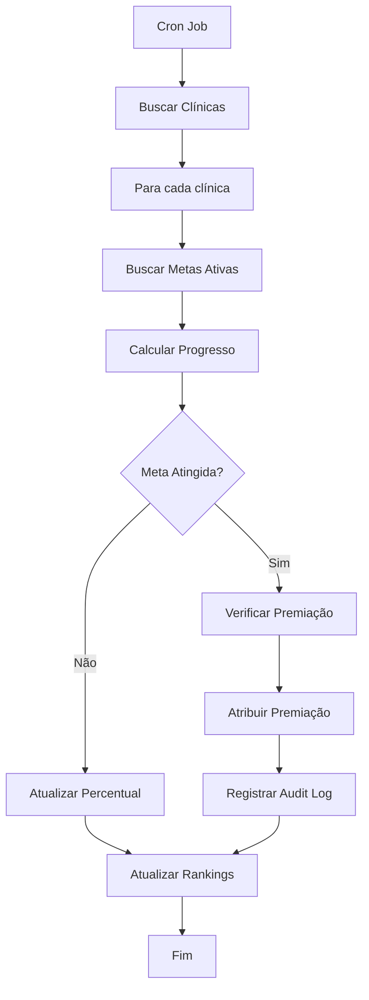
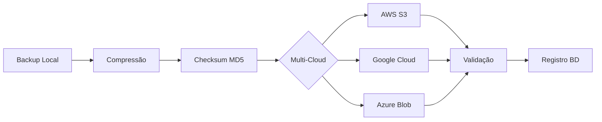
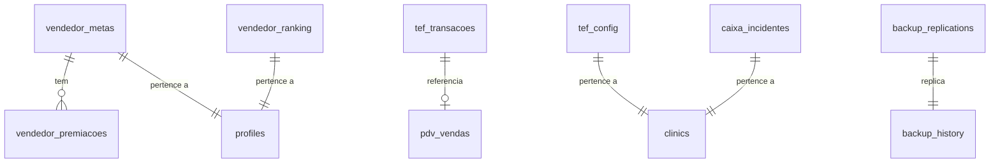

# Documentação Técnica - PDV Profissional com Gamificação e TEF

## Versão: 2.0
## Data: 2025-11-13
## Desenvolvedor: TSI Telecom (Ortho+ System)

---

## 📋 Índice

1. [Visão Geral](#visão-geral)
2. [Sistema de Metas e Gamificação](#sistema-de-metas-e-gamificação)
3. [Integração TEF](#integração-tef)
4. [Sangria Inteligente](#sangria-inteligente)
5. [Backup Geo-Distribuído](#backup-geo-distribuído)
6. [Arquitetura de Dados](#arquitetura-de-dados)
7. [Segurança e Compliance](#segurança-e-compliance)
8. [Guia de Implementação](#guia-de-implementação)

---

## 🎯 Visão Geral

O módulo PDV Profissional do Ortho+ foi completamente refatorado para incluir recursos enterprise-grade:

- **Gamificação Completa**: Sistema de metas, rankings em tempo real e premiações automáticas
- **Integração TEF**: Pagamentos com cartão via múltiplos provedores (SiTef, Rede, Stone, Getnet, PagSeguro)
- **IA para Segurança**: Sangria inteligente baseada em análise de risco
- **Disaster Recovery**: Backup geo-distribuído com replicação multi-cloud
- **Compliance Fiscal**: Integração completa SEFAZ + SPED Fiscal

---

## 🏆 Sistema de Metas e Gamificação

### 1. Arquitetura de Dados

#### Tabela: `vendedor_metas`
```sql
CREATE TABLE vendedor_metas (
  id UUID PRIMARY KEY,
  clinic_id UUID NOT NULL,
  vendedor_id UUID NOT NULL,
  periodo_inicio DATE NOT NULL,
  periodo_fim DATE NOT NULL,
  meta_valor NUMERIC(10,2),
  meta_quantidade INTEGER,
  valor_atingido NUMERIC(10,2),
  quantidade_atingida INTEGER,
  percentual_atingido NUMERIC(5,2),
  status TEXT CHECK (status IN ('EM_ANDAMENTO', 'ATINGIDA', 'NAO_ATINGIDA', 'SUPERADA')),
  premiacao_id UUID,
  premiacao_paga BOOLEAN
);
```

#### Tabela: `vendedor_premiacoes`
Tipos de premiações suportadas:
- `BONUS_MONETARIO`: Bônus em dinheiro
- `FOLGA`: Dias de folga adicional
- `PREMIO_FISICO`: Prêmios materiais
- `VALE_PRESENTE`: Vale-presentes
- `CERTIFICADO`: Certificados de reconhecimento

#### Tabela: `vendedor_ranking`
Rankings disponíveis:
- **DIA**: Ranking diário
- **SEMANA**: Ranking semanal
- **MÊS**: Ranking mensal

Badges automáticos:
- 🥇 **OURO**: 1º lugar
- 🥈 **PRATA**: 2º lugar
- 🥉 **BRONZE**: 3º lugar

### 2. Sistema de Pontuação

```javascript
pontos = (total_vendas / 10) + (quantidade_vendas * 5)
```

**Exemplo:**
- Vendedor com R$ 10.000 em vendas e 20 vendas
- Pontos = (10000 / 10) + (20 * 5) = 1000 + 100 = **1100 pontos**

### 3. Edge Function: `processar-metas-gamificacao`

**Executada automaticamente via cron job**

**Funcionalidades:**
1. Atualização de progresso de metas em tempo real
2. Cálculo de percentual atingido
3. Detecção automática de metas atingidas/superadas
4. Atribuição automática de premiações
5. Geração de rankings por período
6. Atribuição de badges

**Fluxo de Execução:**


### 4. Interface: `MetasGamificacao.tsx`

**Componentes:**

1. **Card de Metas:**
   - Progress bar visual
   - Status colorido (EM_ANDAMENTO, ATINGIDA, SUPERADA, NAO_ATINGIDA)
   - Detalhes de vendas e valores
   - Informações de premiação

2. **Ranking em Tempo Real:**
   - Filtros por período (Dia/Semana/Mês)
   - Badges visuais (Ouro/Prata/Bronze)
   - Destaque para posição do usuário
   - Métricas: total vendas, quantidade, ticket médio

---

## 💳 Integração TEF

### 1. Provedores Suportados

| Provedor | Débito | Crédito | PIX | Voucher |
|----------|--------|---------|-----|---------|
| **SiTef** | ✅ | ✅ | ✅ | ✅ |
| **Rede** | ✅ | ✅ | ❌ | ✅ |
| **Stone** | ✅ | ✅ | ✅ | ❌ |
| **Getnet** | ✅ | ✅ | ✅ | ✅ |
| **PagSeguro** | ✅ | ✅ | ✅ | ❌ |

### 2. Tabela: `tef_config`

```sql
CREATE TABLE tef_config (
  id UUID PRIMARY KEY,
  clinic_id UUID NOT NULL,
  provedor TEXT CHECK (provedor IN ('SITEF', 'REDE', 'STONE', 'GETNET', 'PAGSEGURO')),
  codigo_loja TEXT NOT NULL,
  terminal_id TEXT NOT NULL,
  endpoint_api TEXT,
  api_key TEXT,
  ambiente TEXT CHECK (ambiente IN ('HOMOLOGACAO', 'PRODUCAO')),
  ativo BOOLEAN DEFAULT TRUE
);
```

### 3. Edge Function: `processar-pagamento-tef`

**Parâmetros de Entrada:**
```json
{
  "clinic_id": "uuid",
  "venda_id": "uuid",
  "tipo_operacao": "CREDITO|DEBITO|VOUCHER|PIX_TEF",
  "valor": 150.00,
  "num_parcelas": 3,
  "provedor": "SITEF"
}
```

**Resposta de Sucesso:**
```json
{
  "success": true,
  "transacao": {
    "id": "uuid",
    "nsu_sitef": "NSU123456",
    "nsu_host": "HOST654321",
    "codigo_autorizacao": "ABC123",
    "status": "APROVADA",
    "bandeira": "VISA"
  },
  "comprovante_cliente": "string",
  "comprovante_estabelecimento": "string"
}
```

**Resposta de Falha:**
```json
{
  "success": false,
  "error": "Transação negada pela operadora"
}
```

### 4. Componente: `IntegracaoTEF.tsx`

**Funcionalidades:**
- Seleção de tipo de operação (Débito/Crédito/Voucher/PIX)
- Configuração de parcelas (1x a 12x)
- Loading state durante processamento
- Modal de confirmação com detalhes da transação
- Impressão automática de comprovantes
- Retry automático em caso de falha de comunicação

**Estados de Transação:**
- 🔄 **PENDENTE**: Aguardando processamento
- ✅ **APROVADA**: Transação autorizada
- ❌ **NEGADA**: Recusada pela operadora
- 🚫 **CANCELADA**: Cancelada pelo operador
- ⚠️ **ERRO**: Erro de comunicação

### 5. Modo Homologação vs Produção

**HOMOLOGAÇÃO:**
- Aprovação automática simulada
- NSU e autorização fictícios
- Comprovantes gerados localmente
- Sem cobrança real

**PRODUÇÃO:**
- Integração real com API do provedor
- NSU e autorização reais
- Comunicação com PinPad físico
- Transações reais com cobrança

---

## 🔒 Sangria Inteligente

### 1. Tabela: `caixa_incidentes`

```sql
CREATE TABLE caixa_incidentes (
  id UUID PRIMARY KEY,
  clinic_id UUID NOT NULL,
  tipo_incidente TEXT CHECK (tipo_incidente IN ('ASSALTO', 'ROUBO', 'FURTO', 'PERDA')),
  data_incidente TIMESTAMPTZ NOT NULL,
  dia_semana INTEGER NOT NULL, -- 0=Domingo, 6=Sábado
  horario_incidente TIME NOT NULL,
  valor_caixa_momento NUMERIC(10,2),
  valor_perdido NUMERIC(10,2),
  descricao TEXT,
  boletim_ocorrencia TEXT
);
```

### 2. Edge Function: `sugerir-sangria-ia`

**Algoritmo de Análise de Risco:**

```javascript
// 1. Análise de Volume
if (saldoCaixaAtual > 5000) risco += 30;
else if (saldoCaixaAtual > 3000) risco += 20;
else if (saldoCaixaAtual > 1500) risco += 10;

// 2. Análise de Horário (baseado em histórico)
const horaAtual = new Date().getHours();
const incidentesHorario = incidentes.filter(i => 
  i.horario_incidente.getHours() === horaAtual
);
if (incidentesHorario.length > 0) {
  risco += (incidentesHorario.length * 15);
}

// 3. Análise de Dia da Semana
const diaAtual = new Date().getDay();
const incidentesDia = incidentes.filter(i => 
  i.dia_semana === diaAtual
);
if (incidentesDia.length > 0) {
  risco += (incidentesDia.length * 10);
}

// 4. Sugestão de Sangria
let sugestaoValor = 0;
let sugestaoMotivo = '';

if (risco >= 50) {
  sugestaoValor = saldoCaixaAtual * 0.7; // Retirar 70%
  sugestaoMotivo = 'ALTO RISCO';
} else if (risco >= 30) {
  sugestaoValor = saldoCaixaAtual * 0.5; // Retirar 50%
  sugestaoMotivo = 'RISCO MODERADO';
} else if (saldoCaixaAtual > 3000) {
  sugestaoValor = saldoCaixaAtual - 2000; // Deixar R$ 2000
  sugestaoMotivo = 'VOLUME ELEVADO';
}
```

**Resposta:**
```json
{
  "sugestao_sangria": true,
  "valor_sugerido": 3500.00,
  "motivo": "ALTO RISCO",
  "risco_calculado": 65,
  "horario_risco": "18:00-20:00",
  "detalhes": {
    "incidentes_horario": 3,
    "incidentes_dia_semana": 5,
    "valor_medio_perdido_historico": 4200.00
  }
}
```

### 3. Componente: `SangriaInteligente.tsx`

**Funcionalidades:**
- Card de alerta visual com nível de risco (baixo/médio/alto)
- Sugestão automática de valor
- Histórico de sangrias anteriores
- Botão de executar sangria
- Confirmação com justificativa

---

## ☁️ Backup Geo-Distribuído

### 1. Tabela: `backup_replications`

```sql
CREATE TABLE backup_replications (
  id UUID PRIMARY KEY,
  backup_id UUID NOT NULL,
  source_clinic_id UUID NOT NULL,
  target_clinic_id UUID,
  storage_provider TEXT CHECK (storage_provider IN ('AWS_S3', 'GOOGLE_CLOUD', 'AZURE_BLOB', 'DROPBOX')),
  region TEXT NOT NULL,
  replication_status TEXT CHECK (replication_status IN ('PENDING', 'IN_PROGRESS', 'COMPLETED', 'FAILED')),
  storage_path TEXT,
  checksum_md5 TEXT,
  file_size_bytes BIGINT
);
```

### 2. Edge Function: `replicate-backup`

**Provedores Suportados:**
- **AWS S3**: Regiões us-east-1, us-west-2, eu-west-1, ap-southeast-1
- **Google Cloud Storage**: Regiões us-central1, europe-west1, asia-east1
- **Azure Blob Storage**: Regiões eastus, westeurope, southeastasia
- **Dropbox**: Sem regiões específicas

**Fluxo:**


### 3. Estratégia de Replicação

**Regra 3-2-1:**
- **3** cópias dos dados
- **2** tipos diferentes de mídia
- **1** cópia off-site

**Implementação Ortho+:**
- 1 cópia local (Supabase Storage)
- 1 cópia AWS S3 (região primária)
- 1 cópia Google Cloud (região secundária)

**RPO (Recovery Point Objective):** 1 hora
**RTO (Recovery Time Objective):** 4 horas

---

## 🗄️ Arquitetura de Dados

### Diagrama ER Completo



### Índices Otimizados

```sql
-- Metas
CREATE INDEX idx_vendedor_metas_clinic ON vendedor_metas(clinic_id);
CREATE INDEX idx_vendedor_metas_vendedor ON vendedor_metas(vendedor_id);
CREATE INDEX idx_vendedor_metas_periodo ON vendedor_metas(periodo_inicio, periodo_fim);

-- Ranking
CREATE INDEX idx_vendedor_ranking_clinic ON vendedor_ranking(clinic_id);
CREATE INDEX idx_vendedor_ranking_periodo ON vendedor_ranking(periodo, data_referencia);

-- TEF
CREATE INDEX idx_tef_transacoes_clinic ON tef_transacoes(clinic_id);
CREATE INDEX idx_tef_transacoes_venda ON tef_transacoes(venda_id);
```

---

## 🔐 Segurança e Compliance

### 1. RLS Policies

**Todas as tabelas implementam RLS baseado em `clinic_id`:**

```sql
-- Exemplo: Metas
CREATE POLICY "Users can view metas from their clinic"
  ON vendedor_metas FOR SELECT
  USING (clinic_id = get_user_clinic_id(auth.uid()));

CREATE POLICY "Admins can manage metas in their clinic"
  ON vendedor_metas FOR ALL
  USING (clinic_id = get_user_clinic_id(auth.uid()) AND has_role(auth.uid(), 'ADMIN'));
```

### 2. Auditoria Completa

**Eventos Auditados:**
- `META_ATINGIDA`: Quando vendedor atinge meta
- `TEF_TRANSACAO`: Todas as transações TEF
- `SANGRIA_EXECUTADA`: Sangrias de caixa
- `BACKUP_REPLICADO`: Replicações de backup
- `PREMIACAO_PAGA`: Pagamento de premiações

### 3. Criptografia

**Em Trânsito:**
- TLS 1.3 para todas as conexões
- Certificados SSL válidos

**Em Repouso:**
- API Keys TEF criptografadas com AES-256
- Checksums MD5 para validação de integridade
- Backups comprimidos e criptografados

### 4. Compliance PCI-DSS

**Para integração TEF:**
- ✅ Não armazenamos dados de cartão (PAN)
- ✅ Apenas tokens e NSU são persistidos
- ✅ Comunicação criptografada com PinPad
- ✅ Logs de auditoria completos
- ✅ Segregação de ambientes (homologação/produção)

---

## 🚀 Guia de Implementação

### 1. Configuração Inicial

**Passo 1: Ativar Módulos**
```sql
-- Em Configurações → Ativar/Desativar Módulos
PDV_METAS
PDV_GAMIFICACAO
PDV_TEF
PDV_PREMIACOES
```

**Passo 2: Configurar TEF**
```sql
INSERT INTO tef_config (
  clinic_id,
  provedor,
  codigo_loja,
  terminal_id,
  ambiente
) VALUES (
  '{{clinic_id}}',
  'SITEF',
  'LOJA001',
  'TERM01',
  'HOMOLOGACAO'
);
```

**Passo 3: Criar Premiações**
```sql
INSERT INTO vendedor_premiacoes (
  clinic_id,
  nome,
  descricao,
  tipo,
  valor_bonus,
  percentual_meta_minimo
) VALUES (
  '{{clinic_id}}',
  'Bônus Gold',
  'Bônus para quem bater 120% da meta',
  'BONUS_MONETARIO',
  500.00,
  120
);
```

**Passo 4: Criar Metas**
```sql
INSERT INTO vendedor_metas (
  clinic_id,
  vendedor_id,
  periodo_inicio,
  periodo_fim,
  meta_valor,
  meta_quantidade
) VALUES (
  '{{clinic_id}}',
  '{{vendedor_id}}',
  '2025-01-01',
  '2025-01-31',
  10000.00,
  50
);
```

### 2. Cron Jobs (Automação)

**Configurar no Supabase:**

```sql
-- Processar metas e rankings (a cada hora)
SELECT cron.schedule(
  'processar-metas-gamificacao',
  '0 * * * *',
  $$
  SELECT net.http_post(
    url := 'https://yxpoqjyfgotkytwtifau.supabase.co/functions/v1/processar-metas-gamificacao',
    headers := '{"Authorization": "Bearer ' || current_setting('app.settings.service_role_key') || '"}'::jsonb
  );
  $$
);

-- Replicar backups (a cada 6 horas)
SELECT cron.schedule(
  'replicate-backups',
  '0 */6 * * *',
  $$
  SELECT net.http_post(
    url := 'https://yxpoqjyfgotkytwtifau.supabase.co/functions/v1/replicate-backup',
    headers := '{"Authorization": "Bearer ' || current_setting('app.settings.service_role_key') || '"}'::jsonb
  );
  $$
);
```

### 3. Testes

**Teste de TEF (Homologação):**
```bash
curl -X POST \
  https://yxpoqjyfgotkytwtifau.supabase.co/functions/v1/processar-pagamento-tef \
  -H "Content-Type: application/json" \
  -d '{
    "clinic_id": "uuid",
    "venda_id": "uuid",
    "tipo_operacao": "DEBITO",
    "valor": 50.00,
    "provedor": "SITEF"
  }'
```

**Teste de Metas:**
```bash
curl -X POST \
  https://yxpoqjyfgotkytwtifau.supabase.co/functions/v1/processar-metas-gamificacao \
  -H "Authorization: Bearer SERVICE_ROLE_KEY"
```

---

## 📞 Suporte e Contato

**Desenvolvedor:** TSI Telecom
**Sistema:** Ortho+ v2.0
**Documentação Atualizada:** 2025-11-13

Para suporte técnico ou dúvidas sobre implementação, consulte a documentação completa no repositório GitHub do projeto.

---

**Ortho+ - Sistema de Gestão Odontológica Enterprise**
*Desenvolvido por TSI Telecom*