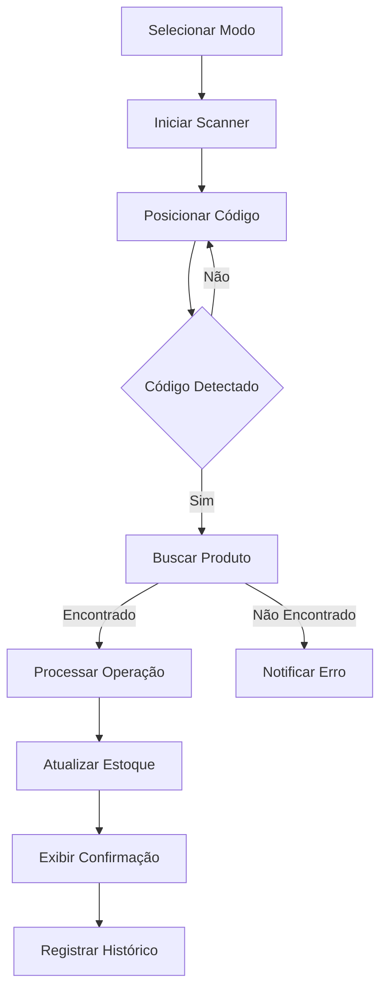

# 📱 Ortho+ Mobile - Setup Capacitor

## Scanner de Código de Barras/QR Code Nativo

Este guia explica como configurar e testar o **App Mobile Nativo** do Ortho+ com scanner de código de barras/QR code integrado ao sistema de estoque.

---

## ✨ Funcionalidades Implementadas

### Scanner Nativo de Código de Barras/QR
- **Entrada Automatizada**: Escaneia código e adiciona +1 unidade ao estoque automaticamente
- **Saída Automatizada**: Escaneia código e remove -1 unidade do estoque automaticamente  
- **Consulta Rápida**: Visualiza informações do produto sem alterar estoque
- **Validação em Tempo Real**: Verifica estoque disponível antes de movimentações
- **Histórico de Scans**: Mantém registro de todas as leituras realizadas
- **Estatísticas**: Contador de entradas/saídas processadas

### Formatos Suportados
- QR Code
- EAN-13 / EAN-8
- CODE-128 / CODE-39 / CODE-93
- UPC-A / UPC-E

---

## 🚀 Configuração Inicial

### 1. Instalar Dependências (Já Feito ✅)

As seguintes dependências já foram instaladas:
```bash
npm install @capacitor/core @capacitor/cli @capacitor/ios @capacitor/android
npm install @capacitor-community/barcode-scanner
```

### 2. Inicializar Capacitor

Execute no terminal:
```bash
npx cap init
```

Quando solicitado:
- **App ID**: `app.lovable.ab203c0d07a2432588930110d34090b0`
- **App Name**: `ortho-plus-modules`

### 3. Transferir para Seu Repositório GitHub

1. Clique no botão **"Export to Github"** no Lovable
2. Clone o projeto do seu repositório GitHub:
```bash
git clone <seu-repo-url>
cd ortho-plus-modules
```

3. Instale as dependências:
```bash
npm install
```

---

## 📲 Testando no Dispositivo

### Para Android:

1. **Adicionar plataforma Android**:
```bash
npx cap add android
```

2. **Atualizar dependências nativas**:
```bash
npx cap update android
```

3. **Build do projeto**:
```bash
npm run build
```

4. **Sincronizar com plataforma nativa**:
```bash
npx cap sync
```

5. **Executar no dispositivo/emulador** (requer Android Studio):
```bash
npx cap run android
```

### Para iOS (Requer Mac + Xcode):

1. **Adicionar plataforma iOS**:
```bash
npx cap add ios
```

2. **Atualizar dependências nativas**:
```bash
npx cap update ios
```

3. **Build do projeto**:
```bash
npm run build
```

4. **Sincronizar com plataforma nativa**:
```bash
npx cap sync
```

5. **Executar no dispositivo/simulador** (requer Xcode):
```bash
npx cap run ios
```

---

## 🎯 Usando o Scanner Mobile

### Acesso à Funcionalidade

1. Faça login no app
2. No menu lateral, vá em **Estoque**
3. Clique em **Scanner Mobile** (badge "Novo")
4. Rota direta: `/estoque/scanner-mobile`

### Modos de Scanner

#### 1. Modo Consulta 📦
- **Função**: Visualizar informações do produto
- **Ação**: Não altera estoque
- **Uso**: Verificações rápidas de estoque e dados do produto

#### 2. Modo Entrada ↗️
- **Função**: Registrar entrada de produtos
- **Ação**: +1 unidade automaticamente
- **Uso**: Recebimento de mercadorias, devolução de materiais

#### 3. Modo Saída ↘️
- **Função**: Registrar saída de produtos
- **Ação**: -1 unidade automaticamente
- **Uso**: Consumo em procedimentos, requisições

### Fluxo de Trabalho



---

## 🔧 Configuração do Capacitor

O arquivo `capacitor.config.ts` já está configurado com:

```typescript
{
  appId: 'app.lovable.ab203c0d07a2432588930110d34090b0',
  appName: 'ortho-plus-modules',
  webDir: 'dist',
  server: {
    url: 'https://ab203c0d-07a2-4325-8893-0110d34090b0.lovableproject.com?forceHideBadge=true',
    cleartext: true  // Permite hot-reload do sandbox
  },
  plugins: {
    BarcodeScanner: {
      supportedFormats: ['QR_CODE', 'EAN_13', 'EAN_8', 'CODE_128', ...]
    }
  }
}
```

---

## 📝 Permissões Necessárias

### Android (`android/app/src/main/AndroidManifest.xml`)

```xml
<uses-permission android:name="android.permission.CAMERA" />
<uses-feature android:name="android.hardware.camera" />
<uses-feature android:name="android.hardware.camera.autofocus" />
```

### iOS (`ios/App/App/Info.plist`)

```xml
<key>NSCameraUsageDescription</key>
<string>O app precisa acessar a câmera para escanear códigos de barras/QR</string>
```

---

## 🐛 Troubleshooting

### Erro: "Permission Denied"
**Solução**: Verifique se concedeu permissão de câmera nas configurações do dispositivo.

### Erro: "Scanner não inicia"
**Solução**: Execute `npx cap sync` após qualquer mudança de código.

### Erro: "Produto não encontrado"
**Solução**: Certifique-se de que o produto está cadastrado com o código correto no campo `codigo` ou `codigoBarras`.

### Scanner lento ou impreciso
**Solução**: 
- Melhore a iluminação
- Mantenha distância de 15-30cm
- Certifique-se de que o código está limpo e legível

---

## 🔄 Workflow de Desenvolvimento

Sempre que fizer mudanças no código:

1. **Git Pull** do seu repositório:
```bash
git pull
```

2. **Instalar dependências** (se houver novas):
```bash
npm install
```

3. **Build do projeto**:
```bash
npm run build
```

4. **Sincronizar com plataforma nativa**:
```bash
npx cap sync
```

5. **Executar no dispositivo**:
```bash
npx cap run android
# ou
npx cap run ios
```

---

## 📚 Recursos Adicionais

### Hot Reload durante Desenvolvimento

O app está configurado para carregar diretamente do sandbox do Lovable, permitindo ver mudanças em tempo real sem rebuild.

### Documentação Oficial
- [Capacitor Docs](https://capacitorjs.com/docs)
- [Barcode Scanner Plugin](https://github.com/capacitor-community/barcode-scanner)
- [Lovable + Capacitor Guide](https://docs.lovable.dev/)

### Suporte
Em caso de dúvidas ou problemas, consulte a [documentação oficial do Lovable](https://docs.lovable.dev/tips-tricks/troubleshooting).

---

## ✅ Checklist de Validação

Antes de publicar na loja de apps:

- [ ] Scanner funciona em dispositivos físicos Android
- [ ] Scanner funciona em dispositivos físicos iOS  
- [ ] Permissões de câmera solicitadas corretamente
- [ ] Produtos cadastrados com códigos de barras válidos
- [ ] Validação de estoque funcionando (não permite saída sem estoque)
- [ ] Histórico de scans registrando corretamente
- [ ] Notificações de sucesso/erro funcionando
- [ ] Interface responsiva em diferentes tamanhos de tela
- [ ] Performance aceitável (leitura < 2 segundos)
- [ ] Atualização em tempo real no Supabase

---

**🎉 Parabéns! Seu sistema de scanner móvel está pronto para uso!**
