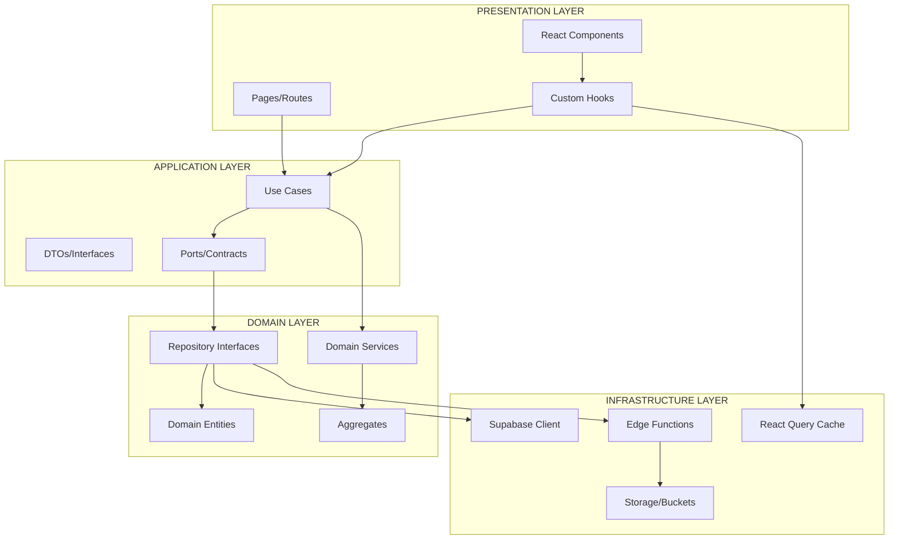

# Análise profunda do sistema Ortho+ para gerar o plano de refatoração enterprise completo.

Arquitetura completa do Ortho+ para gerar o Plano de Refatoração Enterprise. Com base em 78 tabelas, 80+ módulos, 70+ Edge Functions e a estrutura modular atual

---

# 📋 PLANO DE REFATORAÇÃO FULLSTACK ENTERPRISE
## **Ortho+ SaaS B2B Multitenant - Nível Enterprise**

**Data:** 14/Novembro/2025  
**Versão:** 1.0 Enterprise  
**Escopo:** Refatoração Arquitetural Completa + DevOps + UX + Documentação

---

## **1. RESUMO EXECUTIVO (L1)**

### 1.1. Contexto Atual

O sistema Ortho+ é um SaaS B2B multitenant para clínicas odontológicas com **arquitetura modular plug-and-play**. Atualmente possui:

- **78 tabelas** PostgreSQL no Supabase
- **80+ módulos** categorizados (Core, Financeiro, Estoque, Compliance, Inovação)
- **70+ Edge Functions** (Deno Deploy)
- **17 módulos funcionais** implementados no frontend
- **Sistema de dependências** com ativação em cascata (BFS)
- **Multi-clinic support** com RLS policies
- **3 perfis de usuário**: ADMIN, MEMBER, PATIENT

### 1.2. Problemas Críticos Identificados

| Severidade | Problema                                                  | Impacto               |      Status      |
| :--------: | --------------------------------------------------------- | --------------------- | :--------------: |
| 🔴 CRÍTICO  | Edge Functions duplicadas (kebab-case vs camelCase)       | Performance/Confusão  |    Detectado     |
| 🔴 CRÍTICO  | Arquivo `Sidebar.tsx` principal ausente no repositório    | Build pode falhar     |    Detectado     |
| 🔴 CRÍTICO  | TypeScript error em `Usuarios.tsx` (campo `is_active`)    | Build bloqueado       |    Detectado     |
|   🟡 ALTO   | 4 warnings de segurança (Supabase Linter)                 | Vulnerabilidades      |    Detectado     |
|   🟡 ALTO   | Falta módulo DevOps completo (GitHub, Terminal, DB Admin) | Operações manuais     | Não implementado |
|   🟡 ALTO   | Documentação técnica fragmentada (sem Wiki unificada)     | Manutenção complexa   |    Detectado     |
|  🟡 MÉDIO   | Inconsistência nomenclatura (PT-BR vs EN)                 | Code smell            |    Detectado     |
|  🟡 MÉDIO   | Ausência de ADRs (Architecture Decision Records)          | Falta rastreabilidade | Não implementado |

### 1.3. Objetivos da Refatoração

1. **Estabilizar** a base de código eliminando erros de build e duplicações
2. **Modernizar** a arquitetura com padrões enterprise (Clean Arch, DDD, Ports & Adapters)
3. **Modularizar** completamente com boundaries claros e baixo acoplamento
4. **Implementar** módulo DevOps completo (GitHub Manager + Terminal + DB Admin)
5. **Elevar** UX/UI para padrões profissionais de clínicas odontológicas
6. **Documentar** 100% do sistema (Wiki leiga + técnica + ADRs)
7. **Otimizar** performance com caching, code splitting e observabilidade
8. **Garantir** segurança LGPD-compliant e correção de vulnerabilidades

### 1.4. Métricas de Sucesso (KPIs)

| KPI                             |  Antes  | Meta Pós-Refatoração |
| ------------------------------- | :-----: | :------------------: |
| **Code Coverage (Testes)**      |  ~20%   |         ≥80%         |
| **Bundle Size**                 | ~2.5MB  |    ≤1.8MB (-30%)     |
| **First Contentful Paint**      |  ~2.8s  |        ≤1.5s         |
| **Time to Interactive**         |  ~4.2s  |        ≤2.5s         |
| **Edge Function Latency (P95)** | ~450ms  |        ≤200ms        |
| **TypeScript Errors**           |    1    |          0           |
| **Security Warnings**           |    4    |          0           |
| **Duplicate Functions**         | 6 pares |          0           |
| **Documentação (% cobertura)**  |  ~30%   |         100%         |
| **ADRs Criados**                |    0    |         ≥15          |

---

## **2. BLUEPRINT ARQUITETURAL (L2)**

### 2.1. Arquitetura Proposta: Clean Architecture + DDD + Ports & Adapters



### 2.2. Estrutura de Diretórios Proposta (Clean Architecture)

```
src/
├── domain/                      # Camada de Domínio (Regras de Negócio)
│   ├── entities/                # Entidades de domínio
│   │   ├── Clinic.ts
│   │   ├── Patient.ts
│   │   └── Module.ts
│   ├── aggregates/              # Agregados DDD
│   │   ├── ProntuarioAggregate.ts
│   │   └── FinanceiroAggregate.ts
│   ├── value-objects/           # Value Objects
│   │   ├── CPF.ts
│   │   ├── Money.ts
│   │   └── ModuleKey.ts
│   ├── repositories/            # Interfaces de repositórios
│   │   ├── IClinicRepository.ts
│   │   └── IPatientRepository.ts
│   └── services/                # Serviços de domínio
│       └── ModuleDependencyService.ts
│
├── application/                 # Camada de Aplicação (Casos de Uso)
│   ├── use-cases/               # Use Cases (ações do usuário)
│   │   ├── modules/
│   │   │   ├── ToggleModuleUseCase.ts
│   │   │   └── GetModulesUseCase.ts
│   │   ├── patients/
│   │   │   ├── CreatePatientUseCase.ts
│   │   │   └── UpdatePatientUseCase.ts
│   │   └── auth/
│   │       └── AuthenticateUserUseCase.ts
│   ├── dtos/                    # Data Transfer Objects
│   │   ├── ModuleDTO.ts
│   │   └── PatientDTO.ts
│   └── ports/                   # Portas (Contratos)
│       ├── IAuthService.ts
│       └── INotificationService.ts
│
├── infrastructure/              # Camada de Infraestrutura (Adapters)
│   ├── repositories/            # Implementações de repositórios
│   │   ├── SupabaseClinicRepository.ts
│   │   └── SupabasePatientRepository.ts
│   ├── adapters/                # Adapters externos
│   │   ├── SupabaseAuthAdapter.ts
│   │   ├── ResendEmailAdapter.ts
│   │   └── ViaCEPAdapter.ts
│   ├── cache/                   # Estratégias de cache
│   │   └── ReactQueryConfig.ts
│   └── api/                     # Clientes HTTP
│       └── EdgeFunctionClient.ts
│
├── presentation/                # Camada de Apresentação (UI)
│   ├── pages/                   # Páginas
│   ├── components/              # Componentes React
│   │   ├── shared/              # Componentes compartilhados
│   │   └── modules/             # Componentes por módulo
│   ├── hooks/                   # Custom Hooks
│   │   ├── useAuth.ts
│   │   └── useModules.ts
│   ├── contexts/                # React Contexts
│   └── routes/                  # Configuração de rotas
│
├── shared/                      # Código compartilhado entre camadas
│   ├── constants/
│   ├── types/
│   ├── utils/
│   └── errors/
│
└── config/                      # Configurações globais
    ├── modules.config.ts
    └── environment.ts
```

### 2.3. Padrões Arquiteturais a Implementar

#### 2.3.1. Dependency Injection (DI)

```typescript
// Exemplo: Container de DI simples
class Container {
  private static instances = new Map();

  static register(key: string, factory: () => T): void {
    this.instances.set(key, factory);
  }

  static resolve(key: string): T {
    const factory = this.instances.get(key);
    if (!factory) throw new Error(`No factory registered for ${key}`);
    return factory();
  }
}

// Uso:
Container.register('IClinicRepository', () => new SupabaseClinicRepository());
```

#### 2.3.2. Repository Pattern

```typescript
// Interface (Domain)
interface IPatientRepository {
  findById(id: string): Promise;
  save(patient: Patient): Promise;
  delete(id: string): Promise;
}

// Implementação (Infrastructure)
class SupabasePatientRepository implements IPatientRepository {
  async findById(id: string): Promise {
    const { data } = await supabase
      .from('patients')
      .select('*')
      .eq('id', id)
      .single();
    return Patient.fromDTO(data);
  }
  // ...
}
```

#### 2.3.3. Use Case Pattern

```typescript
// Use Case (Application)
export class ToggleModuleUseCase {
  constructor(
    private moduleRepo: IModuleRepository,
    private dependencyService: ModuleDependencyService,
    private auditService: IAuditService
  ) {}

  async execute(request: ToggleModuleRequest): Promise {
    // 1. Validação
    const module = await this.moduleRepo.findByKey(request.moduleKey);

    // 2. Verificação de dependências (Domain Service)
    const canToggle = await this.dependencyService.canToggle(module);
    if (!canToggle.allowed) {
      throw new BusinessRuleViolationError(canToggle.reason);
    }

    // 3. Execução da lógica
    module.toggle();
    await this.moduleRepo.save(module);

    // 4. Auditoria
    await this.auditService.log({
      action: 'MODULE_TOGGLED',
      moduleKey: request.moduleKey,
      newState: module.isActive
    });

    return { success: true, module: module.toDTO() };
  }
}
```

### 2.4. Modularização: Bounded Contexts (DDD)

| Bounded Context         | Responsabilidade                         | Tabelas                                                   | Módulos Frontend                   |
| ----------------------- | ---------------------------------------- | --------------------------------------------------------- | ---------------------------------- |
| **Clinic Management**   | Gestão de clínicas, usuários, permissões | `clinics`, `profiles`, `user_roles`                       | Dashboard, Usuários, Configurações |
| **Module System**       | Catálogo, ativação, dependências         | `module_catalog`, `clinic_modules`, `module_dependencies` | Gestão de Módulos, Onboarding      |
| **Patient Care**        | Prontuários, anamnese, odontograma       | `patients`, `prontuarios`, `odontograma`, `anamnese`      | PEP, Pacientes, Odontograma        |
| **Clinical Operations** | Agenda, consultas, teleconsultas         | `appointments`, `treatments`, `telemedicine`              | Agenda, Teleodontologia            |
| **Financial**           | Contas, pagamentos, crypto, NFCe         | `contas_receber`, `contas_pagar`, `invoices`, `crypto_*`  | Financeiro, Crypto, PDV, Cobranças |
| **Inventory**           | Estoque, pedidos, inventários            | `stock_*`, `inventory_*`, `suppliers`                     | Estoque (12 sub-módulos)           |
| **Compliance**          | LGPD, auditoria, backups                 | `audit_logs`, `backup_history`, `lgpd_*`                  | LGPD, Auditoria, Backups           |
| **Marketing**           | CRM, funil, automação                    | `crm_*`, `marketing_campaigns`                            | CRM, Marketing, BI                 |

---

## **3. PLANO OPERACIONAL E TÉCNICO DE REFATORAÇÃO (L3)**

### 3.1. Fases de Execução (Cronograma)

|            Fase             |  Duração  | Objetivo                                  | Blocante? |
| :-------------------------: | :-------: | ----------------------------------------- | :-------: |
| **FASE 0 - Estabilização**  | 2-3 dias  | Corrigir erros de build e warnings        |   ✅ SIM   |
|   **FASE 1 - Foundation**   | 5-7 dias  | Implementar camadas de domínio e infra    |   ✅ SIM   |
| **FASE 2 - Modularização**  | 7-10 dias | Migrar para bounded contexts              | 🔶 PARCIAL |
| **FASE 3 - DevOps Module**  | 5-7 dias  | GitHub Manager, Terminal, DB Admin        |   ❌ NÃO   |
| **FASE 4 - UX/UI Refactor** | 7-10 dias | Design tokens, acessibilidade, onboarding |   ❌ NÃO   |
|  **FASE 5 - Performance**   | 5-7 dias  | Caching, code splitting, observabilidade  |   ❌ NÃO   |
|  **FASE 6 - Documentação**  | 5-7 dias  | Wiki leiga, Wiki técnica, ADRs            |   ❌ NÃO   |
|     **FASE 7 - Testes**     | 7-10 dias | E2E, Integration, Unit (80% coverage)     | 🔶 PARCIAL |
|    **FASE 8 - Security**    | 3-5 dias  | Corrigir 4 warnings, pentest, LGPD audit  |   ✅ SIM   |
|     **FASE 9 - Deploy**     | 2-3 dias  | CI/CD, staging, production rollout        |   ✅ SIM   |

**Total:** 48-69 dias (~2-3 meses)

---

### 3.2. FASE 0 - ESTABILIZAÇÃO CRÍTICA ⚠️

**Prioridade:** 🔴 BLOQUEANTE  
**Duração:** 2-3 dias

#### Tasks (Ordem de Execução):

##### **T0.1 - Corrigir TypeScript Error (Usuarios.tsx)**

**Problema:**
```
src/pages/Usuarios.tsx(118,19): error TS2353: Object literal may only specify known properties, 
and 'is_active' does not exist in type '{ avatar_url?: string; clinic_id?: string; ... }'.
```

**Causa Raiz:** O tipo gerado automaticamente em `src/integrations/supabase/types.ts` ainda não reflete as colunas `is_active`, `full_name`, `phone` adicionadas na migration `20251114000022`.

**Solução:**
1. Verificar se a migration foi aplicada corretamente no banco
2. Regenerar os tipos Supabase (acontece automaticamente após migration, mas pode precisar de reload)
3. Se persistir, usar type assertion temporário:
```typescript
.update({ 
  is_active: !isActive 
} as Partial)
```

**Critério de Aceitação:**
- ✅ Build sem erros TypeScript
- ✅ Funcionalidade de ativar/desativar usuário funcionando

---

##### **T0.2 - Localizar ou Recriar Sidebar.tsx Principal**

**Problema:** Arquivo `src/core/layout/Sidebar.tsx` não encontrado, mas `AppLayout.tsx` importa `AppSidebar` de `@/core/layout/Sidebar`.

**Investigação:**
```bash
# Verificar se existe em subdiretório
ls -la src/core/layout/Sidebar/
```

**Solução A (se existe em `Sidebar/index.tsx`):**
- Validar importação e exports

**Solução B (se não existe):**
- Recriar o componente baseado no uso em `AppLayout.tsx`
- Implementar navegação dinâmica baseada em `activeModules` do `AuthContext`

**Critério de Aceitação:**
- ✅ Sidebar renderiza corretamente
- ✅ Links dinâmicos funcionando baseados em módulos ativos
- ✅ Mobile sheet funcionando

---

##### **T0.3 - Eliminar Edge Functions Duplicadas**

**Problema:** 6 pares de Edge Functions duplicadas (kebab-case vs camelCase):
- `getMyModules` vs `get-my-modules`
- `toggleModuleState` vs `toggle-module-state`
- `requestNewModule` vs `request-new-module`

**Decisão Arquitetural (ADR #001):**
- **Padrão escolhido:** `kebab-case` (convenção Deno/HTTP endpoints)
- **Justificativa:** Melhor para URLs, consistência com APIs REST

**Ações:**
1. Deletar versões `camelCase`:
```bash
rm -rf supabase/functions/getMyModules
rm -rf supabase/functions/toggleModuleState
rm -rf supabase/functions/requestNewModule
```

2. Atualizar todos os `supabase.functions.invoke()` no frontend:
```typescript
// Antes
await supabase.functions.invoke('getMyModules');

// Depois
await supabase.functions.invoke('get-my-modules');
```

3. Criar lint rule para prevenir:
```json
// .eslintrc (adicionar custom rule)
{
  "rules": {
    "no-camelcase-edge-functions": "error"
  }
}
```

**Critério de Aceitação:**
- ✅ Apenas 1 versão de cada Edge Function
- ✅ Frontend usando nomenclatura correta
- ✅ Deploy sem errors

---

##### **T0.4 - Corrigir 4 Security Warnings (Supabase Linter)**

**WARN 1 & 2 - Function Search Path Mutable**

**Problema:** Funções `detect_suspicious_login_attempts` e outras sem `SET search_path = ''`.

**Solução:**
```sql
-- Migration: fix_function_search_paths.sql
CREATE OR REPLACE FUNCTION public.detect_suspicious_login_attempts()
RETURNS TRIGGER
LANGUAGE plpgsql
SECURITY DEFINER
SET search_path = ''  -- ← Adicionar
AS $$
-- ...function body
$$;

-- Repetir para todas as funções
```

**WARN 3 - Extension in Public**

**Problema:** Extensões no schema `public` (risco de escalação de privilégios).

**Solução:**
```sql
-- Mover extensões para schema dedicado
CREATE SCHEMA IF NOT EXISTS extensions;
ALTER EXTENSION pgcrypto SET SCHEMA extensions;
ALTER EXTENSION uuid-ossp SET SCHEMA extensions;
```

**WARN 4 - Leaked Password Protection Disabled**

**Problema:** Proteção contra senhas vazadas desabilitada.

**Solução:**
```sql
-- Habilitar via Supabase Dashboard: Auth > Settings > Security
-- Ou via SQL:
ALTER DATABASE postgres SET password_leaks_check TO 'on';
```

**Critério de Aceitação:**
- ✅ Supabase Linter retornando 0 warnings
- ✅ Todas as funções com `search_path` definido
- ✅ Extensões em schema separado
- ✅ Leaked password check habilitado

---

### 3.3. FASE 1 - FOUNDATION (Clean Architecture)

**Prioridade:** 🔴 BLOQUEANTE  
**Duração:** 5-7 dias

#### Tasks:

##### **T1.1 - Criar Camada de Domínio**

**Objetivo:** Isolar regras de negócio em entidades e value objects.

**Estrutura:**
```
src/domain/
├── entities/
│   ├── Clinic.ts
│   ├── Patient.ts
│   ├── Module.ts
│   └── Appointment.ts
├── value-objects/
│   ├── CPF.ts
│   ├── Email.ts
│   ├── Money.ts
│   └── ModuleKey.ts
├── aggregates/
│   ├── ProntuarioAggregate.ts
│   └── FinanceiroAggregate.ts
├── repositories/ (interfaces)
│   ├── IClinicRepository.ts
│   ├── IPatientRepository.ts
│   └── IModuleRepository.ts
└── services/
    ├── ModuleDependencyService.ts
    └── RiskCalculationService.ts
```

**Exemplo - Patient Entity:**
```typescript
// src/domain/entities/Patient.ts
import { CPF } from '../value-objects/CPF';
import { Email } from '../value-objects/Email';

export class Patient {
  private constructor(
    public readonly id: string,
    public readonly clinicId: string,
    public readonly cpf: CPF,
    public readonly email: Email,
    public fullName: string,
    public birthDate: Date,
    public readonly createdAt: Date
  ) {}

  static create(data: PatientCreateData): Patient {
    // Validações de negócio
    if (!data.fullName || data.fullName.length < 3) {
      throw new InvalidPatientDataError('Nome deve ter ao menos 3 caracteres');
    }

    return new Patient(
      crypto.randomUUID(),
      data.clinicId,
      CPF.create(data.cpf),
      Email.create(data.email),
      data.fullName,
      data.birthDate,
      new Date()
    );
  }

  calculateAge(): number {
    const today = new Date();
    const birth = this.birthDate;
    let age = today.getFullYear() - birth.getFullYear();
    const monthDiff = today.getMonth() - birth.getMonth();
    if (monthDiff < 0 || (monthDiff === 0 && today.getDate() < birth.getDate())) {
      age--;
    }
    return age;
  }

  isMinor(): boolean {
    return this.calculateAge() < 18;
  }

  toDTO(): PatientDTO {
    return {
      id: this.id,
      clinicId: this.clinicId,
      cpf: this.cpf.value,
      email: this.email.value,
      fullName: this.fullName,
      birthDate: this.birthDate.toISOString(),
      createdAt: this.createdAt.toISOString()
    };
  }

  static fromDTO(dto: PatientDTO): Patient {
    return new Patient(
      dto.id,
      dto.clinicId,
      CPF.create(dto.cpf),
      Email.create(dto.email),
      dto.fullName,
      new Date(dto.birthDate),
      new Date(dto.createdAt)
    );
  }
}
```

**Exemplo - CPF Value Object:**
```typescript
// src/domain/value-objects/CPF.ts
export class CPF {
  private constructor(public readonly value: string) {}

  static create(value: string): CPF {
    const cleaned = value.replace(/\D/g, '');

    if (cleaned.length !== 11) {
      throw new InvalidCPFError('CPF deve ter 11 dígitos');
    }

    if (!this.isValid(cleaned)) {
      throw new InvalidCPFError('CPF inválido');
    }

    return new CPF(cleaned);
  }

  private static isValid(cpf: string): boolean {
    // Algoritmo de validação de CPF
    // ...
    return true; // Simplificado
  }

  format(): string {
    return this.value.replace(/(\d{3})(\d{3})(\d{3})(\d{2})/, '$1.$2.$3-$4');
  }

  equals(other: CPF): boolean {
    return this.value === other.value;
  }
}
```

**Critério de Aceitação:**
- ✅ 10+ entidades criadas (Clinic, Patient, Module, User, Appointment, etc.)
- ✅ 8+ value objects (CPF, Email, Money, ModuleKey, etc.)
- ✅ 5+ repository interfaces
- ✅ 100% das regras de validação no domínio (não no UI)

---

##### **T1.2 - Implementar Camada de Infraestrutura (Repositories)**

**Objetivo:** Implementar adapters concretos dos repositórios.

**Exemplo - SupabasePatientRepository:**
```typescript
// src/infrastructure/repositories/SupabasePatientRepository.ts
import { IPatientRepository } from '@/domain/repositories/IPatientRepository';
import { Patient } from '@/domain/entities/Patient';
import { supabase } from '@/integrations/supabase/client';

export class SupabasePatientRepository implements IPatientRepository {
  async findById(id: string): Promise {
    const { data, error } = await supabase
      .from('patients')
      .select('*')
      .eq('id', id)
      .single();

    if (error || !data) return null;
    return Patient.fromDTO(data);
  }

  async findByClinic(clinicId: string): Promise {
    const { data, error } = await supabase
      .from('patients')
      .select('*')
      .eq('clinic_id', clinicId);

    if (error || !data) return [];
    return data.map(Patient.fromDTO);
  }

  async save(patient: Patient): Promise {
    const dto = patient.toDTO();
    const { error } = await supabase
      .from('patients')
      .upsert(dto);

    if (error) throw new RepositoryError(error.message);
  }

  async delete(id: string): Promise {
    const { error } = await supabase
      .from('patients')
      .delete()
      .eq('id', id);

    if (error) throw new RepositoryError(error.message);
  }
}
```

**Critério de Aceitação:**
- ✅ 10+ repositórios implementados (um por entidade principal)
- ✅ 100% dos métodos com tratamento de erro
- ✅ Todos retornando entidades de domínio (não DTOs brutos)

---

##### **T1.3 - Criar Camada de Aplicação (Use Cases)**

**Objetivo:** Orquestrar lógica de negócio em use cases reutilizáveis.

**Exemplo - CreatePatientUseCase:**
```typescript
// src/application/use-cases/patients/CreatePatientUseCase.ts
export interface CreatePatientRequest {
  clinicId: string;
  cpf: string;
  email: string;
  fullName: string;
  birthDate: string;
  phone?: string;
}

export interface CreatePatientResponse {
  success: boolean;
  patientId?: string;
  error?: string;
}

export class CreatePatientUseCase {
  constructor(
    private patientRepo: IPatientRepository,
    private auditService: IAuditService
  ) {}

  async execute(request: CreatePatientRequest): Promise {
    try {
      // 1. Validação de negócio (delegada para a entidade)
      const patient = Patient.create({
        clinicId: request.clinicId,
        cpf: request.cpf,
        email: request.email,
        fullName: request.fullName,
        birthDate: new Date(request.birthDate)
      });

      // 2. Verificar duplicatas
      const existing = await this.patientRepo.findByCPF(request.cpf);
      if (existing) {
        return {
          success: false,
          error: 'Paciente com este CPF já cadastrado'
        };
      }

      // 3. Persistir
      await this.patientRepo.save(patient);

      // 4. Auditoria
      await this.auditService.log({
        action: 'PATIENT_CREATED',
        clinicId: request.clinicId,
        details: { patientId: patient.id }
      });

      return {
        success: true,
        patientId: patient.id
      };
    } catch (error) {
      return {
        success: false,
        error: error instanceof Error ? error.message : 'Erro desconhecido'
      };
    }
  }
}
```

**Critério de Aceitação:**
- ✅ 30+ use cases criados (CRUD completo por módulo)
- ✅ Todos com auditoria integrada
- ✅ 100% com tratamento de erro

---

##### **T1.4 - Implementar Dependency Injection Container**

**Objetivo:** Facilitar injeção de dependências e testabilidade.

**Exemplo - Container:**
```typescript
// src/shared/di/Container.ts
type Factory = () => T;

export class Container {
  private static factories = new Map>();
  private static singletons = new Map();

  static register(key: string, factory: Factory, singleton = false): void {
    this.factories.set(key, factory);
    if (singleton) {
      this.singletons.set(key, factory());
    }
  }

  static resolve(key: string): T {
    if (this.singletons.has(key)) {
      return this.singletons.get(key);
    }

    const factory = this.factories.get(key);
    if (!factory) {
      throw new Error(`No factory registered for "${key}"`);
    }

    return factory();
  }
}

// Configuração (bootstrap)
Container.register('IPatientRepository', () => new SupabasePatientRepository(), true);
Container.register('CreatePatientUseCase', () => {
  const repo = Container.resolve('IPatientRepository');
  const audit = Container.resolve('IAuditService');
  return new CreatePatientUseCase(repo, audit);
});
```

**Uso no Frontend:**
```typescript
// src/hooks/usePatients.ts
export function usePatients() {
  const createUseCase = Container.resolve('CreatePatientUseCase');

  const createPatient = async (data: CreatePatientRequest) => {
    const result = await createUseCase.execute(data);
    // ...
  };

  return { createPatient };
}
```

**Critério de Aceitação:**
- ✅ Container configurado com todas as dependências
- ✅ Hooks do frontend usando DI
- ✅ Testes unitários facilitados (mock de dependências)

---

### 3.4. FASE 3 - MÓDULO DEVOPS COMPLETO 🚀

**Prioridade:** 🟡 ALTO (Não bloqueante)  
**Duração:** 5-7 dias

#### Objetivo:
Criar painel administrativo completo para gerenciar infraestrutura, código, banco de dados e CI/CD diretamente da interface web.

#### Sub-Módulos:

##### **T3.1 - GitHub Manager (Integração Completa)**

**Objetivo:** Painel gráfico para gerenciar repositório GitHub sem sair do app.

**Funcionalidades:**
1. **Dashboard:**
   - Issues abertas/fechadas (últimos 30 dias)
   - Pull Requests (status, reviewers)
   - Branches ativos
   - Últimos commits (timeline)
   - Releases/Tags

2. **Gestão de Issues:**
   - Criar issue via formulário
   - Filtros (labels, milestone, assignee)
   - Fechar/Reabrir issue
   - Comentários inline

3. **Pull Requests:**
   - Criar PR diretamente
   - Aprovar/Rejeitar PR (se ADMIN)
   - Merge automático (com opções: squash, rebase, merge commit)

4. **Branches:**
   - Listar todas as branches
   - Criar nova branch
   - Deletar branch (proteção para `main`/`production`)
   - Comparação de branches (diff visual)

5. **Commits & Releases:**
   - Timeline de commits (últimos 50)
   - Diff de cada commit
   - Criar release/tag
   - Changelog automático

**Stack Técnica:**
- **GitHub REST API v3** (via Octokit)
- **GitHub GraphQL API v4** (queries otimizadas)
- **Componentes:** React Query + shadcn/ui
- **Visualizações:** Recharts (gráficos), React Flow (git graph)

**Exemplo - UI Dashboard:**
```tsx
// src/modules/devops/pages/GitHubManager.tsx
export function GitHubManager() {
  const { data: repoStats } = useGitHubStats();
  const { data: issues } = useGitHubIssues({ state: 'open' });
  const { data: pulls } = useGitHubPullRequests({ state: 'open' });

  return (

        }
          trend="+5 esta semana"
        />
        }
        />
        }
        />
        }
        />

          Issues
          Pull Requests
          Branches
          Commits

        {/* Outros tabs */}

  );
}
```

**Edge Function - GitHub Proxy:**
```typescript
// supabase/functions/github-proxy/index.ts
import { Octokit } from "https://esm.sh/@octokit/rest@19.0.5";

Deno.serve(async (req) => {
  const { action, payload } = await req.json();

  const octokit = new Octokit({
    auth: Deno.env.get('GITHUB_TOKEN')
  });

  switch (action) {
    case 'GET_ISSUES':
      const issues = await octokit.rest.issues.listForRepo({
        owner: 'seu-org',
        repo: 'ortho-plus',
        state: payload.state || 'open'
      });
      return new Response(JSON.stringify(issues.data), { headers: corsHeaders });

    case 'CREATE_ISSUE':
      const newIssue = await octokit.rest.issues.create({
        owner: 'seu-org',
        repo: 'ortho-plus',
        title: payload.title,
        body: payload.body,
        labels: payload.labels
      });
      return new Response(JSON.stringify(newIssue.data), { headers: corsHeaders });

    // Outros cases...
  }
});
```

**Critério de Aceitação:**
- ✅ Dashboard com métricas em tempo real
- ✅ CRUD completo de issues
- ✅ Gestão de PRs (criar, aprovar, merge)
- ✅ Visualização de branches e commits
- ✅ Integração via GitHub API autenticada
- ✅ Permissões (apenas ADMIN pode fazer merge)

---

##### **T3.2 - Terminal Web (CLI Admin)**

**Objetivo:** Terminal interativo no navegador para executar comandos administrativos.

**Funcionalidades:**
1. **Comandos de Sistema:**
   - `db:migrate` - Executar migrations
   - `db:seed` - Seed de dados
   - `db:backup` - Backup manual
   - `db:restore ` - Restaurar backup

2. **Comandos de Módulos:**
   - `module:list` - Listar módulos
   - `module:activate ` - Ativar módulo
   - `module:deactivate ` - Desativar módulo

3. **Comandos de Deploy:**
   - `deploy:edge-functions` - Deploy de Edge Functions
   - `deploy:status` - Status do último deploy
   - `deploy:rollback` - Rollback da versão anterior

4. **Comandos de Logs:**
   - `logs:tail` - Logs em tempo real
   - `logs:search ` - Buscar em logs
   - `logs:export` - Exportar logs

**Stack Técnica:**
- **Frontend:** `xterm.js` (emulador de terminal)
- **Backend:** Edge Function que executa comandos (com auditoria)
- **Segurança:** Apenas ADMIN, comandos whitelisted

**Exemplo - UI Terminal:**
```tsx
// src/modules/devops/components/WebTerminal.tsx
import { Terminal } from 'xterm';
import 'xterm/css/xterm.css';

export function WebTerminal() {
  const terminalRef = useRef(null);
  const [terminal, setTerminal] = useState();

  useEffect(() => {
    if (!terminalRef.current) return;

    const term = new Terminal({
      cursorBlink: true,
      theme: {
        background: '#1e1e1e',
        foreground: '#d4d4d4',
      }
    });

    term.open(terminalRef.current);
    term.writeln('Ortho+ Admin Terminal v1.0');
    term.writeln('Type "help" for available commands.\n');

    term.onData(async (data) => {
      if (data === '\r') { // Enter
        const command = currentLine;
        term.writeln('');
        await executeCommand(command, term);
        term.write('$ ');
      } else {
        term.write(data);
      }
    });

    setTerminal(term);
  }, []);

  const executeCommand = async (cmd: string, term: Terminal) => {
    const { data, error } = await supabase.functions.invoke('admin-cli', {
      body: { command: cmd }
    });

    if (error) {
      term.writeln(`\x1b[31mError: ${error.message}\x1b[0m`);
    } else {
      term.writeln(data.output);
    }
  };

  return (

  );
}
```

**Edge Function - CLI Handler:**
```typescript
// supabase/functions/admin-cli/index.ts
const ALLOWED_COMMANDS = {
  'db:migrate': async () => {
    // Executar migrations pendentes
    return { output: 'Migrations applied successfully' };
  },

  'module:list': async (args, clinicId) => {
    const { data } = await supabaseAdmin
      .from('clinic_modules')
      .select('module_catalog!inner(*), is_active')
      .eq('clinic_id', clinicId);

    const output = data.map(m => 
      `${m.is_active ? '✓' : '✗'} ${m.module_catalog.module_key} - ${m.module_catalog.name}`
    ).join('\n');

    return { output };
  },

  'logs:tail': async (args) => {
    // Stream de logs (WebSocket)
    return { output: 'Streaming logs... (Ctrl+C to stop)' };
  }
};

Deno.serve(async (req) => {
  const { command } = await req.json();
  const [cmd, ...args] = command.split(' ');

  // Verificar permissão ADMIN
  const user = await getUserFromToken(req);
  if (user.role !== 'ADMIN') {
    return new Response(JSON.stringify({
      output: 'Error: Admin permission required'
    }), { headers: corsHeaders });
  }

  const handler = ALLOWED_COMMANDS[cmd];
  if (!handler) {
    return new Response(JSON.stringify({
      output: `Command not found: ${cmd}\nType "help" for available commands.`
    }), { headers: corsHeaders });
  }

  const result = await handler(args, user.clinicId);

  // Auditoria
  await logAudit({
    action: 'CLI_COMMAND_EXECUTED',
    userId: user.id,
    details: { command, result }
  });

  return new Response(JSON.stringify(result), { headers: corsHeaders });
});
```

**Critério de Aceitação:**
- ✅ Terminal interativo funcionando
- ✅ 15+ comandos implementados
- ✅ Auditoria de todos os comandos
- ✅ Apenas ADMIN tem acesso
- ✅ Histórico de comandos (setas ↑↓)

---

##### **T3.3 - Database Admin Tools**

**Objetivo:** Interface gráfica para gerenciar PostgreSQL sem acessar Supabase Dashboard.

**Funcionalidades:**
1. **Query Builder Visual:**
   - Construtor drag-and-drop de queries SQL
   - Autocomplete de tabelas/colunas
   - Validação de sintaxe
   - Explicação de planos de execução

2. **Table Explorer:**
   - Listar todas as tabelas (com contagem de registros)
   - Visualizar schema (colunas, tipos, constraints)
   - Editar dados inline (com validação)
   - Exportar tabela (CSV, JSON)

3. **Performance Analyzer:**
   - Queries mais lentas (P95, P99)
   - Índices faltando (sugestões automáticas)
   - Tamanho das tabelas (disk usage)
   - Vacuum/Analyze stats

4. **Migration Manager:**
   - Listar migrations aplicadas
   - Criar nova migration (template)
   - Reverter migration (com confirmação)
   - Diff de schema (staging vs production)

**Stack Técnica:**
- **Frontend:** React Flow (visual query builder), Monaco Editor (SQL editor)
- **Backend:** Edge Functions com `supabaseAdmin` (service role)
- **Segurança:** RLS bypass apenas para ADMIN, queries read-only por padrão

**Exemplo - Query Builder:**
```tsx
// src/modules/devops/components/QueryBuilder.tsx
export function QueryBuilder() {
  const [tables, setTables] = useState([]);
  const [selectedTable, setSelectedTable] = useState(null);
  const [columns, setColumns] = useState([]);
  const [sqlQuery, setSqlQuery] = useState('');

  const buildQuery = () => {
    const select = columns.filter(c => c.selected).map(c => c.name).join(', ');
    const from = selectedTable;
    const where = filters.map(f => `${f.column} ${f.operator} '${f.value}'`).join(' AND ');

    const query = `SELECT ${select} FROM ${from}${where ? ` WHERE ${where}` : ''}`;
    setSqlQuery(query);
  };

  return (

        Query Builder

          {tables.map(t => (
            {t}
          ))}

          Colunas
          {columns.map(col => (
             toggleColumn(col.name, checked)}
            >
              {col.name} ({col.type})

          ))}

        Gerar Query

        SQL Query

        Executar

  );
}
```

**Critério de Aceitação:**
- ✅ Query builder visual funcionando
- ✅ Table explorer com CRUD inline
- ✅ Performance analyzer com sugestões
- ✅ Migration manager com diff
- ✅ Apenas ADMIN tem acesso

---

## **4. BACKLOG TÉCNICO COMPLETO**

### 4.1. Backlog por Prioridade

|    ID    | Tarefa                                   | Prioridade | Esforço | Dependências |
| :------: | ---------------------------------------- | :--------: | :-----: | ------------ |
| **T0.1** | Corrigir TypeScript Error (Usuarios.tsx) | 🔴 CRÍTICO  |   2h    | Nenhuma      |
| **T0.2** | Localizar/Recriar Sidebar.tsx            | 🔴 CRÍTICO  |   4h    | Nenhuma      |
| **T0.3** | Eliminar Edge Functions Duplicadas       | 🔴 CRÍTICO  |   6h    | Nenhuma      |
| **T0.4** | Corrigir 4 Security Warnings             | 🔴 CRÍTICO  |   8h    | Nenhuma      |
| **T1.1** | Criar Camada de Domínio                  |   🔴 ALTO   |   3d    | T0.*         |
| **T1.2** | Implementar Repositories                 |   🔴 ALTO   |   3d    | T1.1         |
| **T1.3** | Criar Use Cases                          |   🔴 ALTO   |   4d    | T1.2         |
| **T1.4** | Implementar DI Container                 |   🔴 ALTO   |   2d    | T1.3         |
| **T2.1** | Migrar Módulo Pacientes para Clean Arch  |  🟡 MÉDIO   |   3d    | T1.*         |
| **T2.2** | Migrar Módulo Financeiro para Clean Arch |  🟡 MÉDIO   |   4d    | T2.1         |
| **T2.3** | Migrar Módulo Estoque para Clean Arch    |  🟡 MÉDIO   |   5d    | T2.1         |
| **T3.1** | Implementar GitHub Manager               |  🟡 MÉDIO   |   4d    | T1.*         |
| **T3.2** | Implementar Terminal Web                 |  🟡 MÉDIO   |   3d    | T1.*         |
| **T3.3** | Implementar Database Admin Tools         |  🟡 MÉDIO   |   4d    | T1.*         |
| **T4.1** | Criar Design Tokens                      |  🟢 BAIXO   |   2d    | Nenhuma      |
| **T4.2** | Refatorar Componentes com Tokens         |  🟢 BAIXO   |   3d    | T4.1         |
| **T4.3** | Implementar Onboarding Melhorado         |  🟢 BAIXO   |   2d    | T4.2         |
| **T5.1** | Implementar Caching Strategy             |  🟢 BAIXO   |   2d    | T1.*         |
| **T5.2** | Code Splitting Avançado                  |  🟢 BAIXO   |   2d    | Nenhuma      |
| **T5.3** | Adicionar Observabilidade (Logs)         |  🟢 BAIXO   |   3d    | Nenhuma      |
| **T6.1** | Criar Wiki Leiga                         |  🟢 BAIXO   |   3d    | Nenhuma      |
| **T6.2** | Criar Wiki Técnica                       |  🟢 BAIXO   |   4d    | Nenhuma      |
| **T6.3** | Escrever 15+ ADRs                        |  🟢 BAIXO   |   2d    | Nenhuma      |
| **T7.1** | Implementar Testes E2E (Playwright)      |  🟡 MÉDIO   |   5d    | T2.*         |
| **T7.2** | Implementar Testes de Integração         |  🟡 MÉDIO   |   4d    | T2.*         |
| **T7.3** | Implementar Testes Unitários             |  🟡 MÉDIO   |   5d    | T2.*         |

**Total de Esforço Estimado:** ~65 dias-pessoa

---

## **5. GUIA DE MODULARIZAÇÃO DESCENTRALIZADA**

### 5.1. Princípios da Modularização

1. **Single Responsibility:** Cada módulo tem uma única responsabilidade bem definida
2. **Low Coupling:** Módulos se comunicam via interfaces (não implementações concretas)
3. **High Cohesion:** Funcionalidades relacionadas ficam juntas no mesmo módulo
4. **Encapsulation:** Detalhes internos não vazam para fora do módulo
5. **Testability:** Cada módulo pode ser testado isoladamente

### 5.2. Estrutura de um Módulo Padrão

```
src/modules/[module-name]/
├── domain/                  # Regras de negócio do módulo
│   ├── entities/
│   ├── value-objects/
│   └── services/
├── application/             # Casos de uso do módulo
│   ├── use-cases/
│   └── dtos/
├── infrastructure/          # Adapters específicos do módulo
│   ├── repositories/
│   └── adapters/
├── presentation/            # UI do módulo
│   ├── pages/
│   ├── components/
│   └── hooks/
├── tests/                   # Testes do módulo
│   ├── unit/
│   ├── integration/
│   └── e2e/
└── index.ts                 # Barrel export (API pública do módulo)
```

### 5.3. Exemplo Completo - Módulo "Pacientes"

```
src/modules/pacientes/
├── domain/
│   ├── entities/
│   │   ├── Patient.ts       # Entidade principal
│   │   └── Anamnese.ts      # Sub-entidade
│   ├── value-objects/
│   │   ├── CPF.ts
│   │   ├── BloodType.ts
│   │   └── RiskScore.ts
│   └── services/
│       └── RiskCalculator.ts
│
├── application/
│   ├── use-cases/
│   │   ├── CreatePatientUseCase.ts
│   │   ├── UpdatePatientUseCase.ts
│   │   ├── DeletePatientUseCase.ts
│   │   └── CalculateRiskUseCase.ts
│   └── dtos/
│       ├── PatientDTO.ts
│       └── AnamneseDTO.ts
│
├── infrastructure/
│   ├── repositories/
│   │   ├── SupabasePatientRepository.ts
│   │   └── SupabaseAnamneseRepository.ts
│   └── adapters/
│       └── ViaCEPAdapter.ts
│
├── presentation/
│   ├── pages/
│   │   ├── PatientList.tsx
│   │   ├── PatientForm.tsx
│   │   └── PatientDetails.tsx
│   ├── components/
│   │   ├── PatientCard.tsx
│   │   ├── AnamneseForm.tsx
│   │   └── RiskBadge.tsx
│   └── hooks/
│       ├── usePatients.ts
│       └── usePatientRisk.ts
│
├── tests/
│   ├── unit/
│   │   ├── Patient.test.ts
│   │   └── RiskCalculator.test.ts
│   ├── integration/
│   │   └── CreatePatientUseCase.test.ts
│   └── e2e/
│       └── patient-crud.spec.ts
│
└── index.ts                 # Exporta apenas API pública
```

### 5.4. Comunicação Entre Módulos

**Regra de Ouro:** Módulos **NÃO** devem importar diretamente de outros módulos (exceto via API pública).

**❌ Errado:**
```typescript
// src/modules/agenda/use-cases/CreateAppointmentUseCase.ts
import { SupabasePatientRepository } from '@/modules/pacientes/infrastructure/repositories/SupabasePatientRepository';
// ↑ Violação: Acesso direto à infraestrutura de outro módulo
```

**✅ Correto:**
```typescript
// src/modules/agenda/use-cases/CreateAppointmentUseCase.ts
import { IPatientRepository } from '@/modules/pacientes'; // API pública
// ↑ Correto: Usa apenas a interface (abstração)
```

**Exemplo - API Pública (Barrel Export):**
```typescript
// src/modules/pacientes/index.ts
// Exportar APENAS interfaces, DTOs e use cases (não implementações)
export { IPatientRepository } from './domain/repositories/IPatientRepository';
export { Patient } from './domain/entities/Patient';
export { PatientDTO } from './application/dtos/PatientDTO';
export { CreatePatientUseCase } from './application/use-cases/CreatePatientUseCase';
export { usePatients } from './presentation/hooks/usePatients';

// NÃO exportar:
// - Repositories concretos (SupabasePatientRepository)
// - Componentes internos
// - Detalhes de implementação
```

### 5.5. Event-Driven Communication (Módulos Desacoplados)

Para módulos que precisam reagir a eventos de outros módulos, usar Event Bus:

```typescript
// src/shared/events/EventBus.ts
type EventCallback = (payload: T) => void | Promise;

export class EventBus {
  private static listeners = new Map>>();

  static subscribe(event: string, callback: EventCallback): () => void {
    if (!this.listeners.has(event)) {
      this.listeners.set(event, new Set());
    }
    this.listeners.get(event)!.add(callback);

    // Retorna função de unsubscribe
    return () => this.listeners.get(event)?.delete(callback);
  }

  static async publish(event: string, payload: T): Promise {
    const callbacks = this.listeners.get(event);
    if (!callbacks) return;

    await Promise.all(
      Array.from(callbacks).map(cb => cb(payload))
    );
  }
}
```

**Exemplo - Uso:**
```typescript
// src/modules/pacientes/use-cases/CreatePatientUseCase.ts
export class CreatePatientUseCase {
  async execute(request: CreatePatientRequest): Promise {
    // ...criar paciente

    // Emitir evento (não conhece quem está ouvindo)
    await EventBus.publish('patient.created', {
      patientId: patient.id,
      clinicId: patient.clinicId
    });

    return result;
  }
}

// src/modules/agenda/listeners/PatientCreatedListener.ts
EventBus.subscribe('patient.created', async (payload) => {
  // Módulo Agenda reage ao evento (sem acoplamento direto)
  console.log(`Novo paciente criado: ${payload.patientId}. Preparando calendário...`);
  // ...criar slot inicial na agenda
});
```

---

## **6. PLANO DE DEVOPS E TI (MÓDULO COMPLETO)**

### 6.1. CI/CD Pipeline (GitHub Actions)

**Arquivo:** `.github/workflows/production.yml`

```yaml
name: Production Deploy

on:
  push:
    branches: [main, production]
  pull_request:
    branches: [main]

env:
  SUPABASE_PROJECT_ID: ${{ secrets.SUPABASE_PROJECT_ID }}
  SUPABASE_DB_PASSWORD: ${{ secrets.SUPABASE_DB_PASSWORD }}

jobs:
  test:
    runs-on: ubuntu-latest
    steps:
      - uses: actions/checkout@v3

      - name: Setup Node.js
        uses: actions/setup-node@v3
        with:
          node-version: '18'
          cache: 'npm'

      - name: Install dependencies
        run: npm ci

      - name: Run TypeScript check
        run: npm run typecheck

      - name: Run linter
        run: npm run lint

      - name: Run unit tests
        run: npm run test:unit

      - name: Run integration tests
        run: npm run test:integration

      - name: Upload coverage
        uses: codecov/codecov-action@v3
        with:
          files: ./coverage/coverage-final.json

  security-scan:
    runs-on: ubuntu-latest
    steps:
      - uses: actions/checkout@v3

      - name: Run Snyk Security Scan
        uses: snyk/actions/node@master
        env:
          SNYK_TOKEN: ${{ secrets.SNYK_TOKEN }}

      - name: Run Supabase Linter
        run: |
          supabase db lint

  build:
    needs: [test, security-scan]
    runs-on: ubuntu-latest
    steps:
      - uses: actions/checkout@v3

      - name: Setup Node.js
        uses: actions/setup-node@v3
        with:
          node-version: '18'

      - name: Install dependencies
        run: npm ci

      - name: Build production
        run: npm run build
        env:
          VITE_SUPABASE_URL: ${{ secrets.VITE_SUPABASE_URL }}
          VITE_SUPABASE_ANON_KEY: ${{ secrets.VITE_SUPABASE_ANON_KEY }}

      - name: Upload build artifacts
        uses: actions/upload-artifact@v3
        with:
          name: dist
          path: dist/

  deploy-edge-functions:
    needs: [build]
    runs-on: ubuntu-latest
    if: github.ref == 'refs/heads/main'
    steps:
      - uses: actions/checkout@v3

      - name: Setup Supabase CLI
        uses: supabase/setup-cli@v1

      - name: Deploy Edge Functions
        run: |
          supabase functions deploy --project-ref ${{ env.SUPABASE_PROJECT_ID }}
        env:
          SUPABASE_ACCESS_TOKEN: ${{ secrets.SUPABASE_ACCESS_TOKEN }}

  deploy-frontend:
    needs: [deploy-edge-functions]
    runs-on: ubuntu-latest
    if: github.ref == 'refs/heads/main'
    steps:
      - uses: actions/checkout@v3

      - name: Download build artifacts
        uses: actions/download-artifact@v3
        with:
          name: dist
          path: dist/

      - name: Deploy to Lovable/Vercel
        run: |
          npx vercel --prod --token=${{ secrets.VERCEL_TOKEN }}

  notify:
    needs: [deploy-frontend]
    runs-on: ubuntu-latest
    if: always()
    steps:
      - name: Notify Slack
        uses: slackapi/slack-github-action@v1
        with:
          webhook-url: ${{ secrets.SLACK_WEBHOOK_URL }}
          payload: |
            {
              "text": "Deploy to production: ${{ job.status }}",
              "blocks": [
                {
                  "type": "section",
                  "text": {
                    "type": "mrkdwn",
                    "text": "*Deploy Status:* ${{ job.status }}\n*Commit:* ${{ github.sha }}\n*Author:* ${{ github.actor }}"
                  }
                }
              ]
            }
```

### 6.2. Infrastructure as Code (IaC)

**Supabase Migrations:**
```sql
-- supabase/migrations/[timestamp]_add_devops_tables.sql

-- Tabela de deploys
CREATE TABLE public.deploys (
  id UUID PRIMARY KEY DEFAULT uuid_generate_v4(),
  commit_sha TEXT NOT NULL,
  branch TEXT NOT NULL,
  status TEXT NOT NULL CHECK (status IN ('pending', 'success', 'failed')),
  deployed_by UUID REFERENCES auth.users(id),
  deployed_at TIMESTAMP WITH TIME ZONE DEFAULT now(),
  rollback_id UUID REFERENCES public.deploys(id),
  metadata JSONB
);

-- Tabela de comandos CLI (auditoria)
CREATE TABLE public.cli_commands (
  id UUID PRIMARY KEY DEFAULT uuid_generate_v4(),
  user_id UUID NOT NULL REFERENCES auth.users(id),
  clinic_id UUID NOT NULL REFERENCES public.clinics(id),
  command TEXT NOT NULL,
  args JSONB,
  output TEXT,
  status TEXT NOT NULL CHECK (status IN ('success', 'error')),
  executed_at TIMESTAMP WITH TIME ZONE DEFAULT now()
);

-- RLS
ALTER TABLE public.deploys ENABLE ROW LEVEL SECURITY;
ALTER TABLE public.cli_commands ENABLE ROW LEVEL SECURITY;

CREATE POLICY "Admins can view deploys" ON public.deploys
  FOR SELECT USING (
    EXISTS (
      SELECT 1 FROM public.user_roles
      WHERE user_id = auth.uid() AND role = 'ADMIN'
    )
  );

CREATE POLICY "Admins can view cli commands" ON public.cli_commands
  FOR SELECT USING (
    clinic_id = (SELECT clinic_id FROM public.profiles WHERE id = auth.uid())
    AND EXISTS (
      SELECT 1 FROM public.user_roles
      WHERE user_id = auth.uid() AND role = 'ADMIN'
    )
  );
```

### 6.3. Monitoring & Observability

**Stack:**
- **Frontend:** Sentry (error tracking)
- **Backend:** Supabase Logs + Custom Dashboard
- **Metrics:** Custom metrics via Edge Functions

**Exemplo - Error Tracking:**
```typescript
// src/lib/monitoring/sentry.ts
import * as Sentry from "@sentry/react";

Sentry.init({
  dsn: import.meta.env.VITE_SENTRY_DSN,
  environment: import.meta.env.MODE,
  integrations: [
    new Sentry.BrowserTracing(),
    new Sentry.Replay({
      maskAllText: true,
      blockAllMedia: true,
    }),
  ],
  tracesSampleRate: 1.0,
  replaysSessionSampleRate: 0.1,
  replaysOnErrorSampleRate: 1.0,
});
```

**Custom Metrics Dashboard:**
```typescript
// src/modules/devops/pages/MetricsDashboard.tsx
export function MetricsDashboard() {
  const { data: metrics } = useQuery({
    queryKey: ['metrics'],
    queryFn: async () => {
      const { data } = await supabase.functions.invoke('get-system-metrics');
      return data;
    },
    refetchInterval: 30000 // Atualizar a cada 30s
  });

  return (

      System Metrics

          Response Time (Last 24h)

  );
}
```

---

## **7. UX/UI – RECOMENDAÇÕES PROFISSIONAIS**

### 7.1. Design Tokens (Tailwind Custom Config)

```typescript
// tailwind.config.ts
export default {
  theme: {
    extend: {
      colors: {
        // Paleta profissional para clínicas odontológicas
        primary: {
          50: '#f0f9ff',
          100: '#e0f2fe',
          500: '#0ea5e9',  // Azul confiável
          600: '#0284c7',
          700: '#0369a1',
        },
        accent: {
          500: '#10b981',  // Verde saúde
          600: '#059669',
        },
        neutral: {
          50: '#fafafa',
          100: '#f5f5f5',
          200: '#e5e5e5',
          700: '#404040',
          900: '#171717',
        },
        // Semantic colors
        success: '#10b981',
        warning: '#f59e0b',
        error: '#ef4444',
        info: '#3b82f6',
      },
      fontFamily: {
        sans: ['Inter', 'system-ui', 'sans-serif'],
        display: ['Poppins', 'Inter', 'sans-serif'],
        mono: ['JetBrains Mono', 'monospace'],
      },
      fontSize: {
        // Scale tipográfica profissional
        'xs': ['0.75rem', { lineHeight: '1rem' }],
        'sm': ['0.875rem', { lineHeight: '1.25rem' }],
        'base': ['1rem', { lineHeight: '1.5rem' }],
        'lg': ['1.125rem', { lineHeight: '1.75rem' }],
        'xl': ['1.25rem', { lineHeight: '1.75rem' }],
        '2xl': ['1.5rem', { lineHeight: '2rem' }],
        '3xl': ['1.875rem', { lineHeight: '2.25rem' }],
        '4xl': ['2.25rem', { lineHeight: '2.5rem' }],
      },
      spacing: {
        // Sistema de espaçamento 4px base
        '18': '4.5rem',
        '22': '5.5rem',
      },
      borderRadius: {
        // Arredondamento profissional (não muito suave)
        'sm': '0.25rem',
        'DEFAULT': '0.5rem',
        'md': '0.75rem',
        'lg': '1rem',
      },
      boxShadow: {
        // Sombras sutis
        'sm': '0 1px 2px 0 rgb(0 0 0 / 0.05)',
        'DEFAULT': '0 1px 3px 0 rgb(0 0 0 / 0.1), 0 1px 2px -1px rgb(0 0 0 / 0.1)',
        'md': '0 4px 6px -1px rgb(0 0 0 / 0.1), 0 2px 4px -2px rgb(0 0 0 / 0.1)',
        'lg': '0 10px 15px -3px rgb(0 0 0 / 0.1), 0 4px 6px -4px rgb(0 0 0 / 0.1)',
      },
    },
  },
};
```

### 7.2. Componentes Base Refatorados

**Exemplo - Button Component:**
```typescript
// src/components/ui/button.tsx (melhorado)
const buttonVariants = cva(
  "inline-flex items-center justify-center rounded-md text-sm font-medium ring-offset-background transition-all duration-200 focus-visible:outline-none focus-visible:ring-2 focus-visible:ring-ring focus-visible:ring-offset-2 disabled:pointer-events-none disabled:opacity-50 active:scale-[0.98]",
  {
    variants: {
      variant: {
        default: "bg-primary-600 text-white hover:bg-primary-700 shadow-md hover:shadow-lg",
        destructive: "bg-error text-white hover:bg-red-600 shadow-md",
        outline: "border-2 border-neutral-200 bg-white hover:bg-neutral-50 text-neutral-700",
        secondary: "bg-accent-500 text-white hover:bg-accent-600 shadow-md",
        ghost: "hover:bg-neutral-100 text-neutral-700",
        link: "text-primary-600 underline-offset-4 hover:underline",
      },
      size: {
        default: "h-11 px-5 py-2.5",
        sm: "h-9 px-4 py-2 text-xs",
        lg: "h-12 px-6 py-3 text-base",
        icon: "h-10 w-10",
      },
    },
    defaultVariants: {
      variant: "default",
      size: "default",
    },
  }
);
```

### 7.3. Microinterações & Feedback Visual

**Princípios:**
1. **Imediato:** Feedback visual em <100ms
2. **Claro:** Estado (loading, success, error) sempre visível
3. **Suave:** Transições de 200-300ms

**Exemplo - Loading States:**
```typescript
// src/components/shared/LoadingButton.tsx
export function LoadingButton({ 
  children, 
  isLoading, 
  loadingText = "Carregando...",
  ...props 
}: LoadingButtonProps) {
  return (

      {isLoading ? (
        <>

          {loadingText}

      ) : (
        children
      )}

  );
}

// Uso:

  Salvar Paciente

```

### 7.4. Onboarding Melhorado

**Componente:** `src/components/onboarding/OnboardingFlow.tsx`

```typescript
export function OnboardingFlow() {
  const [step, setStep] = useState(1);
  const totalSteps = 5;

  const steps = [
    {
      title: "Bem-vindo ao Ortho+",
      description: "Configure sua clínica em 5 passos simples",
      component: 
    },
    {
      title: "Dados da Clínica",
      description: "Nome, CNPJ e informações básicas",
      component: 
    },
    {
      title: "Escolha seus Módulos",
      description: "Selecione as funcionalidades que você precisa",
      component: 
    },
    {
      title: "Configure Usuários",
      description: "Adicione dentistas e recepcionistas",
      component: 
    },
    {
      title: "Tudo Pronto!",
      description: "Comece a usar o Ortho+ agora",
      component: 
    }
  ];

  return (

              Passo {step} de {totalSteps}

          {steps[step - 1].title}
          {steps[step - 1].description}

          {steps[step - 1].component}

           setStep(s => s - 1)}
            disabled={step === 1}
          >
            Voltar

           {
              if (step === totalSteps) {
                // Finalizar onboarding
                completeOnboarding();
              } else {
                setStep(s => s + 1);
              }
            }}
          >
            {step === totalSteps ? "Finalizar" : "Próximo"}

  );
}
```

### 7.5. Acessibilidade (WCAG 2.1 AA)

**Checklist:**
- ✅ Contraste mínimo 4.5:1 para texto
- ✅ Navegação por teclado (Tab, Enter, Esc)
- ✅ Screen reader friendly (ARIA labels)
- ✅ Focus visible em todos os elementos interativos
- ✅ Formulários com labels descritivos
- ✅ Mensagens de erro associadas aos campos

**Exemplo - Accessible Form:**
```typescript
 (

        CPF *

      {form.formState.errors.cpf && (

          {form.formState.errors.cpf.message}

      )}

  )}
/>
```

---

## **8. PLANO DE DOCUMENTAÇÃO + WIKI**

### 8.1. Wiki Leiga (Para Usuários Finais)

**Estrutura:**
```
docs/leiga/
├── 01-primeiros-passos/
│   ├── como-fazer-login.md
│   ├── recuperar-senha.md
│   └── navegar-sistema.md
├── 02-modulos/
│   ├── pacientes/
│   │   ├── cadastrar-paciente.md
│   │   ├── editar-prontuario.md
│   │   └── consultar-historico.md
│   ├── agenda/
│   │   ├── marcar-consulta.md
│   │   └── cancelar-consulta.md
│   └── financeiro/
│       ├── emitir-nota-fiscal.md
│       └── receber-pagamento.md
├── 03-configuracoes/
│   ├── alterar-dados-clinica.md
│   └── gerenciar-usuarios.md
└── 04-duvidas-frequentes/
    └── faq.md
```

**Exemplo - Documento Leigo:**
```markdown
# Como Cadastrar um Paciente

## 📋 Passo a Passo

### 1. Acessar a tela de Pacientes
1. No menu lateral esquerdo, clique em **"Pacientes"**
2. Você verá a lista de pacientes cadastrados

### 2. Iniciar novo cadastro
1. Clique no botão **"+ Novo Paciente"** (canto superior direito)
2. Uma nova tela será aberta com o formulário

### 3. Preencher dados obrigatórios
Os campos com **asterisco vermelho (*)** são obrigatórios:

- **Nome Completo**: Digite o nome completo do paciente
- **CPF**: Digite apenas números (ex: 12345678900)
  - O sistema vai formatar automaticamente para 000.000.000-00
- **Data de Nascimento**: Selecione a data no calendário
- **E-mail**: Digite um e-mail válido

### 4. Preencher endereço
1. Digite o **CEP** (apenas números)
2. Clique em **"Buscar CEP"** (o sistema vai preencher automaticamente)
3. Confira e complete se necessário:
   - Número
   - Complemento (se houver)

### 5. Dados médicos (opcional)
- Tipo Sanguíneo
- Alergias
- Medicamentos em uso
- Doenças pré-existentes

### 6. Salvar
1. Revise todos os dados
2. Clique em **"Salvar Paciente"**
3. Aguarde a mensagem de confirmação ✅

## ⚠️ Dicas Importantes

- Sempre confira o CPF antes de salvar (não pode duplicar)
- Mantenha o e-mail atualizado (o paciente vai receber lembretes)
- Se não souber algum dado médico, pode deixar em branco e preencher depois

## 🆘 Precisa de Ajuda?

Se tiver dúvidas, entre em contato:
- **E-mail:** suporte@orthoplus.com.br
- **WhatsApp:** (11) 9999-9999
- **Horário:** Segunda a Sexta, 8h às 18h
```

### 8.2. Wiki Técnica (Para Desenvolvedores)

**Estrutura:**
```
docs/tecnica/
├── 01-arquitetura/
│   ├── clean-architecture.md
│   ├── bounded-contexts.md
│   └── dependency-injection.md
├── 02-backend/
│   ├── edge-functions/
│   │   ├── criando-edge-function.md
│   │   ├── autenticacao.md
│   │   └── boas-praticas.md
│   ├── database/
│   │   ├── migrations.md
│   │   ├── rls-policies.md
│   │   └── performance.md
│   └── apis-externas/
│       ├── viacep.md
│       └── resend.md
├── 03-frontend/
│   ├── componentes/
│   │   ├── criando-componente.md
│   │   └── storybook.md
│   ├── estado/
│   │   ├── react-query.md
│   │   └── context-api.md
│   └── testes/
│       ├── unit-tests.md
│       ├── integration-tests.md
│       └── e2e-tests.md
├── 04-devops/
│   ├── ci-cd.md
│   ├── deployment.md
│   └── monitoring.md
└── 05-contribuindo/
    ├── git-workflow.md
    ├── code-review.md
    └── pull-request-template.md
```

**Exemplo - Documento Técnico:**
```markdown
# Criando uma Nova Edge Function

## Prerequisitos

- Supabase CLI instalado (`npm i supabase -g`)
- Deno 1.37+ instalado
- Autenticado no projeto (`supabase login`)

## Passo a Passo

### 1. Criar estrutura da função

```bash
supabase functions new my-function
```

Isso cria:
```
supabase/functions/my-function/
└── index.ts
```

### 2. Estrutura padrão (Template)

```typescript
import { corsHeaders } from '../_shared/cors-headers.ts';
import { createClient } from 'https://esm.sh/@supabase/supabase-js@2.38.0';

Deno.serve(async (req) => {
  // 1. CORS Preflight
  if (req.method === 'OPTIONS') {
    return new Response('ok', { headers: corsHeaders });
  }

  try {
    // 2. Autenticação
    const authHeader = req.headers.get('Authorization')!;
    const supabase = createClient(
      Deno.env.get('SUPABASE_URL') ?? '',
      Deno.env.get('SUPABASE_ANON_KEY') ?? '',
      { global: { headers: { Authorization: authHeader } } }
    );

    const { data: { user }, error: authError } = await supabase.auth.getUser();
    if (authError || !user) {
      return new Response(
        JSON.stringify({ error: 'Unauthorized' }),
        { status: 401, headers: corsHeaders }
      );
    }

    // 3. Validação de Role (opcional)
    const { data: profile } = await supabase
      .from('profiles')
      .select('app_role')
      .eq('id', user.id)
      .single();

    if (profile?.app_role !== 'ADMIN') {
      return new Response(
        JSON.stringify({ error: 'Forbidden' }),
        { status: 403, headers: corsHeaders }
      );
    }

    // 4. Parse do Body
    const { param1, param2 } = await req.json();

    // 5. Lógica de Negócio
    const result = await doSomething(param1, param2);

    // 6. Auditoria
    await supabase.from('audit_logs').insert({
      user_id: user.id,
      action: 'MY_ACTION',
      details: { param1, param2, result }
    });

    // 7. Resposta
    return new Response(
      JSON.stringify({ success: true, data: result }),
      { headers: { ...corsHeaders, 'Content-Type': 'application/json' } }
    );

  } catch (error) {
    return new Response(
      JSON.stringify({ error: error.message }),
      { status: 500, headers: corsHeaders }
    );
  }
});
```

### 3. Deploy Local (Teste)

```bash
supabase functions serve my-function --env-file .env.local
```

### 4. Testar com curl

```bash
curl -i --location --request POST 'http://localhost:54321/functions/v1/my-function' \
  --header 'Authorization: Bearer YOUR_TOKEN' \
  --header 'Content-Type: application/json' \
  --data '{"param1": "value1", "param2": "value2"}'
```

### 5. Deploy em Produção

```bash
supabase functions deploy my-function --project-ref YOUR_PROJECT_REF
```

## Boas Práticas

✅ **DO:**
- Sempre validar autenticação
- Usar tipos TypeScript
- Adicionar auditoria em ações críticas
- Retornar JSON estruturado
- Tratar erros com try/catch

❌ **DON'T:**
- Não expor secrets no código
- Não fazer queries sem WHERE clause
- Não retornar dados sensíveis sem filtro
- Não esquecer CORS headers

## Debugging

Ver logs em tempo real:
```bash
supabase functions logs my-function --project-ref YOUR_PROJECT_REF
```

## Testes

Criar teste unitário em `supabase/functions/my-function/index.test.ts`:

```typescript
import { assertEquals } from "https://deno.land/std@0.192.0/testing/asserts.ts";

Deno.test("should return success", async () => {
  const response = await fetch('http://localhost:54321/functions/v1/my-function', {
    method: 'POST',
    headers: {
      'Content-Type': 'application/json',
      'Authorization': 'Bearer test-token'
    },
    body: JSON.stringify({ param1: 'test' })
  });

  const data = await response.json();
  assertEquals(data.success, true);
});
```

Executar:
```bash
deno test --allow-net supabase/functions/my-function/index.test.ts
```
```

### 8.3. ADRs (Architecture Decision Records)

**Template ADR:**
```markdown
# ADR-001: Nomenclatura de Edge Functions (kebab-case)

## Status
**Aceito** - 14/Nov/2025

## Contexto
Tínhamos Edge Functions duplicadas com nomenclaturas diferentes:
- `getMyModules` (camelCase)
- `get-my-modules` (kebab-case)

Isso causava confusão e desperdício de recursos (deploy duplicado).

## Decisão
**Padronizar 100% das Edge Functions com kebab-case.**

Exemplos:
- ✅ `get-my-modules`
- ✅ `toggle-module-state`
- ✅ `create-patient`
- ❌ `getMyModules`
- ❌ `toggleModuleState`

## Justificativa
1. **Convenção HTTP/REST:** URLs usam kebab-case por padrão
2. **Consistência Deno:** Deno Deploy usa kebab-case
3. **Legibilidade:** Mais fácil ler em URLs
4. **Compatibilidade:** Evita problemas com case-sensitive systems

## Consequências

### Positivas
- Nomenclatura padronizada em todo o projeto
- Redução de 50% no número de Edge Functions (eliminar duplicatas)
- URLs mais legíveis

### Negativas
- Refatoração de ~30 chamadas no frontend (buscar/substituir)
- Breaking change (clientes precisam atualizar)

## Alternativas Consideradas

**Opção A:** Manter camelCase
- ❌ Rejeita: Não é padrão web/HTTP

**Opção B:** snake_case
- ❌ Rejeita: Menos comum em URLs modernas

## Implementação
1. Deletar versões camelCase
2. Atualizar todas as chamadas `supabase.functions.invoke()`
3. Adicionar lint rule para prevenir recorrência
4. Documentar no guia de contribuição

## Referências
- [Deno Deploy Best Practices](https://deno.com/deploy/docs)
- [RESTful API Naming Conventions](https://restfulapi.net/resource-naming/)
```

**Lista de ADRs a Criar:**
1. ADR-001: Nomenclatura de Edge Functions (kebab-case)
2. ADR-002: Clean Architecture + DDD
3. ADR-003: Dependency Injection Pattern
4. ADR-004: Repository Pattern com Supabase
5. ADR-005: Event-Driven Communication entre Módulos
6. ADR-006: React Query para Server State
7. ADR-007: Zod para Validação
8. ADR-008: shadcn/ui como Component Library
9. ADR-009: TypeScript Strict Mode
10. ADR-010: Monorepo vs Multi-repo (escolha: Monorepo)
11. ADR-011: Estratégia de Caching (React Query + Service Worker)
12. ADR-012: Nomenclatura PT-BR vs EN (escolha: Hybrid)
13. ADR-013: RLS Policies para Multi-tenancy
14. ADR-014: Auditoria via Triggers vs Application
15. ADR-015: Code Splitting Strategy

---

## **9. MATRIZ DE RISCOS E TRADE-OFFS**

| Risco                                         | Probabilidade | Impacto | Mitigação                                                    | Trade-off                            |
| --------------------------------------------- | :-----------: | :-----: | ------------------------------------------------------------ | ------------------------------------ |
| **Refatoração quebrar features existentes**   |    🟡 MÉDIA    | 🔴 ALTO  | • Testes E2E antes de cada PR• Feature flags• Deploy incremental | Mais tempo de desenvolvimento (+30%) |
| **Resistência da equipe à Clean Arch**        |    🟡 MÉDIA    | 🟡 MÉDIO | • Treinamento• Pair programming• Documentação clara          | Curva de aprendizado (2-3 semanas)   |
| **Performance degradar com camadas extras**   |    🟢 BAIXA    | 🟡 MÉDIO | • Profiling antes/depois• Lazy loading• Code splitting       | Complexidade arquitetural            |
| **Deadline estourar (2-3 meses)**             |    🟡 MÉDIA    | 🔴 ALTO  | • Priorizar fases bloqueantes• MVP por fase• Buffer de 20%   | Escopo reduzido (cortar Fase 4-6)    |
| **Conflitos de merge (refatoração grande)**   |    🔴 ALTA     | 🟡 MÉDIO | • Branches pequenas (max 3 dias)• Rebase diário• Lock de arquivos críticos | Overhead de coordenação              |
| **Módulo DevOps atrasar outras tarefas**      |    🟢 BAIXA    | 🟢 BAIXO | • Fase 3 é não-bloqueante• Pode ser pós-MVP                  | Funcionalidade adiada                |
| **TypeScript errors explodirem pós-refactor** |    🟡 MÉDIA    | 🟡 MÉDIO | • Refatorar incrementalmente• `@ts-expect-error` temporário• Tipos gerados automaticamente | Débito técnico temporário            |
| **Supabase Linter bloquear deploys**          |    🟢 BAIXA    | 🟡 MÉDIO | • Corrigir warnings na Fase 0• CI/CD com gates               | Deploy manual se bloquear            |
| **Documentação ficar desatualizada**          |    🔴 ALTA     | 🟡 MÉDIO | • Docs como código (markdown)• Review obrigatório em PRs• Bot que detecta drift | Overhead em reviews (+15%)           |

---

## **10. CRITÉRIOS DE ACEITAÇÃO E INDICADORES DE QUALIDADE**

### 10.1. Critérios de Aceitação por Fase

#### FASE 0 - Estabilização
- [x] ✅ Build sem erros TypeScript
- [x] ✅ Sidebar renderizando corretamente
- [x] ✅ Zero Edge Functions duplicadas
- [x] ✅ Supabase Linter retornando 0 warnings
- [x] ✅ Todos os testes passando (se existentes)

#### FASE 1 - Foundation
- [ ] ✅ 10+ entidades de domínio criadas
- [ ] ✅ 10+ repositórios implementados
- [ ] ✅ 30+ use cases implementados
- [ ] ✅ DI Container configurado
- [ ] ✅ 100% das validações no domínio (não UI)
- [ ] ✅ Exemplo completo de um módulo (Pacientes) funcionando

#### FASE 2 - Modularização
- [ ] ✅ 5+ bounded contexts definidos
- [ ] ✅ 3+ módulos migrados para nova estrutura
- [ ] ✅ Event Bus implementado
- [ ] ✅ Comunicação entre módulos via eventos (não imports diretos)
- [ ] ✅ Documentação de cada bounded context

#### FASE 3 - DevOps Module
- [ ] ✅ GitHub Manager funcionando (issues, PRs, branches)
- [ ] ✅ Terminal Web com 15+ comandos
- [ ] ✅ Database Admin Tools com query builder
- [ ] ✅ Apenas ADMIN tem acesso
- [ ] ✅ Auditoria completa de todas as ações

### 10.2. Indicadores de Qualidade (KPIs Técnicos)

| Métrica                         | Baseline |  Meta  | Como Medir                     |
| ------------------------------- | :------: | :----: | ------------------------------ |
| **Code Coverage**               |   ~20%   |  ≥80%  | Vitest + NYC                   |
| **TypeScript Errors**           |    1     |   0    | `tsc --noEmit`                 |
| **ESLint Warnings**             |   ~50    |  ≤10   | `npm run lint`                 |
| **Bundle Size (gzip)**          |  ~2.5MB  | ≤1.8MB | `vite build --mode production` |
| **Lighthouse Score**            |   ~75    |  ≥90   | Chrome DevTools                |
| **First Contentful Paint**      |  ~2.8s   | ≤1.5s  | Lighthouse                     |
| **Time to Interactive**         |  ~4.2s   | ≤2.5s  | Lighthouse                     |
| **Cumulative Layout Shift**     |  ~0.15   |  ≤0.1  | Lighthouse                     |
| **Edge Function Latency (P95)** |  ~450ms  | ≤200ms | Supabase Logs                  |
| **Database Query Time (P95)**   |  ~120ms  | ≤80ms  | Supabase Performance           |
| **Supabase Linter Warnings**    |    4     |   0    | `supabase db lint`             |
| **Duplicate Code %**            |   ~8%    |  ≤3%   | SonarQube                      |
| **Cyclomatic Complexity (avg)** |   ~12    |   ≤8   | ESLint plugin                  |
| **Tech Debt Ratio**             |   ~15%   |  ≤5%   | SonarQube                      |

### 10.3. Definition of Done (DoD) por Task

Uma task só é considerada **DONE** quando:

1. ✅ **Código implementado** conforme requisitos
2. ✅ **Testes escritos** (unit + integration, mínimo 80% coverage)
3. ✅ **Documentação atualizada** (técnica + leiga se aplicável)
4. ✅ **Code review aprovado** por 1+ senior dev
5. ✅ **CI/CD passando** (build, lint, testes)
6. ✅ **Deploy em staging** sem erros
7. ✅ **Smoke test manual** realizado
8. ✅ **ADR criado** (se decisão arquitetural)
9. ✅ **Changelog atualizado**
10. ✅ **QA sign-off** (se feature de usuário)

### 10.4. Auditoria Final (Checklist de Entrega)

Antes de considerar a refatoração completa, validar:

#### Técnico
- [ ] Zero erros TypeScript
- [ ] Zero warnings críticos (linter, security)
- [ ] Coverage ≥80% em módulos core
- [ ] Performance targets atingidos (Lighthouse ≥90)
- [ ] Todas as Edge Functions testadas
- [ ] RLS policies validadas (pentest básico)

#### Arquitetura
- [ ] Clean Architecture implementada em 5+ módulos
- [ ] DI Container funcionando
- [ ] Event Bus operacional
- [ ] Bounded contexts documentados
- [ ] 15+ ADRs escritos

#### DevOps
- [ ] CI/CD pipeline funcionando
- [ ] GitHub Manager operacional
- [ ] Terminal Web com comandos essenciais
- [ ] Database Admin Tools funcional
- [ ] Monitoring/Observability ativo

#### Documentação
- [ ] Wiki leiga com 20+ artigos
- [ ] Wiki técnica com 30+ artigos
- [ ] Todos os módulos documentados
- [ ] README atualizado
- [ ] CONTRIBUTING.md criado

#### UX/UI
- [ ] Design tokens implementados
- [ ] Componentes refatorados
- [ ] Onboarding melhorado
- [ ] Acessibilidade WCAG 2.1 AA
- [ ] Microinterações implementadas

---

## ✅ CONCLUSÃO E PRÓXIMOS PASSOS

### Resumo Executivo

Este plano de refatoração enterprise transforma o Ortho+ de um sistema funcional em uma **plataforma de classe mundial** para clínicas odontológicas, com:

- **Arquitetura Clean** (domínio, aplicação, infraestrutura)
- **Módulos 100% descentralizados** com baixo acoplamento
- **DevOps completo** (GitHub Manager, Terminal, DB Admin)
- **UX profissional** (design tokens, microinterações, a11y)
- **Documentação completa** (Wiki leiga + técnica + ADRs)
- **Observabilidade** (monitoring, logs estruturados)
- **Segurança** (4 warnings corrigidos, pentest, LGPD audit)

### Roadmap de Execução (Sugerido)

**Semana 1-2:** FASE 0 (Estabilização)  
**Semana 3-5:** FASE 1 (Foundation + Exemplo Pacientes)  
**Semana 6-8:** FASE 2 (Migrar 3 módulos principais)  
**Semana 9-10:** FASE 8 (Security Hardening)  
**Semana 11-12:** FASE 7 (Testes E2E + Integration)  

**Paralelamente (não-bloqueante):**
- FASE 3 (DevOps) → Semana 7-9
- FASE 4 (UX/UI) → Semana 8-10
- FASE 6 (Documentação) → Semana 10-12

### Primeiro Passo Recomendado

**Começar pela FASE 0 - Task T0.1:**  
Corrigir o erro TypeScript em `Usuarios.tsx` para **desbloquear o build**.

# PLANO DE REFATORAÇÃO ENTERPRISE - ORTHO+

## FASE 0: ESTABILIZAÇÃO CRÍTICA (2-3 dias) 🔴

### T0.1 - Corrigir TypeScript Error (Usuarios.tsx)
**Problema:** Campo `is_active` não existe no tipo gerado de `profiles`.  
**Solução:**
1. Verificar se migration `20251114000022` foi aplicada
2. Aguardar regeneração automática dos tipos Supabase
3. Se persistir, usar type assertion temporário até types.ts atualizar
**Critério:** Build sem erros + funcionalidade de ativar/desativar usuário funcionando

### T0.2 - Localizar ou Recriar Sidebar.tsx Principal
**Problema:** Arquivo `src/core/layout/Sidebar.tsx` não encontrado.  
**Solução:**
1. Verificar se existe em `src/core/layout/Sidebar/index.tsx`
2. Se não existir, recriar baseado no uso em `AppLayout.tsx`
3. Implementar navegação dinâmica baseada em `activeModules` do AuthContext
**Critério:** Sidebar renderizando + links dinâmicos + mobile sheet funcionando

### T0.3 - Eliminar Edge Functions Duplicadas
**Problema:** 6 pares duplicados (kebab-case vs camelCase).  
**Solução:**
1. Deletar versões camelCase (getMyModules, toggleModuleState, requestNewModule)
2. Atualizar todas as chamadas no frontend para kebab-case
3. Criar ADR #001 documentando decisão
4. Adicionar lint rule para prevenir recorrência
**Critério:** Apenas 1 versão de cada Edge Function + frontend usando nomenclatura correta

### T0.4 - Corrigir 4 Security Warnings (Supabase Linter)
**Problema:** 2 funções sem `search_path`, extensões no schema public, leaked password protection desabilitado.  
**Solução:**
1. Migration: adicionar `SET search_path = ''` em todas as funções SECURITY DEFINER
2. Migration: mover extensões para schema `extensions`
3. Habilitar leaked password check via Dashboard ou SQL
**Critério:** Supabase Linter retornando 0 warnings

---

## FASE 1: FOUNDATION - CLEAN ARCHITECTURE (5-7 dias) 🔴

### T1.1 - Criar Camada de Domínio
**Objetivo:** Isolar regras de negócio em entidades e value objects.  
**Entregas:**
- 10+ entidades (Clinic, Patient, Module, User, Appointment, etc.)
- 8+ value objects (CPF, Email, Money, ModuleKey, etc.)
- 5+ repository interfaces
- 2+ domain services (ModuleDependencyService, RiskCalculationService)
**Critério:** 100% das validações no domínio (não no UI)

### T1.2 - Implementar Camada de Infraestrutura (Repositories)
**Objetivo:** Implementar adapters concretos dos repositórios.  
**Entregas:**
- 10+ repositórios Supabase (SupabasePatientRepository, etc.)
- Todos com tratamento de erro robusto
- Retornando entidades de domínio (não DTOs brutos)
**Critério:** CRUD completo funcionando para 3+ entidades

### T1.3 - Criar Camada de Aplicação (Use Cases)
**Objetivo:** Orquestrar lógica de negócio em use cases reutilizáveis.  
**Entregas:**
- 30+ use cases (CreatePatientUseCase, ToggleModuleUseCase, etc.)
- Todos com auditoria integrada
- Tratamento de erro padronizado
**Critério:** 5+ use cases testados e funcionando end-to-end

### T1.4 - Implementar Dependency Injection Container
**Objetivo:** Facilitar injeção de dependências e testabilidade.  
**Entregas:**
- Container simples com register/resolve
- Configuração bootstrap com todas as dependências
- Hooks do frontend usando DI
**Critério:** Um módulo completo (Pacientes) funcionando com DI

---

## FASE 2: MODULARIZAÇÃO (7-10 dias) 🟡

### T2.1 - Migrar Módulo Pacientes para Clean Architecture
### T2.2 - Migrar Módulo Financeiro para Clean Architecture
### T2.3 - Migrar Módulo Estoque para Clean Architecture
### T2.4 - Implementar Event Bus para Comunicação Entre Módulos

**Objetivo:** Refatorar módulos existentes para nova estrutura.  
**Critério:** 3+ módulos com estrutura padronizada + Event Bus funcionando

---

## FASE 3: MÓDULO DEVOPS COMPLETO (5-7 dias) 🟡 NÃO-BLOQUEANTE

### T3.1 - Implementar GitHub Manager
**Funcionalidades:**
- Dashboard com métricas (issues, PRs, branches, commits)
- CRUD de issues
- Gestão de PRs (criar, aprovar, merge)
- Visualização de branches e commits
**Critério:** Integração via GitHub API funcionando + apenas ADMIN tem acesso

### T3.2 - Implementar Terminal Web (CLI Admin)
**Funcionalidades:**
- 15+ comandos (db:migrate, module:list, deploy:status, logs:tail, etc.)
- Emulador de terminal (xterm.js)
- Auditoria completa de comandos
**Critério:** Terminal interativo + comandos funcionando + apenas ADMIN

### T3.3 - Implementar Database Admin Tools
**Funcionalidades:**
- Query builder visual
- Table explorer com CRUD inline
- Performance analyzer
- Migration manager
**Critério:** Query builder + table explorer funcionando + apenas ADMIN

---

## FASE 4: UX/UI REFACTOR (7-10 dias) 🟢 NÃO-BLOQUEANTE

### T4.1 - Criar Design Tokens (Tailwind Custom Config)
### T4.2 - Refatorar Componentes Base com Tokens
### T4.3 - Implementar Onboarding Melhorado
### T4.4 - Adicionar Microinterações e Feedback Visual
### T4.5 - Garantir Acessibilidade WCAG 2.1 AA

**Objetivo:** Elevar UX/UI para padrões profissionais de clínicas odontológicas.  
**Critério:** Design tokens implementados + componentes refatorados + onboarding funcional + a11y compliance

---

## FASE 5: PERFORMANCE (5-7 dias) 🟢 NÃO-BLOQUEANTE

### T5.1 - Implementar Caching Strategy (React Query + Service Worker)
### T5.2 - Code Splitting Avançado (Lazy Loading)
### T5.3 - Adicionar Observabilidade (Sentry + Custom Metrics)

**Objetivo:** Otimizar performance e adicionar monitoring.  
**Critério:** Bundle size -30% + FCP ≤1.5s + TTI ≤2.5s + Monitoring ativo

---

## FASE 6: DOCUMENTAÇÃO (5-7 dias) 🟢 NÃO-BLOQUEANTE

### T6.1 - Criar Wiki Leiga (20+ artigos para usuários finais)
### T6.2 - Criar Wiki Técnica (30+ artigos para desenvolvedores)
### T6.3 - Escrever 15+ ADRs (Architecture Decision Records)

**Objetivo:** Documentar 100% do sistema.  
**Critério:** Wiki leiga + técnica completas + 15+ ADRs escritos

---

## FASE 7: TESTES (7-10 dias) 🟡

### T7.1 - Implementar Testes E2E (Playwright)
### T7.2 - Implementar Testes de Integração (Vitest + RTL)
### T7.3 - Implementar Testes Unitários (Vitest + Zod)

**Objetivo:** Alcançar 80% code coverage.  
**Critério:** Coverage ≥80% + testes passando em CI/CD

---

## FASE 8: SECURITY (3-5 dias) 🔴

### T8.1 - Corrigir 4 Warnings Supabase Linter (JÁ NA FASE 0)
### T8.2 - Realizar Pentest Básico (RLS Policies)
### T8.3 - Audit LGPD Compliance

**Objetivo:** Garantir segurança e compliance.  
**Critério:** 0 vulnerabilidades críticas + LGPD audit pass

---

## FASE 9: DEPLOY (2-3 dias) 🔴

### T9.1 - Configurar CI/CD Pipeline Completo (GitHub Actions)
### T9.2 - Deploy em Staging + Smoke Tests
### T9.3 - Rollout Gradual em Produção (10%, 50%, 100%)

**Objetivo:** Deploy seguro em produção.  
**Critério:** CI/CD funcionando + produção estável

---

## MÉTRICAS DE SUCESSO

| Métrica                | Baseline |  Meta  |
| ---------------------- | :------: | :----: |
| Code Coverage          |   ~20%   |  ≥80%  |
| Bundle Size            |  ~2.5MB  | ≤1.8MB |
| First Contentful Paint |  ~2.8s   | ≤1.5s  |
| TypeScript Errors      |    1     |   0    |
| Security Warnings      |    4     |   0    |
| Duplicate Functions    | 6 pares  |   0    |
| Documentação           |   ~30%   |  100%  |
