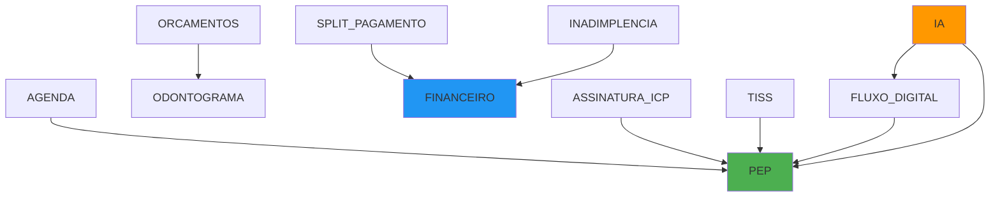

# 📐 Estrutura de Módulos - Ortho+ V4.0

## 🎯 Visão Geral

O Ortho+ segue uma arquitetura **Domain-Driven Design (DDD)** modular, onde cada módulo é independente e pode ser ativado/desativado pela clínica.

---

## 📦 Estrutura de um Módulo

Cada módulo segue a estrutura DDD de 4 camadas:

```
src/modules/{module-name}/
├── domain/                    # Camada de Domínio (Regras de Negócio)
│   ├── entities/             # Entidades do domínio
│   │   ├── Entity.ts         # Ex: Campaign, Product, Transaction
│   │   └── ValueObject.ts    # Ex: Money, Period, Email
│   └── repositories/         # Interfaces dos repositórios
│       └── IEntityRepository.ts
│
├── application/              # Camada de Aplicação (Casos de Uso)
│   ├── use-cases/           # Use Cases (lógica de aplicação)
│   │   ├── CreateEntityUseCase.ts
│   │   ├── UpdateEntityUseCase.ts
│   │   └── ListEntitiesUseCase.ts
│   └── dtos/                # Data Transfer Objects (opcional)
│       └── CreateEntityDTO.ts
│
├── infrastructure/          # Camada de Infraestrutura (Implementações)
│   ├── repositories/        # Implementações concretas
│   │   ├── SupabaseEntityRepository.ts
│   │   └── mappers/         # Mapeamento Domain <-> DB
│   │       └── EntityMapper.ts
│   └── services/            # Serviços externos (APIs, etc.)
│       └── ExternalService.ts
│
└── presentation/            # Camada de Apresentação (UI)
    ├── hooks/               # React Hooks customizados
    │   └── useEntities.ts
    ├── components/          # Componentes React
    │   ├── EntityList.tsx
    │   └── EntityForm.tsx
    └── pages/               # Páginas completas
        └── EntityPage.tsx
```

---

## 🧩 Módulos Implementados

### 1. **PEP (Prontuário Eletrônico do Paciente)**
**Categoria**: Gestão e Operação  
**Dependências**: Nenhuma  
**Tabelas**:
- `prontuarios`
- `pep_tratamentos`
- `pep_anexos`

**Entidades Principais**:
- `Prontuario` - Prontuário do paciente
- `Tratamento` - Tratamento odontológico
- `Anexo` - Anexos do prontuário

---

### 2. **AGENDA (Agenda Inteligente)**
**Categoria**: Gestão e Operação  
**Dependências**: `PEP`  
**Tabelas**:
- `appointments`
- `blocked_times`
- `appointment_reminders`
- `appointment_confirmations`

**Funcionalidades**:
- Drag & Drop de consultas
- Confirmação via WhatsApp
- Lembretes automáticos

---

### 3. **ORCAMENTOS (Orçamentos e Contratos)**
**Categoria**: Gestão e Operação  
**Dependências**: `ODONTOGRAMA`  
**Tabelas**:
- `budgets`
- `budget_items`
- `budget_versions`
- `budget_approvals`

**Funcionalidades**:
- Versionamento de orçamentos
- Assinatura digital
- Conversão em contrato

---

### 4. **ODONTOGRAMA (Odontograma 2D/3D)**
**Categoria**: Gestão e Operação  
**Tabelas**:
- `odontograma`

**Funcionalidades**:
- Visualização 2D/3D
- Mapeamento de dentes
- Histórico de alterações

---

### 5. **ESTOQUE (Controle de Estoque)**
**Categoria**: Gestão e Operação  
**Tabelas**:
- `produtos`
- `movimentacoes_estoque`
- `requisicoes_estoque`
- `estoque_alertas`

**Entidades Principais**:
- `Produto` - Produto do estoque
- `MovimentacaoEstoque` - Entrada/Saída/Ajuste
- `RequisicaoEstoque` - Solicitação de produtos

---

### 6. **FINANCEIRO (Gestão Financeira)**
**Categoria**: Financeiro  
**Tabelas**:
- `transactions`
- `transaction_categories`
- `caixa_movimentos`

**Entidades Principais**:
- `Transaction` - Receita/Despesa
- `Money` (Value Object) - Representação monetária

---

### 7. **SPLIT_PAGAMENTO (Split de Pagamento)**
**Categoria**: Financeiro  
**Dependências**: `FINANCEIRO`  
**Tabelas**:
- `split_rules`
- `split_transactions`

**Funcionalidades**:
- Divisão automática de valores
- Otimização tributária

---

### 8. **INADIMPLENCIA (Controle de Inadimplência)**
**Categoria**: Financeiro  
**Dependências**: `FINANCEIRO`  
**Tabelas**:
- `inadimplentes`
- `negociacoes_divida`
- `campanhas_inadimplencia`

**Funcionalidades**:
- Cobrança automatizada
- Negociação de dívidas

---

### 9. **CRM (Funil de Vendas)**
**Categoria**: Crescimento e Marketing  
**Tabelas**:
- `crm_leads`
- `crm_lead_stages`
- `crm_activities`

**Funcionalidades**:
- Pipeline de vendas
- Conversão de leads

---

### 10. **MARKETING_AUTO (Automação de Marketing)**
**Categoria**: Crescimento e Marketing  
**Tabelas**:
- `marketing_campaigns`
- `campaign_sends`
- `campaign_metrics`

**Funcionalidades**:
- Campanhas de pós-consulta
- Recall automático
- Métricas de conversão

---

### 11. **BI (Business Intelligence)**
**Categoria**: Crescimento e Marketing  
**Tabelas**:
- `bi_dashboards`
- `bi_widgets`
- `bi_metrics`

**Funcionalidades**:
- Dashboards customizados
- Métricas KPI
- Relatórios automatizados

---

### 12. **LGPD (Segurança e Conformidade)**
**Categoria**: Compliance  
**Tabelas**:
- `consent_logs`
- `data_requests`
- `security_audit_log`

**Funcionalidades**:
- Gestão de consentimentos
- Solicitações LGPD
- Auditoria completa

---

### 13. **ASSINATURA_ICP (Assinatura Digital)**
**Categoria**: Compliance  
**Dependências**: `PEP`  
**Funcionalidades**:
- Assinatura ICP-Brasil
- Validade jurídica

---

### 14. **TISS (Faturamento de Convênios)**
**Categoria**: Compliance  
**Dependências**: `PEP`  
**Tabelas**:
- `tiss_guias`
- `tiss_lotes`

**Funcionalidades**:
- Geração de guias TISS
- Faturamento automático

---

### 15. **TELEODONTO (Teleodontologia)**
**Categoria**: Compliance  
**Tabelas**:
- `teleconsultas`
- `teleconsulta_recordings`

**Funcionalidades**:
- Consultas remotas
- Gravação de sessões

---

### 16. **FLUXO_DIGITAL (Integração com Scanners)**
**Categoria**: Inovação  
**Dependências**: `PEP`  
**Funcionalidades**:
- Integração com scanners 3D
- Envio para laboratórios

---

### 17. **IA (Inteligência Artificial)**
**Categoria**: Inovação  
**Dependências**: `PEP`, `FLUXO_DIGITAL`  
**Tabelas**:
- `analises_radiograficas`
- `radiografia_ai_feedback`

**Funcionalidades**:
- Análise de radiografias
- Detecção de patologias
- Feedback de aprendizado

---

## 🔗 Grafo de Dependências



---

## 🛠️ Como Criar um Novo Módulo

### 1. Crie a estrutura de pastas:
```bash
mkdir -p src/modules/{module-name}/{domain,application,infrastructure,presentation}
```

### 2. Domain Layer (Entidades + Interfaces):
```typescript
// domain/entities/Entity.ts
export class Entity {
  static create(data): Entity { /* ... */ }
  static restore(props): Entity { /* ... */ }
}

// domain/repositories/IEntityRepository.ts
export interface IEntityRepository {
  findById(id: string): Promise<Entity | null>;
  save(entity: Entity): Promise<void>;
}
```

### 3. Application Layer (Use Cases):
```typescript
// application/use-cases/CreateEntityUseCase.ts
export class CreateEntityUseCase {
  constructor(private repository: IEntityRepository) {}
  async execute(input): Promise<Entity> { /* ... */ }
}
```

### 4. Infrastructure Layer (Implementação):
```typescript
// infrastructure/repositories/SupabaseEntityRepository.ts
export class SupabaseEntityRepository implements IEntityRepository {
  async findById(id: string): Promise<Entity | null> { /* ... */ }
  async save(entity: Entity): Promise<void> { /* ... */ }
}
```

### 5. Presentation Layer (Hooks + UI):
```typescript
// presentation/hooks/useEntities.ts
export function useEntities() {
  const repository = new SupabaseEntityRepository();
  const useCase = new ListEntitiesUseCase(repository);
  // React Query logic...
}
```

---

## ✅ Checklist de Qualidade

Ao criar um novo módulo, garanta:

- [ ] **Entidades** com validações de domínio
- [ ] **Use Cases** bem definidos
- [ ] **Repositories** com interface e implementação
- [ ] **Mappers** Domain ↔ Supabase
- [ ] **Hooks** com React Query
- [ ] **Componentes** memoizados (`React.memo`)
- [ ] **Tipos TypeScript** completos
- [ ] **Testes** unitários (Use Cases)
- [ ] **Documentação** no wiki

---

## 📚 Referências

- [DDD na Prática](https://docs.lovable.dev/architecture/ddd)
- [Clean Architecture](https://blog.cleancoder.com/uncle-bob/2012/08/13/the-clean-architecture.html)
- [Repositórios e Mappers](./repositories-and-mappers.md)

---

**Autor**: Ortho+ Team  
**Versão**: 4.0  
**Data**: Novembro 2025
